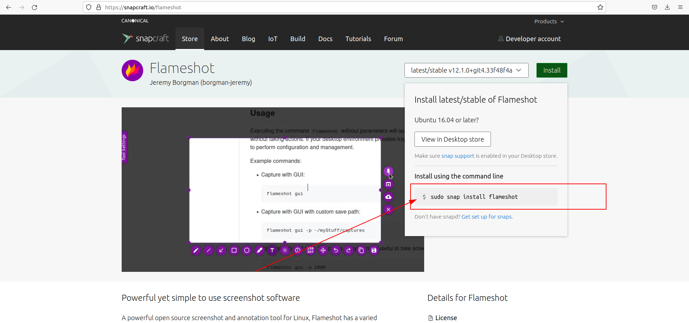
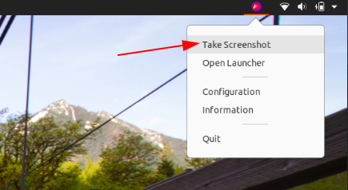
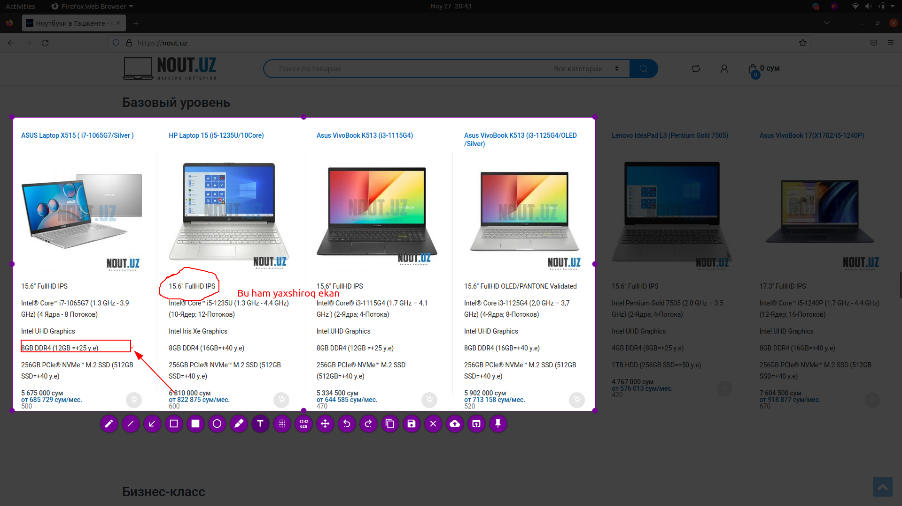
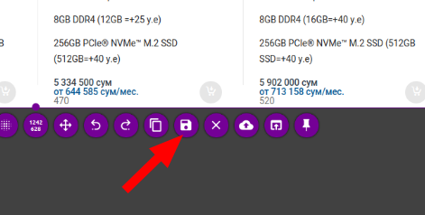
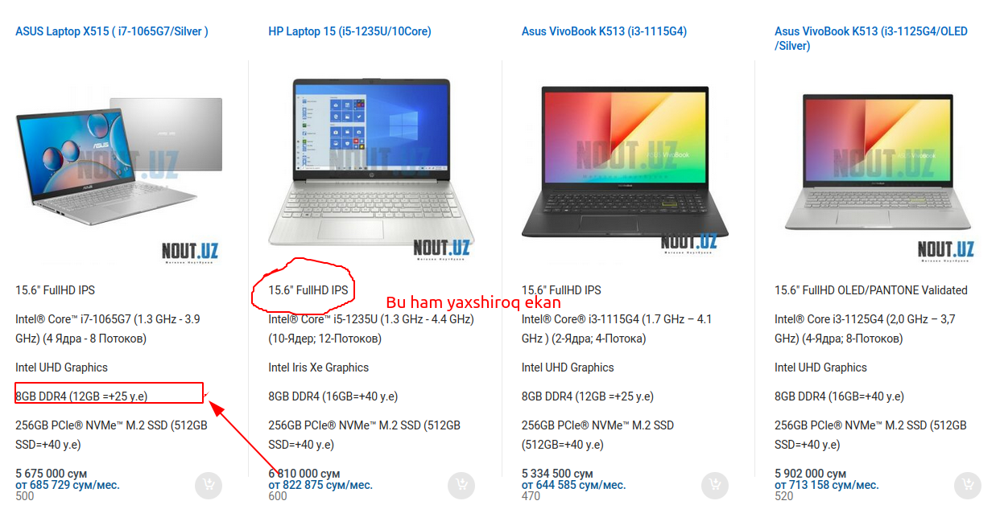

## Flameshot dasturini o'rnatish.

#### Bu dastur nima qiladi?

Linux uchun kuchli ochiq manbali skrinshot va izohlash vositasi, Flameshot turli xil belgilash vositalariga ega,
ular orasida Freehand chizish, chiziqlar, strelkalar, ajratib ko'rsatish, xiralashtirish kiradi. 
Bundan tashqari, siz ushbu tasvirni izohlash vositalarining ko'pchiligining rangi, o'lchami yoki qalinligini sozlashingiz mumkin.

#### Qanday o'rnatamiz?

* Bu dasturni oson o'rnatish uchun `snap` organizatsiyasidan foydalanamiz. Quyidagi manzilga boramiz.
  * `https://snapcraft.io/flameshot` 

<p align="center">
    
</p>

`Install` qismiga kirib `sudo snap install flameshot` ushbu qismidan nusxa olib terminalimizga borib ishlatib dasturimizni o'rnatamiz.

```shell
nuriddin@MSI:~$ sudo snap install flameshot
```

#### Flameshotni ishlatish

* Flameshotni o'rnatib bo'lgandan so'ng, unga kirganizda ekranimizning yuqori burchagida paydo bo'ladi. Quyida ko'rsatilganidek ishlatib ko'ramiz.

<p align="center">
    
</p>

* Flameshotdan foydalanish jarayoni.

<p align="center">
    
</p>

* Rasmni saqlash.

<p align="center">
    
</p>

* Tayyorlangan rasm ko'rinishi.

<p align="center">
    
</p>