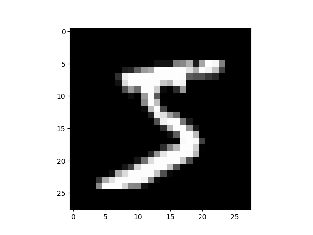

`Pytorch` - `Python` dasturlash tili va `Torch` (`library`) kutibxonasiga asoslangan ochiq manbali `machine learning framework`ki hisoblanadi.

### TORCH.NN haqiqatdan nima?

PyTorch neyron tarmoqlarni yaratish va oʻrgatishda (train) yordam berish uchun torch.nn , torch.optim , Dataset va DataLoader  kabi ishlab chiqilgan modul va sinflarni taqdim etadi.
Ularning kuchidan to'liq foydalanish va ularni muammongizga moslashtirish uchun siz ular nima qilayotganini aniq tushunishingiz kerak.
Ushbu tushunchani rivojlantirish uchun biz birinchi navbatda MNIST ma'lumotlar to'plamida ushbu modellarning hech qanday xususiyatlaridan foydalanmasdan asosiy neyron tarmog'ini o'rgatamiz;
Biz dastlab PyTorch tensorining eng asosiy funksiyasidan foydalanamiz. Keyin torch.nn, torch.optim, Dataset yoki DataLoader’dan bir funksiyani bosqichma-bosqich qo‘shamiz, bunda har bir qism aynan nima qilishini va kodni yanada ixcham yoki moslashuvchan qilish uchun qanday ishlashini ko‘rsatamiz.
Ushbu qo'llanmada sizda PyTorch allaqachon o'rnatilgan va tenzor operatsiyalari asoslari bilan tanish bo'lganligi taxmin qilinadi.

### MNIST data setup

Biz qo'lda chizilgan raqamlarning oq-qora tasvirlaridan (0 dan 9 gacha) iborat klassik MNIST ma'lumotlar to'plamidan foydalanamiz.
Biz `path`lar (yo'llar) bilan ishlash uchun pathlib dan foydalanamiz (Python 3 standart kutubxonasining bir qismi) va so'rovlar(`request`) yordamida ma'lumotlar to'plamini yuklab olamiz. Biz modullarni faqat ulardan foydalanganda import qilamiz, shuning uchun har bir nuqtada aniq nima ishlatilayotganini ko'rishingiz mumkin.

```python
from pathlib import Path
import requests

DATA_PATH = Path("data")
PATH = DATA_PATH / "mnist"

PATH.mkdir(parents=True, exist_ok=True)

URL = "https://github.com/pytorch/tutorials/raw/main/_static/"
FILENAME = "mnist.pkl.gz"

if not (PATH / FILENAME).exists():
        content = requests.get(URL + FILENAME).content
        (PATH / FILENAME).open("wb").write(content)
```

yuqoridagi  kodimizni ishlatish orqali, malumotlar to'plamimizni ya'ni `data`mizni hosil qilib oldik. Va fayllar bo'limiga e'tibor bersangiz data quyidagicha hosil bo'ladi.

```
├── data
   ├── mnist
       ├── mnist.pkl.gz
```

Ushbu ma'lumotlar to'plami numpy massiv (`numpy array`) formatida va ma'lumotlarni ketma-ketlashtirish uchun pythonga xos format bo'lgan pickle yordamida saqlangan.

```python
import pickle
import gzip

with gzip.open((PATH / FILENAME).as_posix(), "rb") as f:
        ((x_train, y_train), (x_valid, y_valid), _) = pickle.load(f, encoding="latin-1")
```

Har bir rasm 28 x 28 o'lchamda va 784 (=28x28) uzunlikdagi tekislangan qator sifatida saqlanadi. Keling, bittasini ko'rib chiqaylik; avval uni 2D ga o'zgartirishimiz kerak.

```python
from matplotlib import pyplot
import numpy as np

pyplot.imshow(x_train[0].reshape((28, 28)), cmap="gray")
# ``pyplot.show()`` only if not on Colab
try:
    import google.colab
except ImportError:
    pyplot.show()
print(x_train.shape)
```
<p align="center">
    
</p>

Out:`(50000, 784)`

PyTorch numpy massivlardan ko'ra torch.tensor dan foydalanadi, shuning uchun biz ma'lumotlarimizni torch.tensor ga o'tkazib olamiz.

```python
import torch

x_train, y_train, x_valid, y_valid = map(
    torch.tensor, (x_train, y_train, x_valid, y_valid)
)
n, c = x_train.shape
print(x_train, y_train)
print(x_train.shape)
print(y_train.min(), y_train.max())
```

Out: 
```console
tensor([[0., 0., 0.,  ..., 0., 0., 0.],
        [0., 0., 0.,  ..., 0., 0., 0.],
        [0., 0., 0.,  ..., 0., 0., 0.],
        ...,
        [0., 0., 0.,  ..., 0., 0., 0.],
        [0., 0., 0.,  ..., 0., 0., 0.],
        [0., 0., 0.,  ..., 0., 0., 0.]]) tensor([5, 0, 4,  ..., 8, 4, 8])
torch.Size([50000, 784])
tensor(0) tensor(9)
```

### Neural net from scratch (without torch.nn)

Keling, avval PyTorch tenzor operatsiyalaridan boshqa hech narsa ishlatmasdan model yarataylik. Siz neyron tarmoqlar(neural networks) asoslari bilan allaqachon tanishsiz deb o'ylaymiz.

PyTorch tasodifiy yoki nol bilan to'ldirilgan tensorlarni yaratish usullarini taqdim etadi, biz ulardan oddiy chiziqli model uchun `weights` va `bias` yaratishda foydalanamiz. 
Bular oddiy tensorlar bo'lib, ularda bitta maxsus qo'shimcha mavjud: biz PyTorchga ular gradient kerakligini aytamiz. 
Bu PyTorch-ga tensorda bajarilgan barcha operatsiyalarni yozib olishiga olib keladi, shuning uchun u orqaga tarqalish paytida gradientni avtomatik ravishda hisoblashi mumkin!

`Weights` uchun biz ishga tushirilgandan so'ng requires_grad ni o'rnatdik, chunki biz bu qadamni gradientga kiritishni xohlamaymiz.

```python
import math

weights = torch.randn(784, 10) / math.sqrt(784)
weights.requires_grad_()
bias = torch.zeros(10, requires_grad=True)
```

PyTorch-ning gradientlarni avtomatik hisoblash qobiliyati tufayli biz har qanday standart Python funktsiyasidan (yoki chaqiriladigan ob'ektdan) 
model sifatida foydalanishimiz mumkin! Shunday qilib, oddiy chiziqli modelni yaratish uchun oddiy matritsani ko'paytirish va translyatsiya 
qilingan qo'shishni yozaylik. Bizga faollashtirish funksiyasi ham kerak, shuning uchun log_softmax ni yozamiz va undan foydalanamiz. 
Esingizda bo'lsin: PyTorch juda ko'p oldindan yozilgan yo'qotish funktsiyalarini, faollashtirish funktsiyalarini va boshqalarni taqdim etsa ham, 
siz oddiy python yordamida osongina o'zingiz yozishingiz mumkin. PyTorch hatto funktsiyangiz uchun avtomatik ravishda tezkor GPU yoki vektorlashtirilgan protsessor kodini yaratadi.

```python
def log_softmax(x):
    return x - x.exp().sum(-1).log().unsqueeze(-1)

def model(xb):
    return log_softmax(xb @ weights + bias)
```

Yuqorida @ matritsani ko'paytirish operatsiyasini anglatadi. Biz o'z funktsiyamizni bitta ma'lumotlar to'plamiga chaqiramiz(on one batch of data) (bu holda, 64 ta rasm). 
Bu bitta oldinga o'tish. E'tibor bering, bizning bashoratlarimiz bu bosqichda tasodifiy emas, chunki biz tasodifiy `weights` boshlaymiz.

```python
bs = 64  # batch size

xb = x_train[0:bs]  # a mini-batch from x
preds = model(xb)  # predictions
preds[0], preds.shape
print(preds[0], preds.shape)
```

Out:
```console
tensor([-2.1400, -2.3861, -2.0920, -2.3659, -2.7347, -2.4097, -2.1384, -2.1687,
        -2.1853, -2.6079], grad_fn=<SelectBackward0>) torch.Size([64, 10])
```

Ko'rib turganingizdek, preds tensor nafaqat tensor qiymatlarini, balki gradient funktsiyasini ham o'z ichiga oladi.
Keling `loss function` funksiyasi sifatida foydalanish uchun `negative log-likelihood` funsiyasini hosil qilib olamiz.

```python
def nll(input, target):
    return -input[range(target.shape[0]), target].mean()

loss_func = nll
```

Keling, tasodifiy modelimiz bilan yo'qotishimizni(loss) tekshirib ko'raylik, shunda biz yaxshilanganimizni ko'ramiz.

```python
yb = y_train[0:bs]
print(loss_func(preds, yb))
```
Out: `tensor(2.2699, grad_fn=<NegBackward0>)`

Keling, modelimizning aniqligini hisoblash funktsiyasini ham amalga oshiraylik. 
Har bir bashorat uchun, agar eng katta qiymatga ega indeks maqsadli qiymatga mos kelsa, bashorat to'g'ri bo'lgan.

```python
def accuracy(out, yb):
    preds = torch.argmax(out, dim=1)
    return (preds == yb).float().mean()
```

Tasodifiy modelimizning to'g'riligini tekshirib ko'raylik,
shunda biz yo'qotishimiz yaxshilangani sayin aniqligimiz yaxshilanadimi yoki yo'qligini ko'ramiz.

```python
print(accuracy(preds, yb))
```
Out:`tensor(0.0938)`

Endi biz `training loop`ni ishga tushurishimiz mumkin. Har bir iteratsiya uchun biz:

* `mini-batch of data` ya'ni `batch size`ning  minimum qiymatini tanlang
* bashorat qilish uchun (predictions) modeldan foydalaning
* loss ni hisoblang
* `loss.backward()` modelning gradientlarini yangilaydi, ushbu holatda `weights` va `bias`

Endi biz ushbu `gradients` lardan `weights` va `bias` larni yangilash uchun foydalanamiz. 
Biz buni `torch.no_grad()` kontekst menejerida qilamiz, chunki biz bu harakatlar keyingi gradient hisobimiz uchun qayd etilishini istamaymiz.

Keyin biz gradientlarni nolga o'rnatamiz, shunda biz keyingi for loopga tayyormiz.
Aks holda, bizning gradientlarimiz sodir bo'lgan barcha operatsiyalarning jamlanmasini yozadi 
(masalan, loss.backward() gradientlarni almashtirish o'rniga, allaqachon saqlangan narsalarga qo'shadi).

```python
from IPython.core.debugger import set_trace

lr = 0.5  # learning rate
epochs = 2  # how many epochs to train for

for epoch in range(epochs):
    for i in range((n - 1) // bs + 1):
        #         set_trace()
        start_i = i * bs
        end_i = start_i + bs
        xb = x_train[start_i:end_i]
        yb = y_train[start_i:end_i]
        pred = model(xb)
        loss = loss_func(pred, yb)

        loss.backward()
        with torch.no_grad():
            weights -= weights.grad * lr
            bias -= bias.grad * lr
            weights.grad.zero_()
            bias.grad.zero_()
```

Biz `minimal neural network`ni yaratdik va train qildik
(bu holda logistik regressiya(a logistic regression), chunki bizda yashirin qatlamlar yo'q)

Keling, yo'qotish va aniqlikni tekshirib ko'raylik va ularni oldingi narsalar bilan solishtiramiz. 
Biz yo'qotishlar kamayib, aniqlik oshganini kutamiz va ular ham bor.

```python
print(loss_func(model(xb), yb), accuracy(model(xb), yb))
```

Out:`tensor(0.0813, grad_fn=<NegBackward0>) tensor(1.)`

### `torch.nn.functional`dan foydalanish

Endi biz kodimizni qayta tahrirlaymiz, shunda u avvalgidek ishlaydi, faqat biz uni yanada ixcham va moslashuvchan qilish
uchun PyTorch nn sinflaridan foydalanishni boshlaymiz. Bu yerdan har bir qadamda biz kodimizni bir yoki bir nechtasini 
qilishimiz kerak: qisqaroq, tushunarliroq va/yoki ko'proq moslashuvchan. <br>
Birinchi va eng oson qadam qo'lda yozilgan faollashtirish va yo'qotish funksiyalarini torch.nn.functional 
(odatda F nomlar maydoniga konventsiya bo'yicha import qilingan) bilan almashtirish orqali kodimizni qisqartirishdir.
Ushbu modul torch.nn kutubxonasidagi barcha funktsiyalarni o'z ichiga oladi 
(kutubxonaning boshqa qismlarida sinflar mavjud). Yo'qotish va faollashtirish funktsiyalarining keng doirasi bilan
bir qatorda, siz bu erda neyron tarmoqlarni yaratish uchun bir nechta qulay funktsiyalarni topasiz, masalan,
birlashtirish funktsiyalari. (Shuningdek, konvolyutsiyalar, chiziqli qatlamlar va boshqalarni bajarish uchun 
funktsiyalar mavjud, ammo biz ko'rib turganimizdek, ular odatda kutubxonaning boshqa qismlari yordamida yaxshiroq 
ishlaydi.) <br>

Agar siz salbiy log ehtimolini yo'qotish (negative log likelihood loss)va log softmax faollashtirishdan foydalanayotgan bo'lsangiz,
Pytorch ikkalasini birlashtirgan yagona F.cross_entropy funksiyasini taqdim etadi. 
Shunday qilib, biz hatto faollashtirish funksiyasini modelimizdan olib tashlashimiz mumkin.

```python
import torch.nn.functional as F

loss_func = F.cross_entropy

def model(xb):
    return xb @ weights + bias
```

E'tibor bering, biz endi log_softmax ni model funksiyasida chaqirmaymiz. Bizning yo'qotishimiz va aniqligimiz avvalgidek ekanligini tasdiqlaylik:

```python
print(loss_func(model(xb), yb), accuracy(model(xb), yb))
```

Out:`tensor(0.0813, grad_fn=<NllLossBackward0>) tensor(1.)`

### nn.Moduledan foydalanib refactor qilish (refactor-qisqartirish, ixchamlash)

Keyinchalik aniqroq va ixcham training loop uchun `nn.Module` va `nn.Parameter` dan foydalanamiz. 
Biz nn.Module subklassini olamiz. 
Bunday holda, biz `weights`, `bias` va oldinga qadam uchun usulni ushlab turadigan sinf yaratmoqchimiz.
nn.Module biz foydalanadigan bir qator atribut va usullarga ega (masalan, .parameters() va .zero_grad()).

```python
from torch import nn

class Mnist_Logistic(nn.Module):
    def __init__(self):
        super().__init__()
        self.weights = nn.Parameter(torch.randn(784, 10) / math.sqrt(784))
        self.bias = nn.Parameter(torch.zeros(10))

    def forward(self, xb):
        return xb @ self.weights + self.bias
```

Biz endi faqat funktsiyadan foydalanish o'rniga ob'ektdan foydalanayotganimiz sababli, avvalo modelimizni yaratishimiz kerak:

```commandline
model = Mnist_Logistic()
```

Endi biz yo'qotishni avvalgidek hisoblashimiz mumkin. Shuni esda tutingki, nn.Module ob'ektlari xuddi funksiyalar kabi 
ishlatiladi (ya'ni ular chaqirish mumkin), lekin sahna ortida Pytorch bizning oldinga yo'naltirish usulini avtomatik ravishda chaqiradi.

```python
print(loss_func(model(xb), yb))
```
Out:`tensor(2.3096, grad_fn=<NllLossBackward0>)`

Ilgari training loopimiz uchun biz har bir parametr uchun qiymatlarni nom bo'yicha yangilashimiz va har bir parametr uchun graduslarni qo'lda alohida nolga tushirishimiz kerak edi, masalan:

```python
with torch.no_grad():
    weights -= weights.grad * lr
    bias -= bias.grad * lr
    weights.grad.zero_()
    bias.grad.zero_()
```

Endi biz model.parameters() va model.zero_grad() dan (ikkalasi ham nn.Module uchun PyTorch tomonidan belgilangan) afzalliklaridan foydalanishimiz mumkin, bu qadamlarni yanada ixcham va ba'zi parametrlarimizni unutish xatosiga kamroq moyil bo'ladi.


```python
with torch.no_grad():
    for p in model.parameters(): p -= p.grad * lr
    model.zero_grad()
```

`Training loop`imizni moslash funksiyasiga o'rab olamiz, shunda uni keyinroq qayta ishga tushiramiz.

```python
def fit():
    for epoch in range(epochs):
        for i in range((n - 1) // bs + 1):
            start_i = i * bs
            end_i = start_i + bs
            xb = x_train[start_i:end_i]
            yb = y_train[start_i:end_i]
            pred = model(xb)
            loss = loss_func(pred, yb)

            loss.backward()
            with torch.no_grad():
                for p in model.parameters():
                    p -= p.grad * lr
                model.zero_grad()

fit()
```

Keling, `loss`ni pasayganini yana bir bor tekshirib ko'raylik:
```python
print(loss_func(model(xb), yb))
```

Out:`tensor(0.0821, grad_fn=<NllLossBackward0>)`

### nn.Lineardan foydalanib refactor qilish (refactor-qisqartirish, ixchamlash)

Biz kodimizni qayta tiklashda davom etamiz. Self.weights va self.bias ni qoʻlda aniqlash va ishga tushirish va xb @ self.weights + self.bias ni hisoblash
oʻrniga, chiziqli qatlam uchun Pytorch nn.Linear sinfidan foydalanamiz, bu biz uchun hammasini bajaradi.
Pytorch-da oldindan belgilangan qatlamlarning ko'p turlari mavjud bo'lib, ular bizning kodimizni sezilarli darajada soddalashtiradi va ko'pincha uni tezlashtiradi.

```python
class Mnist_Logistic(nn.Module):
    def __init__(self):
        super().__init__()
        self.lin = nn.Linear(784, 10)

    def forward(self, xb):
        return self.lin(xb)
```

Biz modelimizni yaratamiz va yo'qotishni avvalgidek hisoblaymiz:

```python
model = Mnist_Logistic()
print(loss_func(model(xb), yb))
```

Out:`tensor(2.3313, grad_fn=<NllLossBackward0>)`

Biz hali ham avvalgidek moslashish usulidan(fit method) foydalanishimiz mumkin.
```python
fit()

print(loss_func(model(xb), yb))
```

Out:`tensor(0.0819, grad_fn=<NllLossBackward0>)`

### torch.optimdan foydalanib refactor qilish (refactor-qisqartirish, ixchamlash)

Pytorch shuningdek, turli xil optimallashtirish algoritmlari bo'lgan torch.optim paketiga ega. Har bir parametrni qo'lda yangilash o'rniga, 
oldinga qadam tashlash uchun optimallashtiruvchimizdan qadam usulidan foydalanishimiz mumkin. <br>

Bu bizga qo'lda kodlangan avvalgi optimallashtirish qadamimizni almashtirish imkonini beradi:

```python
with torch.no_grad():
    for p in model.parameters(): p -= p.grad * lr
    model.zero_grad()
```

va o'rniga foydalaning:

```python
opt.step()
opt.zero_grad()
```

(optim.zero_grad() gradientni 0 ga qaytaradi va keyingi minibatch uchun gradientni hisoblashdan oldin uni chaqirishimiz kerak.)

```commandline
from torch import optim
```

Kelajakda uni qayta ishlatishimiz uchun modelimiz va optimallashtiruvchimizni yaratish uchun kichik funksiyani aniqlaymiz.

```python
def get_model():
    model = Mnist_Logistic()
    return model, optim.SGD(model.parameters(), lr=lr)

model, opt = get_model()
print(loss_func(model(xb), yb))

for epoch in range(epochs):
    for i in range((n - 1) // bs + 1):
        start_i = i * bs
        end_i = start_i + bs
        xb = x_train[start_i:end_i]
        yb = y_train[start_i:end_i]
        pred = model(xb)
        loss = loss_func(pred, yb)

        loss.backward()
        opt.step()
        opt.zero_grad()

print(loss_func(model(xb), yb))
```

Out:
```console
tensor(2.2659, grad_fn=<NllLossBackward0>) 
tensor(0.0810, grad_fn=<NllLossBackward0>)
```

PyTorch mavhum Dataset sinfiga ega. Ma'lumotlar to'plami __len__ funksiyasi (Pythonning standart len funktsiyasi deb ataladi) 
va __getitem__ funksiyasiga ega bo'lgan har qanday narsa bo'lishi mumkin, uni indekslash usuli sifatida. Ushbu o'quv qo'llanma Ma'lumotlar to'plamining 
kichik klassi sifatida maxsus FacialLandmarkDataset sinfini yaratishning yaxshi namunasi orqali o'tadi. <br>

PyTorch-ning TensorDataset - bu ma'lumotlar to'plamini o'rash tensorlari. 
Indekslashning uzunligi va usulini belgilash orqali bu bizga tenzorning birinchi o'lchami bo'ylab takrorlash, indekslash va kesish uchun yo'l beradi. 
Bu biz o'qiyotganimizda bir qatorda mustaqil va qaram o'zgaruvchilarga kirishni osonlashtiradi.

```commandline
from torch.utils.data import TensorDataset
```

X_train ham, y_train ham bitta TensorDatasetda birlashtirilishi mumkin, uni takrorlash va kesish osonroq bo'ladi.

```commandline
train_ds = TensorDataset(x_train, y_train)
```

Ilgari biz x va y qiymatlarining minibatchalarini alohida takrorlashimiz kerak edi:

```commandline
xb = x_train[start_i:end_i]
yb = y_train[start_i:end_i]
```

Endi biz ushbu ikki qadamni birgalikda bajarishimiz mumkin:

```commandline
xb,yb = train_ds[i*bs : i*bs+bs]
```

```python
model, opt = get_model()

for epoch in range(epochs):
    for i in range((n - 1) // bs + 1):
        xb, yb = train_ds[i * bs: i * bs + bs]
        pred = model(xb)
        loss = loss_func(pred, yb)

        loss.backward()
        opt.step()
        opt.zero_grad()

print(loss_func(model(xb), yb))
```

Out:`tensor(0.0826, grad_fn=<NllLossBackward0>)`

### DataLoaderdan foydalanib refactor qilish (refactor-qisqartirish, ixchamlash)

PyTorch DataLoader paketlarni boshqarish uchun javobgardir. Har qanday ma'lumotlar to'plamidan DataLoader 
yaratishingiz mumkin. DataLoader paketlarni takrorlashni osonlashtiradi. 
Train_ds[i*bs: i*bs+bs] dan foydalanish o'rniga, DataLoader bizga har bir minibatchni avtomatik ravishda beradi.

```python
from torch.utils.data import DataLoader

train_ds = TensorDataset(x_train, y_train)
train_dl = DataLoader(train_ds, batch_size=bs)
```

Ilgari bizning loopimiz batches (xb, yb) bo'ylab takrorlangan,  quyidagicha:

```python
for i in range((n-1)//bs + 1):
    xb,yb = train_ds[i*bs : i*bs+bs]
    pred = model(xb)
```

Endi bizning loopimiz ancha toza, chunki (xb, yb) ma'lumotlar yuklovchidan avtomatik ravishda yuklanadi:

```python
for xb,yb in train_dl:
    pred = model(xb)
```

```python
model, opt = get_model()

for epoch in range(epochs):
    for xb, yb in train_dl:
        pred = model(xb)
        loss = loss_func(pred, yb)

        loss.backward()
        opt.step()
        opt.zero_grad()

print(loss_func(model(xb), yb))
```

Out:`tensor(0.0818, grad_fn=<NllLossBackward0>)`

PyTorch-ning nn.Module, nn.Parameter, Dataset va DataLoader tufayli bizning loopimiz endi sezilarli 
darajada kichikroq va tushunish osonroq. 
Keling, amalda samarali modellarni yaratish uchun zarur bo'lgan asosiy xususiyatlarni qo'shishga harakat qilaylik.

### validation qo'shish

1-bo'limda biz faqat o'quv ma'lumotlarimizdan(training data) foydalanish uchun o'rnatilgan oqilona train loopni 
olishga harakat qildik. Haqiqatdan ham,
siz haddan tashqari mos ekanligingizni aniqlash uchun sizda har doim tekshirish to'plami(validation set) bo'lishi kerak.
<br>

O'quv ma'lumotlarini aralashtirish partiyalar va ortiqcha moslamalar o'rtasidagi korrelyatsiyani 
oldini olish uchun muhimdir. Boshqa tomondan, tekshirish to'plamini aralashtiramizmi yoki yo'qmi, 
tekshirish yo'qolishi bir xil bo'ladi. Aralashtirish qo'shimcha vaqt talab qilganligi sababli, 
tekshirish ma'lumotlarini aralashtirib yuborishning ma'nosi yo'q.
<br>
Biz tekshirish to'plami uchun(validation set) o'quv to'plamidan(training set) ikki baravar katta partiya hajmidan(batch size) foydalanamiz. 
Buning sababi shundaki, tekshirish to'plami orqaga tarqalishga muhtoj emas va shuning uchun kamroq xotira oladi
(u gradientlarni saqlashga hojat yo'q). 
Biz bundan kattaroq partiya hajmidan foydalanish va yo'qotishni tezroq hisoblash uchun foydalanamiz.

```python
train_ds = TensorDataset(x_train, y_train)
train_dl = DataLoader(train_ds, batch_size=bs, shuffle=True)

valid_ds = TensorDataset(x_valid, y_valid)
valid_dl = DataLoader(valid_ds, batch_size=bs * 2)
```

Har bir davr oxirida `validation loss`ni hisoblab chiqamiz va chop etamiz.

```python
model, opt = get_model()

for epoch in range(epochs):
    model.train()
    for xb, yb in train_dl:
        pred = model(xb)
        loss = loss_func(pred, yb)

        loss.backward()
        opt.step()
        opt.zero_grad()

    model.eval()
    with torch.no_grad():
        valid_loss = sum(loss_func(model(xb), yb) for xb, yb in valid_dl)

    print(epoch, valid_loss / len(valid_dl))
```

Out:
```console
0 tensor(0.3048)
1 tensor(0.2872)
```


### fit() and get_data()  funksiyalarini yaratish

Endi biz o'zimiz uchun kichik refaktoring qilamiz. O'quv to'plami(`train set`) va tekshirish to'plami(`validation set`) 
uchun yo'qotishlarni(`loss`) hisoblashning shunga o'xshash jarayonini ikki marta boshdan kechirganimiz sababli, keling, 
buni bitta partiya(`batch`) uchun yo'qotishni(`loss`) hisoblaydigan loss_batch funksiyasiga aylantiraylik.

Biz `training set` uchun optimizerni (optimallashtiruvchi) o'tkazib yuboramiz va undan `backprop`ni bajarish uchun bajaramiz. 
`Valiidation set` uchun optimizerni o'tkazmaymiz, shu sababli method (usul) `backprop` ni amalga oshirmaydi.

```python
def loss_batch(model, loss_func, xb, yb, opt=None):
    loss = loss_func(model(xb), yb)

    if opt is not None:
        loss.backward()
        opt.step()
        opt.zero_grad()

    return loss.item(), len(xb)
```

`fit` modulimizni train qilish uchun zarur operatisiyalarni bajaradi va har bir `epoch` uchun `training` va 
`validation` losslarni hisoblaydi.

```python
import numpy as np

def fit(epochs, model, loss_func, opt, train_dl, valid_dl):
    for epoch in range(epochs):
        model.train()
        for xb, yb in train_dl:
            loss_batch(model, loss_func, xb, yb, opt)

        model.eval()
        with torch.no_grad():
            losses, nums = zip(
                *[loss_batch(model, loss_func, xb, yb) for xb, yb in valid_dl]
            )
        val_loss = np.sum(np.multiply(losses, nums)) / np.sum(nums)

        print(epoch, val_loss)
```

`get_data` funksiyasi `training va validation sets` uchun `dataloders` ni (ma'lumotlar yuklagichi) qaytaradi.

```python
def get_data(train_ds, valid_ds, bs):
    return (
        DataLoader(train_ds, batch_size=bs, shuffle=True),
        DataLoader(valid_ds, batch_size=bs * 2),
    )
```

Endi bizning ma'lumotlar yuklagichlarini(`data loaders`) olish va modelni o'rnatish jarayonini
3 qator kodda bajarib ko'rishimiz mumkin:

```python
train_dl, valid_dl = get_data(train_ds, valid_ds, bs)
model, opt = get_model()
fit(epochs, model, loss_func, opt, train_dl, valid_dl)
```

Out:
```console
0 0.29393543709516523
1 0.3258970961511135
```

Siz turli xil modellarni train qilish uchun ushbu asosiy 3 qator koddan foydalanishingiz mumkin. Keling, 
ularni convolutional neural network (CNN) train qilish uchun ishlatishimiz mumkinligini ko'rib chiqaylik!


### Switch to CNN

Endi biz neyron tarmog'imizni uchta konvolyutsion qatlam bilan qurmoqchimiz. <br>
Oldingi bo'limdagi funksiyalarning hech biri model shakli haqida hech narsa o'z ichiga olmaydi, 
chunki biz ulardan CNNni o'qitish uchun hech qanday o'zgartirishlarsiz foydalanishimiz mumkin. <br>

Biz konvolyutsion qatlam sifatida PyTorch-ning oldindan belgilangan Conv2d sinfidan foydalanamiz.
Biz CNNni 3 ta konvolyutsion qatlam bilan belgilaymiz. Har bir konvolyutsiyadan keyin ReLU keladi. 
Oxirida biz o'rtacha birlashtirishni amalga oshiramiz.

```python
class Mnist_CNN(nn.Module):
    def __init__(self):
        super().__init__()
        self.conv1 = nn.Conv2d(1, 16, kernel_size=3, stride=2, padding=1)
        self.conv2 = nn.Conv2d(16, 16, kernel_size=3, stride=2, padding=1)
        self.conv3 = nn.Conv2d(16, 10, kernel_size=3, stride=2, padding=1)

    def forward(self, xb):
        xb = xb.view(-1, 1, 28, 28)
        xb = F.relu(self.conv1(xb))
        xb = F.relu(self.conv2(xb))
        xb = F.relu(self.conv3(xb))
        xb = F.avg_pool2d(xb, 4)
        return xb.view(-1, xb.size(1))

lr = 0.1
```

Momentum - bu avvalgi yangilanishlarni hisobga oladigan va odatda tezroq mashg'ulotlarga olib keladigan 
gradient tushishining o'zgarishi.

```python
model = Mnist_CNN()
opt = optim.SGD(model.parameters(), lr=lr, momentum=0.9)

fit(epochs, model, loss_func, opt, train_dl, valid_dl)
```

Out:
```console
0 0.35472598304748537
1 0.2717800006389618
```

### nn.Sequential dan foydalanish

`torch.nn`da kodimizning `Sequential` qismini soddalashtirish uchun foydalana oladigan boshqa qulay `class`si mavjud.
Sequential ob'ekt uning tarkibidagi modullarning har birini ketma-ket ishga tushiradi.Bu bizning neyron tarmog'imizni yozishning oddiyroq usuli. <br>

Bundan foydalanish uchun biz berilgan funksiyadan moslashtirilgan qatlamni osongina aniqlay olishimiz kerak.
Masalan, PyTorch-da ko'rish qatlami yo'q va biz tarmog'imiz uchun uni yaratishimiz kerak.
`Lambda` qatlamni yaratadi, biz undan keyin `Sequential` bilan tarmoqni aniqlashda foydalanishimiz mumkin.


```python
class Lambda(nn.Module):
    def __init__(self, func):
        super().__init__()
        self.func = func

    def forward(self, x):
        return self.func(x)


def preprocess(x):
    return x.view(-1, 1, 28, 28)
```

Sequential yordamida yaratilgan model oddiy:

```python
model = nn.Sequential(
    Lambda(preprocess),
    nn.Conv2d(1, 16, kernel_size=3, stride=2, padding=1),
    nn.ReLU(),
    nn.Conv2d(16, 16, kernel_size=3, stride=2, padding=1),
    nn.ReLU(),
    nn.Conv2d(16, 10, kernel_size=3, stride=2, padding=1),
    nn.ReLU(),
    nn.AvgPool2d(4),
    Lambda(lambda x: x.view(x.size(0), -1)),
)

opt = optim.SGD(model.parameters(), lr=lr, momentum=0.9)

fit(epochs, model, loss_func, opt, train_dl, valid_dl)
```


Out:
```console
0 0.309630585193634
1 0.23419328112602233
```

### DataLoaderni oʻrash

Bizning CNN juda qisqa, lekin u faqat MNIST bilan ishlaydi, chunki:

* U kirish 28*28 uzunlikdagi vektor deb hisoblaydi
* Yakuniy CNN tarmog'ining o'lchami 4 * 4 deb taxmin qilinadi (chunki bu biz foydalangan o'rtacha yadro hajmidir)<br>

Keling, ushbu ikkita taxmindan xalos bo'laylik, shuning uchun bizning modelimiz har qanday 2D bitta kanalli tasvir bilan ishlaydi.
Birinchidan, biz dastlabki Lambda qatlamini ma'lumotlarni qayta ishlashni generatorga o'tkazish orqali olib tashlashimiz mumkin:

```python
def preprocess(x, y):
    return x.view(-1, 1, 28, 28), y


class WrappedDataLoader:
    def __init__(self, dl, func):
        self.dl = dl
        self.func = func

    def __len__(self):
        return len(self.dl)

    def __iter__(self):
        for b in self.dl:
            yield (self.func(*b))

train_dl, valid_dl = get_data(train_ds, valid_ds, bs)
train_dl = WrappedDataLoader(train_dl, preprocess)
valid_dl = WrappedDataLoader(valid_dl, preprocess)
```

Keyinchalik, biz nn.AvgPool2d ni nn.AdaptiveAvgPool2d bilan almashtirishimiz mumkin, bu bizda mavjud bo'lgan kirish 
tensorini emas, balki biz xohlagan chiqish tensorining hajmini aniqlash imkonini beradi. 
Natijada, bizning modelimiz har qanday o'lchamdagi kirish bilan ishlaydi.

```python
model = nn.Sequential(
    nn.Conv2d(1, 16, kernel_size=3, stride=2, padding=1),
    nn.ReLU(),
    nn.Conv2d(16, 16, kernel_size=3, stride=2, padding=1),
    nn.ReLU(),
    nn.Conv2d(16, 10, kernel_size=3, stride=2, padding=1),
    nn.ReLU(),
    nn.AdaptiveAvgPool2d(1),
    Lambda(lambda x: x.view(x.size(0), -1)),
)

opt = optim.SGD(model.parameters(), lr=lr, momentum=0.9)
```

Keling, sinab ko'raylik:

```commandline
fit(epochs, model, loss_func, opt, train_dl, valid_dl)
```

Out:
```console
0 0.32121348752975465
1 0.20731825503110884
```

### GPU dan foydalanish

Agar sizga CUDA qo'llab-quvvatlaydigan GPUga kirish imkoni bo'lsa (ko'pgina bulutli provayderlardan uni soatiga 0,50 dollarga ijaraga olishingiz mumkin) 
undan kodingizni tezlashtirish uchun foydalanishingiz mumkin. Avval GPU Pytorch da ishlayotganligini tekshiring:

```commandline
print(torch.cuda.is_available())
```

Out:`True`

Va keyin u uchun qurilma ob'ektini yarating:

```python
dev = torch.device(
    "cuda") if torch.cuda.is_available() else torch.device("cpu")
```

To'plamlarni GPUga o'tkazish uchun oldingi jarayonni yangilaymiz:

```python
def preprocess(x, y):
    return x.view(-1, 1, 28, 28).to(dev), y.to(dev)


train_dl, valid_dl = get_data(train_ds, valid_ds, bs)
train_dl = WrappedDataLoader(train_dl, preprocess)
valid_dl = WrappedDataLoader(valid_dl, preprocess)
```

Nihoyat, biz modelimizni GPU-ga o'tkazishimiz mumkin.

```python
model.to(dev)
opt = optim.SGD(model.parameters(), lr=lr, momentum=0.9)
```

Endi uning tezroq ishlashini ko'rishingiz kerak:

```python
fit(epochs, model, loss_func, opt, train_dl, valid_dl)
```

Out:
```console
0 0.18234353145360946
1 0.16786567342281342
```

Endi bizda Pytorch yordamida ko'plab turdagi modellarni o'rgatish uchun foydalanishingiz mumkin bo'lgan umumiy ma'lumotlar uzatish liniyasi va o'quv tsikli mavjud. 
Modelni mashq qilish qanchalik sodda ekanligini ko'rish uchun `mnist_sample noutbook`ga qarang.

<details> <summary>mnist_sample noutbook</summary>

```python
import pickle, gzip
from pathlib import Path
from mnist_sample import *


PATH = Path('data')/'mnist'

with gzip.open(PATH/'mnist.pkl.gz', 'rb') as f:
    ((train_x, train_y), (valid_x, valid_y), _) = pickle.load(f, encoding='latin-1')


bs=64
lr=0.1
epochs=2

dev = torch.device('cuda') if torch.cuda.is_available() else torch.device('cpu')


def preprocess(x,y): return x.view(-1,1,28,28).to(dev),y.to(dev)

def get_dataloader(x,y,bs,shuffle):
    ds = TensorDataset(*map(tensor, (x,y)))
    dl = DataLoader(ds, batch_size=bs, shuffle=shuffle)
    return WrappedDataLoader(dl, preprocess)


train_dl = get_dataloader(train_x, train_y, bs,   shuffle=False)
valid_dl = get_dataloader(valid_x, valid_y, bs*2, shuffle=True )


model = nn.Sequential(
    nn.Conv2d(1,  16, kernel_size=3, stride=2, padding=1), nn.ReLU(),
    nn.Conv2d(16, 16, kernel_size=3, stride=2, padding=1), nn.ReLU(),
    nn.Conv2d(16, 10, kernel_size=3, stride=2, padding=1), nn.ReLU(),
    nn.AdaptiveAvgPool2d(1),
    Lambda(lambda x: x.view(x.size(0),-1))
).to(dev)

opt = optim.SGD(model.parameters(), lr=lr, momentum=0.9)


fit(epochs, model, F.cross_entropy, opt, train_dl, valid_dl)    
```
</details> 