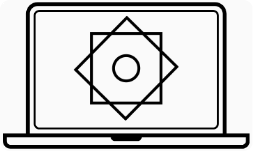

<h1 align="center">Python</h1>

  

**OchiqAI** maqsadi _`hamisha ochiq`_ va hammabop kurslarni taqdim qilish. 

* Birinchi kursimiz Python bo'ldi. Faqat yaxshi niyatda yurgan va holis o'rganuvchilar uchun taqdim qilamiz. 
* Pythonda bemalol [qo'rqmay] dastur yozadigan programmist bo'lishingizga yordam berish. 
* Hozircha eng muhim bo'lgan 10 kunlik darsni yozib chiqdik. 

## Python 

  1. [Programma nima?](./python/01-kun-Programma/01-kun.md) 
    - Local ishlash uchun: PyCharm [Win](./biblateka/pycharm_windows.md) [LINUX](no)
    - Onlayn ishash uchun: Google colab [Colab](./biblateka/google-colab-ishlash/google-colab-ochish.md))
    - [Javoblar](./python/01-kun-Programma/01-kun-javoblar.md)
  2. [O'zgaruvchi](./python/02-kun-O'zgaruvchi/02-kun.md) 
    - [Javoblar](./python/02-kun-O'zgaruvchi/02-kun-javoblar.md)
  3. [Funksiya](./python/03-kun-Funksiya/03-kun.md) 
    - [Javoblar](./python/03-kun-Funksiya/03-kun-javoblar.md)
  4. [If (Agar)](./python/04-kun-Agar/04-kun.md)
    - [Javoblar](./python/04-kun-Agar/04-kun-javoblar.md)
  5. [Loop](./python/05-kun-Loop/05-kun.md)
    - [Javoblar](./python/05-kun-Loop/05-kun-javoblar.md)
  6. [String](./python/06-kun-String/06-kun.md)
    - [Javoblar](./python/06-kun-String/06-kun-javoblar.md)
  7. [List](./python/07-kun-List/07-kun.md)
    - [Javoblar](./python/07-kun-List/07-kun-javoblar.md)
  8. [Dictionary](./python/08-kun-Dictionary/08-kun.md)
    - [Javoblar](./python/08-kun-Dictionary/08-kun-javoblar.md)
  9. [Tuple](./python/09-kun-Tuple/09-kun.md)
    - [Javoblar](./python/09-kun-Tuple/09-kun-javoblar.md)
  10. [Mashqlar](./python/10-kun-Mashqlar/10-kun.md)
    - [Javoblar](./python/10-kun-Mashqlar/10-kun-javoblar.md)
  11. [Fayllar bilan ishlash](./python/11-kun-Fayl/11-kun-fayl.md)
  12. [Regular-ifodalar](./python/12-kun-Regular-ifodalar/12-kun-regular-ifodalar.md)
  13. [Net programma](./python/13-kun-Net-Programma/13-net-programma.md)
  14. [Veb servis](./python/14-kun-Veb-servis/14-kun-veb-servis.md)
  15. [OOP](./python/15-kun-OOP/15-kun-oop.md)
  16. [SQL](./python/16-kun-SQL/16-kun-sql.md)

#### Takrorlash: [1-10 kunlar](./biblateka/python_shpagralka.pdf)

## Git/Github 
  0. [Terminalga kirish WINDOWS](./terminal/terminal_windows.md)
  1. [Gitga kirish](./github/Gitga_kirish.md)
  2. [Githubga joylash](./github/githubga_joylash.md)
  3. [PR ochish](./github/github_pr_qilish.md)
  4. [PR dan keyingi ishlar](./github/PRdan_keyingi_qadam.md)
  5. [PR review qoidalari](./github/PR_review_qoidalari.md)

## Proyektlar
  1. Yuzlarni solishtirish  
     1.0 [Condani o'rnatish](./projects/yuzlarni-taqqoslash/doklar/1-0-conda-urnatish.md)  
     1.1 [Conda orqali muhit yaratish](./projects/yuzlarni-taqqoslash/doklar/1-1-conda-muhit-yaratish.md)  
     1.2 [Kutubxonalarni o'rnatish](./projects/yuzlarni-taqqoslash/doklar/1-2-kutubxona-urnatish.md)  
     1.3 [NumPy da ishlash](./projects/yuzlarni-taqqoslash/doklar/1-3-numpy.md) 
     1.4 [Matplotlibda da ishlash](./projects/yuzlarni-taqqoslash/doklar/1-4-matplotlib.md) 
     1.5 [Vektorlarni solishtirish](./projects/yuzlarni-taqqoslash/doklar/1-5-vektorlarni-solishtirish.md) 
     1.6 [Yuzlarni rasmdan aniqlash](./projects/yuzlarni-taqqoslash/doklar/1-6-yuzni-rasmdan-aniqlash.md) 
     1.7 [Yuzlarni piksellar orqali solishtirish](./projects/yuzlarni-taqqoslash/doklar/1-7-yuzlarni-solishtirish-piksellar.md) 
     1.8 [Yuzlarni AI orqali vektorlarga o'tkazish va solishtirish](./projects/yuzlarni-taqqoslash/doklar/1-8-yuzlarni-solishtirish-AI.md) 
     1.9 [Refaktorlash](./projects/yuzlarni-taqqoslash/doklar/1-9-refaktorlash.md)
  2. [Rasmdan yuzlarni topish (Gradio)](./projects/gradio_apps/yuztop.py) 
  3. [Prezident (Gradio)](./projects/gradio_apps/prezident_aniqlash.py) 
  4. [Rasmlar yaqinligi (Gradio)](./projects/gradio_apps/yaqinlik_aniqlash.py)   
  5. [Kameradan yuzni aniqlash (Gradio)](./projects/gradio_apps/kameradan_yuz_aniqlash.py)   
  6. [Kameradan yuzni identifikatsiya qilish (tanib olish) (Gradio)](./projects/gradio_apps/kameraga_boglab.py)

## Django
   1. [Django: ishga tushirish](./django/01-blog-websayt/blog-proyekt/01-djangoni-urnatish.md)
   2. [Apps](./django/01-blog-websayt/blog-proyekt/02-apps.md)
   3. [Templates](./django/01-blog-websayt/blog-proyekt/03-templates.md)
   4. [Admin Sahifasi](./django/01-blog-websayt/blog-proyekt/04-admin-sahifasi.md)
   5. [Databaza](./django/01-blog-websayt/blog-proyekt/05-database.md)
   6. [Foydalanuvchi registratsiyasi](./django/01-blog-websayt/blog-proyekt/06-Ruyhatdan_utish.md)

### Savol va muhokama uchun: [link](https://github.com/ochiqai/python/discussions)

## Maslahatlar

- [Pomidor foydasi](https://github.com/ochiqai/python/blob/main/biblateka/pomidor_texnikasi.md)  

## Taklif

> Nimaiki taklif/muammo bo'lsa bo'lishing (sharing): ochiqaikontakt@gmail.com

