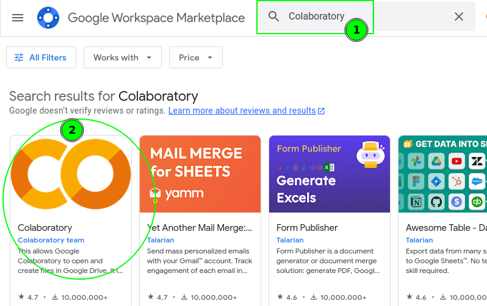
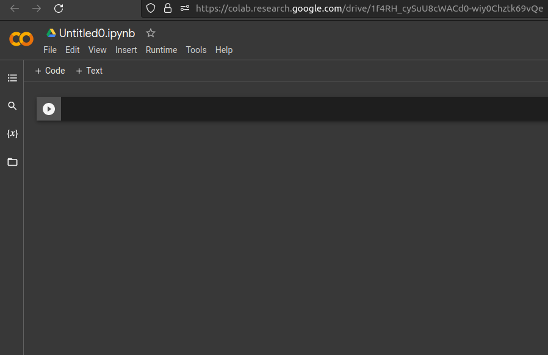
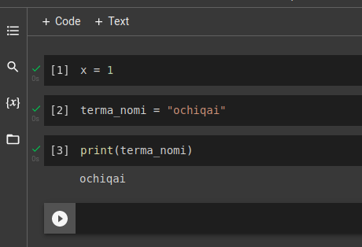

## Google colab ochish

### O'rnatish
- Google drive boramizda, quyidagini bosamiz

  

- Keyin `More > Connect more apps` ga boramiz
- `Colaboratory` topib o'rnatamiz

   

  

## Ishlatish

- Google drive boramizda, quyidagini bosamiz

  

- `New > More` ni bosamiz, keyin `Google Colaboratory`ni tanlaymiz

    

- Bu endi bizga `python` da ishlaydigan joy. Kompyuter o'zi google servelarida ishlaydi
  

