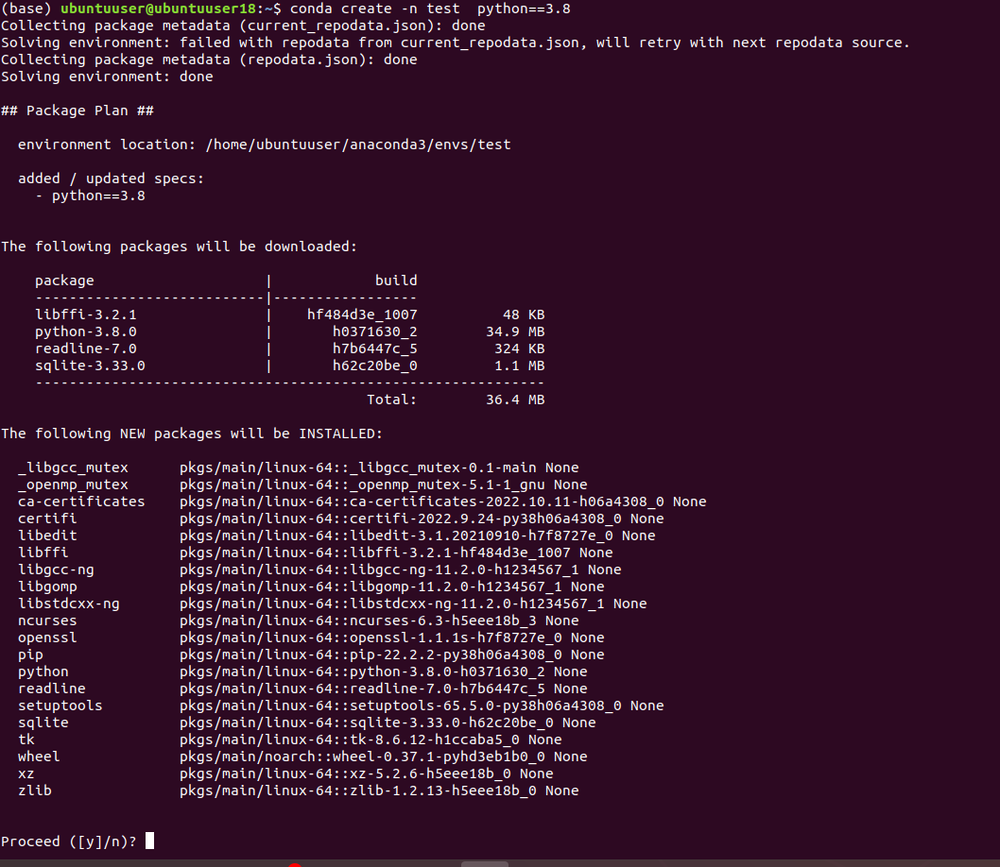

# Condada environment (muhit) yaratish
 
Biz projectlar bilan ishlayotganimizda kutibxonalarga murojat qilamiz,har xil projektda ishlaganimizda turlixil biblatrkalar
 ornatganimizda bizda ba'zi muammolar kelib chiqishi mumkin, masalan `Django` da bizga ishlatiladigan kutibxonalar
`AI` da ishlatilmasligi mumkin shuning uchin biz ozimizga qulay bolgan muhit (`environment`) yaratib olish maqsasdga muvofiq boladi
.

Muhit yaratish uchun `Minnicondadan` foydalanamiz.birinchi orinda kompyuterga Minni kondani o'rnatib olamiz
👇https://docs.conda.io/projects/conda/en/latest/user-guide/install/linux.html link orqali condani kompyuterga `install`(o'rnatib)
olamiz.

O'rnatib olgandan keyin yangi muhit yaratish uchun biz terminlaga otamiz 

```conda create -n environment_nomi python==3.8  ``` shundan song 
 y ni bosamiz bu bizga yangi enviroment yaratib beradi

va uni ishga tushirish uchun ```activate  environment_nomi``` qilib  ishga tushuramiz
. 

va unga kerakli biblatekalarni ornatishda ```conda  ``` kalit sozidan foydalaniladi yoki `Pycharimda interpreted settings`
dan unga biblatekalar ornatishni boshlimi


