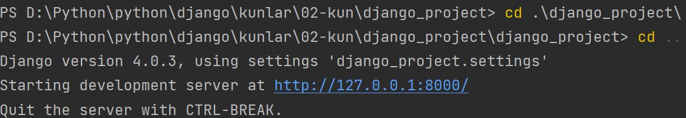
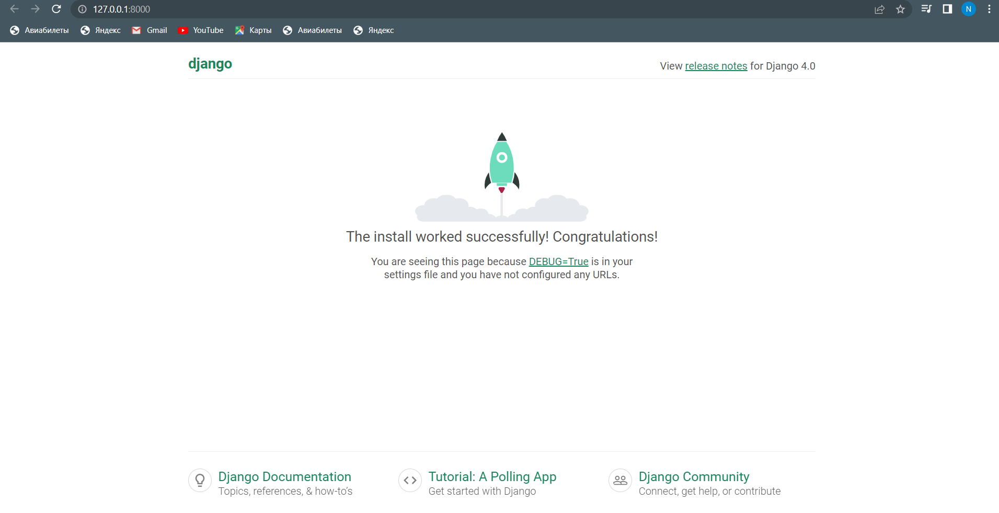

## [Django: o'rnatish va ishga tushirish](#django--o-rnatish-va-ishga-tushirish)
  * [Djangoni o'rnatish](#djangoni-o-rnatish)
  * [Ishga tushirish](#ishga-tushirish)


### Djangoni o'rnatish 


1. Terminalda quyidagi kommandani ishlatish orqali djangoni o'rnatamiz:
    ```console
    ochiqai@com:~$ pip install django
    ```
    

2. Django versiyasi tekshirish.
    ```console
    ochiqai@com:~$ python -m django --version
    ```
    
3. Djangoda mavjud bo'lgan buyruqlarni ko'rishni quyidagicha amalga oshiramiz:

    ```console
    ochiqai@com:~$ django-admin
    ```
   
    <details>
    <summary>django kommandalari</summary>
   
    ```console
    [django]
    check
    compilemessages
    createcachetable
    dbshell
    diffsettings
    dumpdata
    flush
    inspectdb
    loaddata
    makemessages
    makemigrations
    migrate
    runserver
    sendtestemail
    shell
    showmigrations
    sqlflush
    sqlmigrate
    sqlsequencereset
    squashmigrations
    startapp
    startproject
    test
    testserver
    ```  
    </details>

<br>

### Ishga tushirish

Quyidagi kommanda orqali yangi proyekt yaratamiz:

```console
ochiqai@com:~$ django-admin startproject django_project
```

`django_project` - bu proyekt nomi hisoblanadi. Kommanda ishlagandan so'ng, django_project deb nomlangan papka 
ko'rishimiz mumkin. Misol uchun, aytaylik siz 02-kun papka ichidasiz va yuqoridagi kommandani ishlatdingiz shunda 
`django_project` degan papkani ko'rishingiz mumkin:
   
<p align="center">
    
</p>

Proyektni ishga tushurish uchun, quyidalarni bajaramiz 

  1. Serverni ishlatamiz. Birinchi `manage.py` fayli joylashgan papkaga boramiz `cd django_project`. 

        ```console
        ochiqai@com:~$ cd django_project
        ```

  2. Keyin quyidagini ishlatamiz

        ```console
        ochiqai@com:~$ python manage.py runserver
        ```

Va ekranga quyidagiga o'xshash yozuvlarni ko'rishimiz mumkin:

<p align="center">

</p>

U yerda bizga sever qayerda ishlayotgani ko'rsatuvchi adress beriladi: `http://127.0.0.1:8000/`.
Ushbu manzil olib brovserda ishlatsak, quyidagini ko'rishimiz mumkin:

<p align="center">
   
</p>
Yani hozirgi yaratgan proyektimiz ishlayapti demakdir!

Diqqat! `http://127.0.0.1:8000/` adressdagi, `127.0.0.1` ning o'rniga `localhost` bilan almashtirsak ham
bo'ladi - bir xil ishlaydi (`http://localhost:8000/`).