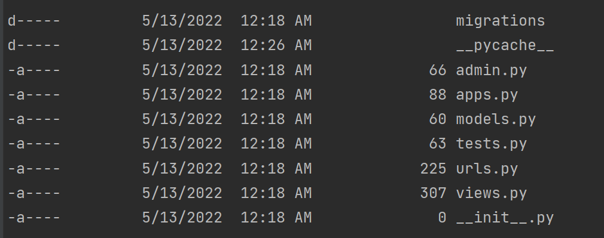

## Django Apps va _blog_ nomli app qilish
 
* django muhitini o'rnatib bo'lgach, `blog` nomli app yaratamiz.
`python manage.py startapp blog` bu buyruq orqali `blog` nomli yangi app yaratamiz.
<p align="center">
    
</p>

`blog`da mavjud ma'lumotlar quyidagilar.

<p align="center">
    
</p>

* Biz asosiy sahifada `Blog home` so'zini foydalanuvchiga ko'rsatish uchun sodda veb sayt yaratishni ko'rib chiqamiz.

<br>

* Biz `blog` nomli app yaratib oldik. `blog` fayli ichidan `views.py` fayliga kiramiz. Foydalanuvchiga ko'rinadigan barcha amallarni `views.py` faylida amalga oshiramiz.

<br>

* `views.py` faylida quyidagi amallarni bajaramiz.

```python 
from django.shortcuts import render
from django.http import HttpResponse


def home(request):
    return HttpResponse('<h1>Blog home</h1>')
```

Biz foydalanuvchiga `Blog home` matnni qaytarmoqchimiz.
`from django.http import HttpResponse` Shuning uchun biz `HttpResponse` dan foydalanamiz. 

`home` nomli funksiya yaratdik, qachonki biz funksiyani chaqirganimizda `HttpResponse` orqali foydalanuvchiga
 `Blog home` matnini qaytaradi.

* Endi biz `blog` fayli ichiga yangi `urls.py` nomli fayl yaratamiz va quyidagilarni bajaramiz.

```python
from django.urls import path
from . import views

urlpatterns = [
    path('',views.home, name='blog-home'),
]
```

* `django_project` fayl ichidagi `urls.py` faylini ochib quyidagi amallarni bajaramiz.


dastlabki holat

```python
from django.contrib import admin
from django.urls import path

urlpatterns = [
    path('admin/', admin.site.urls),
]
```
va quyidagilarni bajaramiz.

```python
from django.contrib import admin
from django.urls import path, include

urlpatterns = [
    path('admin/', admin.site.urls),
    path('', include('blog.urls')),
]
```
* Serverni ishlatib ko'ramiz. `python manage.py runserver`

<p align="center">
    
</p>

`http://127.0.0.1:8000/` manzilga kirsak, quyidagicha ko'rinish hosil bo'ladi.

<p align="center">
    
</p>

* `http://127.0.0.1:8000/` manzildan `/` belgisidan keyin ochiqai deb yozganimizda ya'ni `http://127.0.0.1:8000/ochiqai` ga kirganimizda bizga `Ochiq AI ga xush kelibsiz` degan matn qaytaradigan yangi sahifa qo'shishni ko'rib chiqamiz.


* `blog` faylidagi `views.py` fayliga quyidagicha ishni amalga oshiramiz.

```python
from django.shortcuts import render
from django.http import HttpResponse


def home(request):
    return HttpResponse('<h1>Blog home</h1>')

def ochiqai(request):
    return HttpResponse('<h1>Ochiq AI ga xush kelibsiz! </h1>')
```
`Ochiq AI ga xush kelibsiz!` matnini foydalanuvchiga qaytaradigan `ochiqai` nomli funksiyani hosil qilib oldik.


* `blog` faylidagi `urls.py` fayliga quyidagicha ishni amalga oshiramiz.

```python
from django.urls import path
from . import views

urlpatterns = [
    path('',views.home, name='blog-home'),
    path('ochiqai/',views.ochiqai,name='blog-ochiqai'),
]
```

* Serverni qayta ishga tushuramiz. `python manage.py runserver`

`http://127.0.0.1:8000/` manzilga kiramiz.

<p align="center">
    
</p>

* `http://127.0.0.1:8000/ochiqai/` manzilga kirsak, quyidagi yangi sahifamizni ko'rishimiz mumkin.

<p align="center">
    
</p>

`Ctrl + C` tugmasini bosib server ishlashini to'xtatamiz.