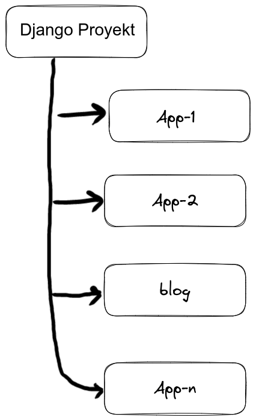
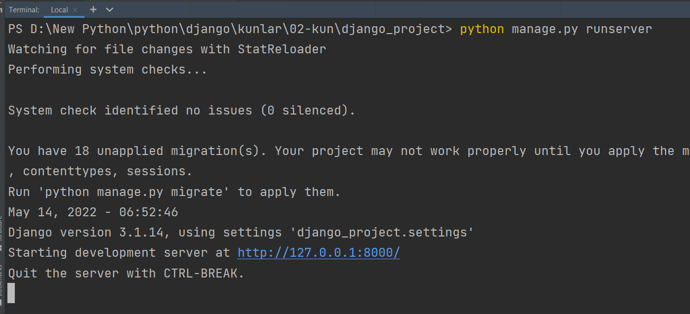
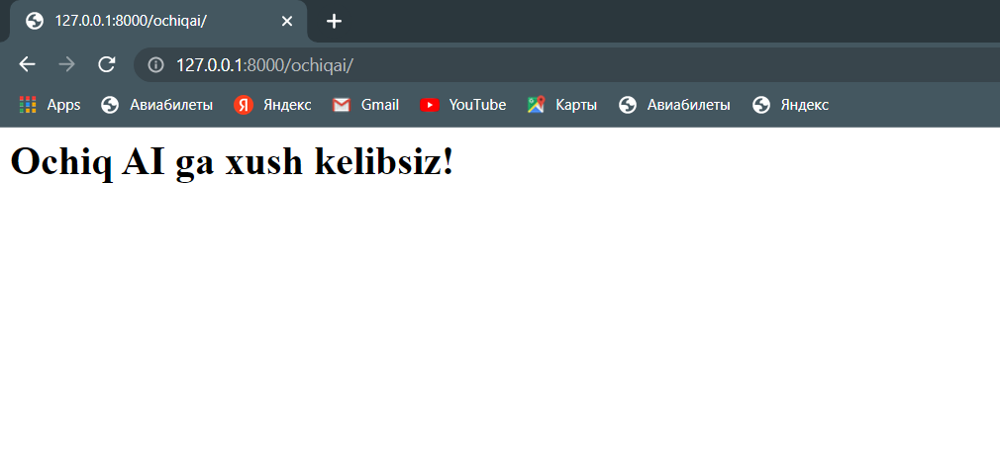

## Django Apps 
  * [Kirish](#kirish)
  * [Blog App yaratish](#blog-app-yaratish)
  * [OchiqAI sahifasini qo'shish](#ochiqai-sahifasini-qo-shish)

#### Kirish
Bundan oldingi bobda django muhitini o'rnatdik va dango proyekt yaratdik. Hozir app 
haqida gaplashamiz. Boshida bu terminlar shalkash ko'rinadi. Proyektlar qilish bilan 
yaxshi tushunib boraveramiz. Umuman olganda django orqali proyekt yaratganimizda, 
proyekt bir nechta applardan tashkil topishligi mumkin. Endi app tushunachasi bilan 
tanishamiz. App - bu nomidan ko'rinib turibdiki aniq bir vazifani qiladigan programma.

<p align="center">
    
</p>


### Blog App yaratish 
Biz djangoni o'rganish mobaynida blog qilishni ko'ramiz, o'shaning uchun blog nomli app 
yaratamiz: _blog_. Ya'ni terminalda quyidagi kommandani ishlatamiz:

 ```console
 ochiqai@com:~$ python manage.py startapp blog
 ```
    
Bu kommanda blog nomli app hamda blog nomli papka yaratadi

```
django_project      
│   manage.py
└───blog
│   __init__.py
│   admin.py
│   apps.py
│   models.py
│   tests.py
│   views.py
└───django_project
    │   __init__.py
    │   asgi.py
    │   settings.py
    │   urls.py
    │   wsgi.py 
```

`blog` papkasiga nazar tashlasak quyidagilar ko'ramiz:

```
blog      
│   __init__.py
│   admin.py
│   apps.py
│   models.py
│   tests.py
│   views.py
```

Tabbiyki biz shu paytgacha hech qanday kod yozganimiz yo'q. Lekin, kod yozilgan fayllar ko'p. Hozircha bundan
havotirlanishimiz shart emas. Aynan har bir fayl nimaga kerakligini va nima qilishligini yo'l yo'lakay 
ko'rib ketaveramiz.

Shulardan eng birinchi ko'radiganimiz `views.py`. Bu faylda biz funksiyalar yaratamiz. Bu funksiyalar saytimiz
ko'rinishiga va bajaradigan vazifasiga ta'sir qiladi. Xullas, shu faylga o'zgartirish orqali blog appimizni 
jonlantirishni boshlaymiz! Aytaylik, foydalanuvchi blogga kirganida bosh sahifada `Blog home` deb yozuvni ko'rsin. Buni
quyidagicha amalga oshiramiz
<br>
- `views.py` fayliga kiramiz.  
- ```home``` funksiyasini quyidagicha yaratamiz

  ```python 
  from django.shortcuts import render
  from django.http import HttpResponse

  def home(request):
      return HttpResponse('<h1>Blog home</h1>')
  ```

  Bu yerda `<h1>Blog home</h1>` kodi foydalanuvchiga `Blog home` matnni ko'rsatish uchundir. Qachonki biz funksiyani 
  chaqirganimizda, `HttpResponse` foydalanuvchiga `Blog home` matnini qaytaradi.


Shundan so'ng, project shu funksiyani topishligi uchun manzil beramiz. Buning uchun birinchi `blog` folderidan
`urls.py` nomli fayl yaratamiz.

```
blog      
│   __init__.py
│   admin.py
│   apps.py
│   models.py
│   tests.py
│   urls.py    <---[shu fayl hozir yaratildi]
│   views.py
```

Endi `urls.py` fayliga quyidagicha yozamiz:

  ```python 
  from django.urls import path
  from . import views
  
  urlpatterns = [
      path('', views.home, name='blog-home'),
  ]
  ```

Bu yerda `path('', views.home` degani: saytga kirganimizda eng birinchi views faylidagi `home` funksiyasi ishlasin degani
(`views.home`)

Shunga o'xshash `django_project` papkasidagi `urls.py` fayliga quyidagi o'zgartirish kiritamiz:

  ```python
  from django.contrib import admin
  from django.urls import path, include
  
  urlpatterns = [
      path('admin/', admin.site.urls),
      path('', include('blog.urls')),
  ]
  ```
Bu yerda, oxirgi qatorni tushunishimiz darkor: `path('', include('blog.urls')),`. Ya'ni, proyektga aytayapmizki blog 
appiga tegishli manzillarni `include` moduli orqali olgin `include('blog.urls')`.

Shu bilan blog home (asosiy, kirish) sahifamiz tayyor. 

Endi, blogimiz bosh sahifasini ko'rish uchun, serverni ishlatamiz

```console
ochiqai@com:~$ python manage.py runserver
```

<p align="center">
    
</p>

`http://127.0.0.1:8000/` manzilga boramiz, quyidagicha ko'rinish hosil bo'ladi.

<p align="center">
    
</p>


### OchiqAI sahifasini qo'shish
Shu paytgacha biz bosh sahifani ko'rib chiqdik. Endi aytaylik yangi sahifa qo'shmoqchimiz, 
nima qilamiz? Hozirgacha qilgan ichimizni yana takrorlaymiz!:

1. `views.py` fayliga ochiqai funksiyasini qo'shamiz:
   ```python
   from django.shortcuts import render
   from django.http import HttpResponse
      
   def home(request):
       return HttpResponse('<h1>Blog home</h1>')
   
   def ochiqai(request):
       return HttpResponse('<h1>Ochiq AI ga xush kelibsiz! </h1>')
   ```
   `Ochiq AI ga xush kelibsiz!` matnni foydalanuvchiga qaytaradigan `ochiqai` nomli funksiyani hosil qilib oldik.

2. `urls.py` fayliga addresni beramiz.

   ```python
   from django.urls import path
   from . import views
   
   urlpatterns = [
       path('', views.home, name='blog-home'),
       path('ochiqai/', views.ochiqai, name='blog-ochiqai'),
   ]
   ```
    Diqqat qilishimiz kerak, bunda `''` deb emas, balki `'ochiqai/'` deb manzil berayapmiz. Bu degani, ochiqai 
    sahifasiga borish uchun albatta saytimiz manzili oxiri `'ochiqai/'` bo'lib tugashligi kerak.

3. Serverni ishga tushuramiz (agar server ishlayotgan bo'lsa shartmas). 

   ```console
   ochiqai@com:~$ python manage.py runserver
   ```

4. `http://127.0.0.1:8000/` manzilga kiramiz.
   * `http://127.0.0.1:8000/` manzildan `/` belgisidan keyin ochiqai deb yozamiz
     * `http://127.0.0.1:8000/ochiqai`  

   Va quyidagi yangi sahifamizni ko'rishimiz mumkin:

   <p align="center">
       
   </p>

Serverni to'xtatish uchun terminalda turib `Ctrl + C` ni bossak server to'xtaydi.

### Eslatmalar
- Djangoda Apps nima? 
  - Saytning aniq bir vazifasini bajaradigan bo'lagi. Masalan, sayt bir necha bo'limdan tashkil topishi mumkin. 
  - Blog bo'lishi mumkin. Elektron magazin bo'lishi mumkin va hokazo. 
  - Shunda, blog bitta app, elektron magazin yana boshqa app bo'lishligi mumkin.
- views.py nima uchun kerak?
  - Appning ko'rinishini belgilaydigan joy. By yerda asosiy funksiyalar yaratiladi. 
- App ichidagi urls.py nima uchun kerak?
  - Bunda views.py da yaratilgan funksiyalarga manzillar beriladi.  
- Proyektdagi urls.py nima uchun kerak?
  - Sayt ishlaganda, sayt birinchi hamma manzillar shu yerdaligini biladi. Keyin o'sha manzillar orqali 
  - boshqa applarga borish mumkin. Masalan, blog appiga boriladi.


