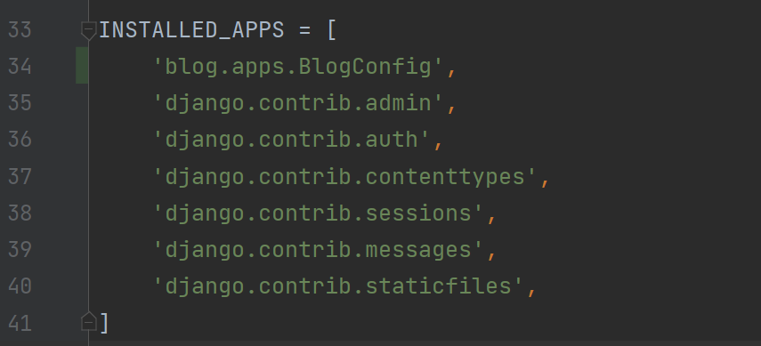
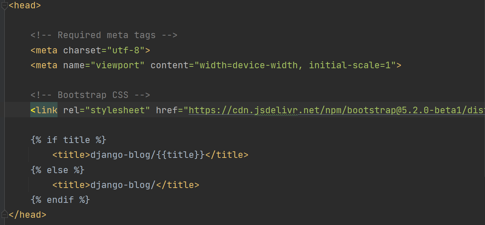
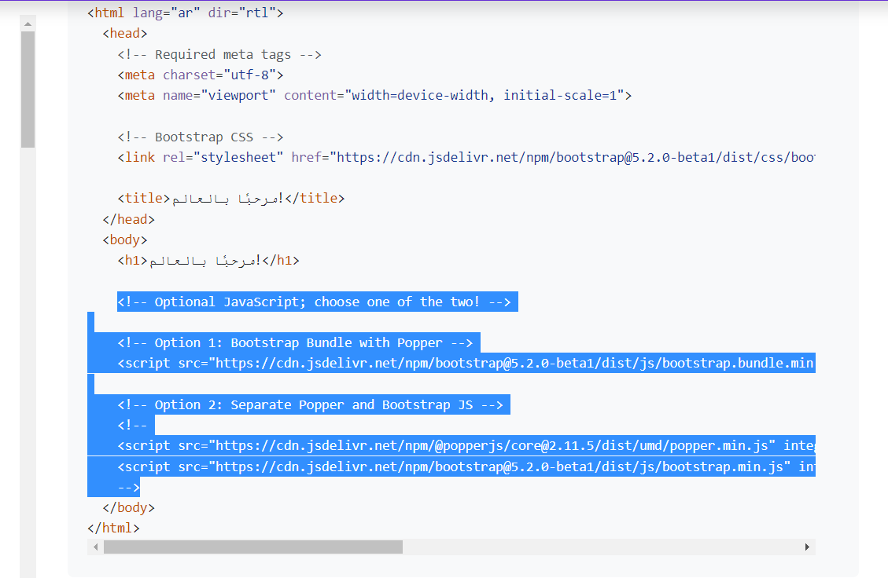
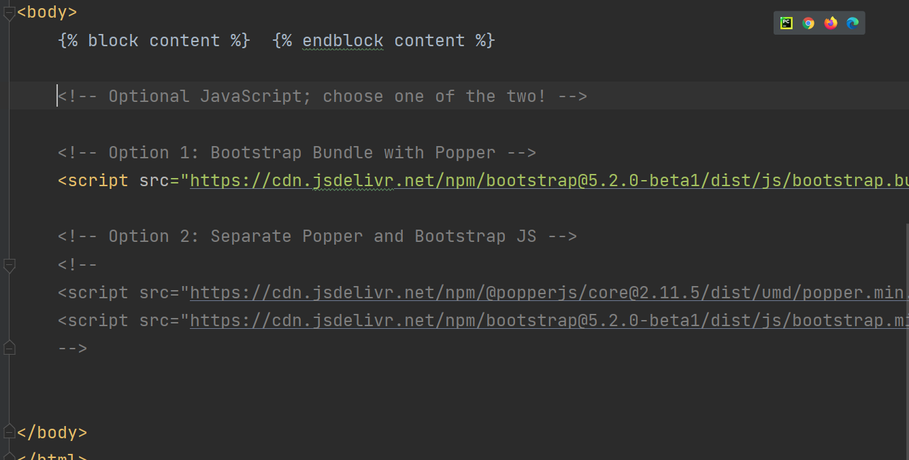

## Django Templates 

* 03-kunda biz `blog` nomli app yaratib olgandik. `blog` nomli papkamizdan, templatelar uchun  yangi `templates` nomli papka yaratib olamiz.
* Yaratgan `templates` nomli papkamiz ichidan yangi `blog` nomli papka yaratib olamiz.
* Biz nima qildik? `blog-> templates-> blog-> template.html` . `blog` nomli appimizdan templateslar uchun `templates` nomli papka yaratdik, va `templates` papka ichidan `blog` nomli papka yaratib oldik. Bu yerda biz templateslar uchun htmlga oid fayllar bilan ishlaymiz.
* Templateslar uchun yaratgan `blog` papka ichidan `home.html` va `about.html` nomli yangi html kengaytmali fayllarni yaratib olamiz.
* `home.html` fayli ichida quyidagi ishni amalga oshiramiz.
```python
<!DOCTYPE html>
<html>
<head>
    <title></title>
</head>
<body>

    <h1>Blog home!</h1>

</body>
</html>
```
* `blog` nomli appimiz ichidagi `apps.py` nomli faylidan class nomidan nusxa olib, `django_project` loyihamiz ichidagi `settings.py` ga `INSTALLED_APPS` qismiga quyidagicha appimizni qo'shib qo'yamiz. (34-qator)
<p align="center">
    
</p>

* Endi `blog` papka ichidagini `views.py` fayliga borib quyidagi ishni amalga oshiramiz.

```python
from django.shortcuts import render
from django.http import HttpResponse
def home(request):
    return render(request,"blog/home.html")
```

* Terminalga borib serverni ishlatib ko'ramiz.

<p align="center">
    
</p>

* Endi `about.html` ga borib quyidagi ishni bajaramiz.
Ya'ni `About Page` so'zini chiqarib ko'ramiz.
```python
<!DOCTYPE html>
<html>
<head>
    <title></title>
</head>
<body>

    <h1>About Page</h1>

</body>
</html>
```

* `about.html` ni ham `home.html` kabi `blog` appimiz ichidagi `views.py` ga borib quyidagi ishni amalga oshiramiz.

```python
from django.shortcuts import render
from django.http import HttpResponse
def home(request):
    return render(request,"blog/home.html")

def about(request):
    return render(request,"blog/about.html")
```

* `http://127.0.0.1:8000/` manzilimizdan so'ng `about` so'zini yozib ishlatsak, quyidagicha oyna hosil bo'ladi.

<p align="center">
    
</p>

* `views.py` quyidagicha xabar yozamiz.

```python
xabarlar = [
    {
        'muallif': 'Ulugbek',
        'sarlavha': 'Toshkent haqida',
        'matn': 'Toshkent Uzbekistanni poytaxti',
        'sana': 'may 28, 2022'
    },
    {
        'muallif': 'Orif',
        'sarlavha': 'Samarkand haqida',
        'matn': 'Samarkand Uzbekistanni shaharchasi',
        'sana': 'may 29, 2022'
    }
]
```

`home` nomli funksiyaga quyidagicha o'zgartisihlar kiritamiz.

```python
def home(request):
    context = {
        "xabarlar":xabarlar
    }
    return render(request,"blog/home.html",context)
```

`home.html` ga quyidagi ishni bajaramiz.

```python
<!DOCTYPE html>
<html>
<head>
    <title></title>
</head>
<body>
        
            <h1>{{ xabar.sarlavha}}</h1>
        
        <h1>Blog home</h1>
</body>
</html>
```
`` bu belgilarning o'rtasida biz python kodlarini yozishimiz kerak. 
Serverni ishlatib ko'rsak quyidagi oyna hosil bo'ladi.


<p align="center">
    
</p>

`Title`ga sarlavha yozishni ko'ramiz.
Quyidagi ishlarni bajarsangiz `title` o'zgarganini ko'rasiz.
* `home.html` ga quyidagicha yozamiz.


```python
<!DOCTYPE html>
<html>
<head>
        
        <title>django-blog/{{title}}</title>
        
            <title>django-blog/</title>
        
</head>
<body>
        
            <h1>{{ xabar.sarlavha}}</h1>
        
        <h1>Blog home</h1>
</body>
</html>
```

* `about.html` ga quyidagicha yozamiz.

```python
<!DOCTYPE html>
<html>
<head>
        
        <title>django-blog/{{title}}</title>
        
            <title>django-blog/</title>
        
</head>
<body>
        <h1>About home</h1>
</body>
</html>
```

`views.py`dan `about` funksiyaga boramiz va `title` ga `ochiqai` deb argument beramiz.
```python
def about(request):
    return render(request,"blog/about.html",{'title':" ochiqai"})
```

<p align="center">
    
</p>

<p align="center">
    
</p>

E'tibor bersangiz `title` qismimizning sarlavhasini o'zgartirdik.

* Ba'zida  `html`kengaytmali fayllar yaratganimizda bir xil kodlarni qayta qayta yozishizga to'g'ri keladi. Endi biz buning osonroq yo'lini ko'ramiz.
Buning uchun birinchi `templates` ichidagi `blog` faylidan `base.html` nomli yangi html kengaytmali fayl yaratib olamiz.

* `base.html` ga quyidagicha ishni amalga oshiramiz.

```python
<!DOCTYPE html>
<html>
<head>
    
        <title>django-blog/{{title}}</title>
    
        <title>django-blog/</title>
    
</head>
<body>




</body>
</html>
```

`home.html` dan `base.html` ga o'xshash qismlarini olib tashlaymiz va quyidagicha o'zgartirishlar qilamiz.

```python



    
        <h1>{{ xabar.sarlavha}}</h1>
    
    <h1>Blog home</h1>

```
`extends` funksiyadan foydalanib `base.html` chaqirgan holda kodlarimizni osonroq ko'rinishga keltiramiz.

* `about.html` ga ham huddi shu tarzda o'zgartiramiz.

```python



    <h1>About home</h1>

```
* Serverni qayta ishlatsangiz avvalgidek ishlayveradi.

<p align="center">
    
</p>

<p align="center">
    
</p>

* `Bootstrap`dan foydalanish.

https://getbootstrap.com/docs/5.2/getting-started/rtl/#starter-template quyidagi manzilga borib, saytimizni chiroyliroq ko'rinishga keltirish uchun ma'lum qismini o'zimizga ko'chirib olamiz.

<p align="center">
    
</p>

<p align="center">
    
</p>
* Yuqorida ko'rsatilgan qismdan nusxa olib, `base.html` faylimizning `head` qismiga tashlaymiz. `title` dan nusxa olmadik, chunki `base.html`da `title` qismi mavjud.


* Huddi shunday qilib `body` qismidagi kodlarni `base.html` faylimizning `body` qismimizga nusxa olamiz.

<p align="center">
    
</p>

<p align="center">
    
</p>

* `bootstrap` ni ishlatganimizdan so'ng, ko'p o'zgarishlar bo'ladi.

* `body` qismidagi `block content` alohida `div`ga olib `class`ga `container` nomini berib serverimizni ishlatib ko'ramiz.
```python
<div class="container">
  
</div>
```
<p align="center">
    
</p>

