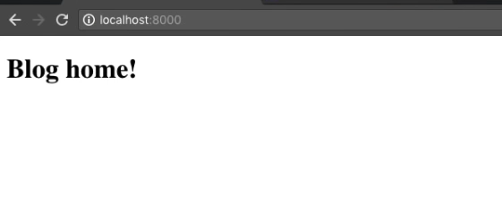
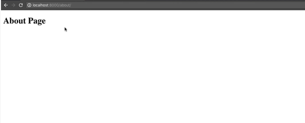
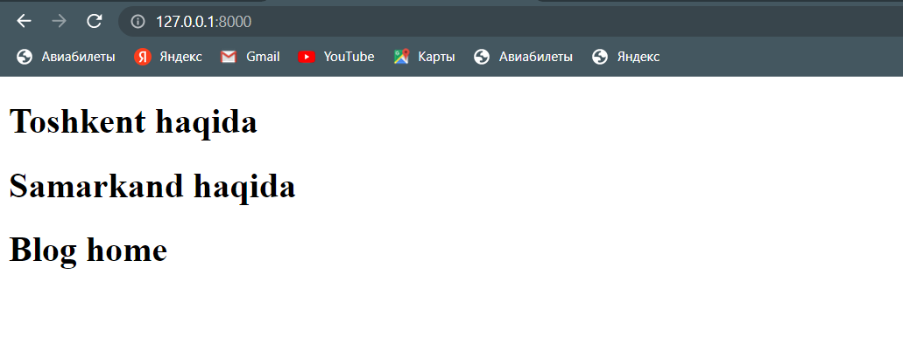
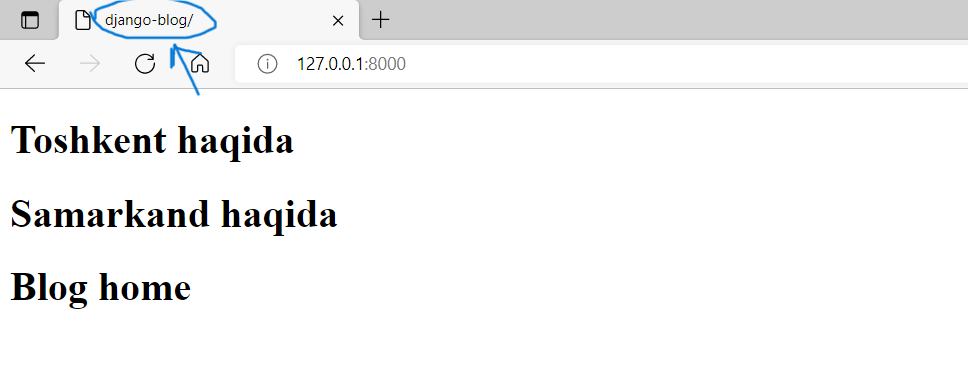
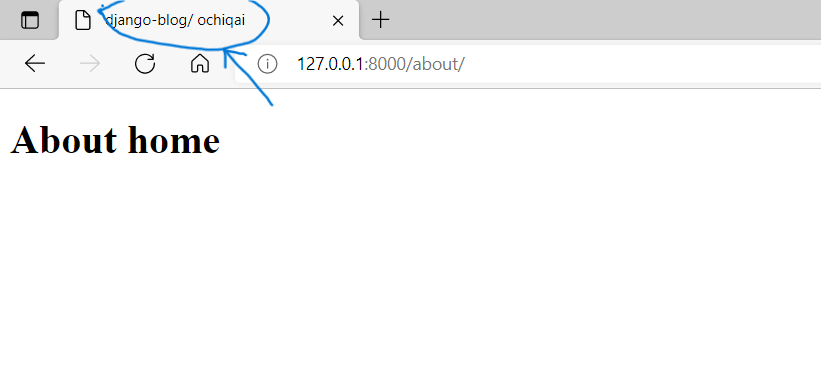
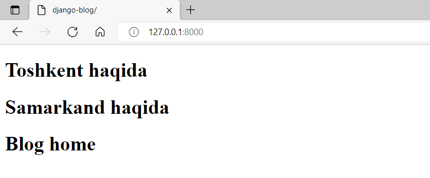
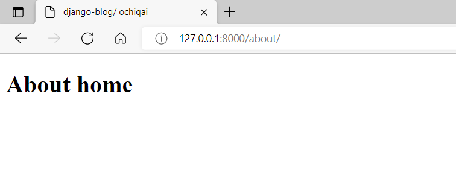
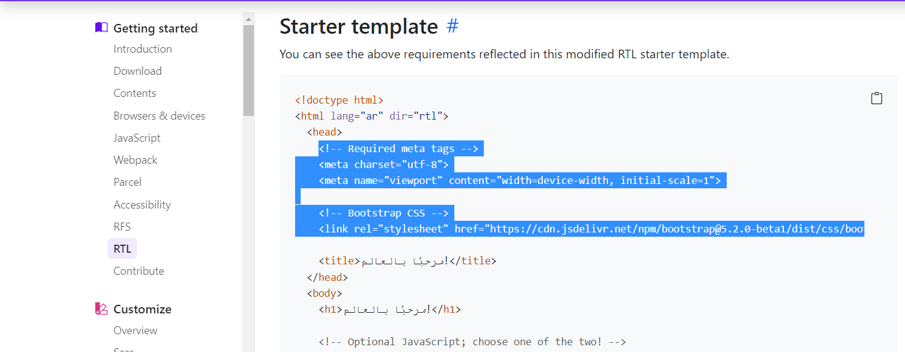
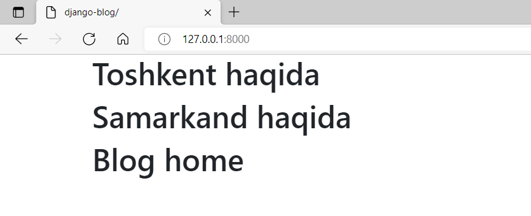

## Django Templates 
  * [Nimage templates](#nimage-templates)
  * [Templates yaratish jarayoni](#templates-yaratish-jarayoni)
  * [Blogga xabarlar qo'yish](#blogga-xabarlar-qo-yish)
  * [Sayt sarlavhasi bilan ishlash](#sayt-sarlavhasi-bilan-ishlash)
  * [Takrorlanishga qarshi](#takrorlanishga-qarshi)
  * [Blog bosh sahifasini yaxshilash](#blog-bosh-sahifasini-yaxshilash)

### Nimage templates

Avvalgi darsimizda biror matnni foydalanuvchiga ko'rinadigan qilib ko'rgandik. 
Bunda biz funksiya yordamida amalga oshirgan edik. 
Keyinchalik darsturimiz kattalashib ketgach, biz ko'plab kod yozishimizga to'g'ri keladi.
Bu amallarni funksiya yordamida bajarsak, kodlarimiz tushunarsiz va tartibsiz bo'lib qoladi. 
Bu kabi muammolar bo'lmasligi uchun biz `templates`lardan foydalanamiz.


### Templates yaratish jarayoni

`blog` appini davom ettiramiz. `blog` papkasidan, templatelar uchun  yangi `templates` nomli papka yaratamiz.
Uning ichidan `blog` appimizga tegishli yangi `blog` nomli papka yaratib olamiz. Papka nomi app nomi bilan 
bir xil bo'lishi kerak.

```
django_project      
│   manage.py
└───blog
    │   __init__.py
    │   admin.py
    │   apps.py
    │   models.py
    │   tests.py
    │   views.py
    └───templates
        └───blog

```

`blog` appimizga tegishli barcha `templates`larni shu yerda bajaramiz.

Foydalanuchiga asosiy sahifada ko'rinadigan `Blog home!` matnini ko'rsatish jarayonini ko'rib chiqamiz. 
Buning uchun yangi `home.html` faylini yaratib olamiz. (templates papka ichidagi blog papkasi ichidan) 
`home.html` fayli ichi quyidagicha bo'ladi:

```
<!DOCTYPE html>
<html>
<head>
    <title></title>
</head>
<body>
    <h1>Blog home!</h1>
</body>
</html>
```

`blog` appimiz ichidagi `apps.py` faylidan class nomidan nusxa olib, `django_project` loyihamiz 
ichidagi `settings.py` ga `INSTALLED_APPS` qismiga quyidagicha appimizni qo'shib qo'yamiz. 

```console
# settings.py fayli
INSTALLED_APPS = [
    'blog.apps.BlogConfig', <--- [shu qatorni qo'shib qo'yamiz.]
    'django.contrib.admin',
    'django.contrib.auth',
    'django.contrib.contenttypes',
    'django.contrib.sessions',
    'django.contrib.messages',
    'django.contrib.staticfiles',
]
```

Yaratgan applarimizni shu yerda qo'shib ketishimiz kerak. Bu yerdan biz yaratgan appimizga bog'lanib, 
ma'lumotlarni uzatadi. Endi `blog` papka ichidagini `views.py` fayliga borib quyidagi ishni amalga oshiramiz.

```python
from django.shortcuts import render
from django.http import HttpResponse

def home(request):
    return render(request, "blog/home.html")
```

Qachonki funksiyani chaqirganimizda `render` orqali `blog` papka ichidagi `home.html`dagi ma'lumotlarni 
foydalanuvchiga qaytaradi. Terminalga borib serverni ishlatamiz 

```console
ochiqai@com:~$ python manage.py runserver
```

<p align="center">
    
</p>

Keling yana boshqa fayl yaratamiz `about.html` nomli. 
`home.html` joylaylashgan papkada `about.html` ni hosil qilib olamiz. Unga quyidagi kodni yozamiz:


```html
<!DOCTYPE html>
<html>
<head>
    <title></title>
</head>
<body>

    <h1>About Page</h1>

</body>
</html>
```

Bunda `About Page` so'zini chiqarayapmiz.

`about.html` ni ham `home.html` kabi `blog` appimiz ichidagi `views.py` ga borib quyidagi ishni amalga oshiramiz:

```python
from django.shortcuts import render
from django.http import HttpResponse

def home(request):
    return render(request, "blog/home.html")

def about(request):
    return render(request, "blog/about.html")
```

Ishlab turgan serverdan, `http://127.0.0.1:8000/` dan so'ng `about` so'zini yozib ishlatsak, quyidagicha oyna hosil bo'ladi:

<p align="center">
    
</p>


### Blogga xabarlar qo'yish

`views.py`ga quyidagicha o'zgarishlar qilamiz:
 1. Har bir blogning sarlavhasi, muallifi, matni va qachon yozilganligi haqida malumot bo'ladi. Ushbu narsalarni 
    mujasammlashtirgan o'zgaruvchi xosil qilamiz. Uni nomini `xabarlar` deb ataymiz:  

    ```python
    bloglar = [
        {
            'muallif': 'Nuriddin',
            'sarlavha': 'Programma nima?',
            'matn': 
                """Programma bu aniq bir muammoni yechish uchun ko'rsatmalar ketma keltligidir. 
                    Programmalash esa mana shu ko'rsatmalarni ishlab shiqishdir. Shuning uchun, 
                    programmist uchun eng muhim kerak bo'ladigan mahorat bu berilgan muammoni hal qilish ketma-ketligini 
                    o'ylab topish. Yechim ko'rsatmalari aniq va to'g'ri bo'lishi shart. Bu mahorat, programma tuzish orqali 
                    shakllantiriladi. Qancha ko'p programma tuzsangiz shuncha yaxshi, ko'p o'qish yoki kino ko'rish bilan emas :).
                """,
            'sana': '28 Avgust, 2021'
        },
        {
            'muallif': 'Muhriddin',
            'sarlavha': 'Funksiya haqida',
            'matn': 
                """Biz programma ko'rsatmalardan tashkil topishini bildik. Kattaroq programma tuzayotganimizda, ko'rsatmalar 
                    ko'payib ketadi. Ularni ixchamlashtirish uchun, soddalashtirish uchun biron nima qilishimiz kerak.
                    Tasavvur qiling bir 999 varaqli kitob bor. Uning na mundarijasi, na bobi bor. Na bo'limi, na varaq 
                    nomeri bor. Boshidan oxirigacha hammasi tekst. Kitobni o'qiyotgan odam o'qib ketaveradi. Lekin u 
                    yerdan qaysi betga kelgani, o'qiyotgan joyi asosan nima uchunligi bilmay o'qib ketaveradi. Bu 
                    kitobxonga juda katta qiyinchilik bo'ladi. Mana shu va boshqa muammolarni hal qilish uchun 
                    kitoblarda quyidagilar qilingan:
                """,
            'sana': '17 Sentabr 2021'
        }
    ]
    ```
    
    Bu yerda, 2-ta elementi bo'lgan `list` yaratdik. Har bir elementi dict dan tashkil topgan. 
    Mana shu xabarlarni bosh sahifada chiqaramiz. Buning uchun, `home` nomli funksiyaga quyidagicha o'zgartisihlar kiritamiz.

    ```python
    def home(request):
        kontekst = {
            "bloglar": bloglar
        }
        return render(request, "blog/home.html", kontekst)
    ```
    Funksiyada `kontekst` degan o'zgaruvchiga `bloglar`ni yuklaymiz. Keyin, `kontekst` `render`ning uchunchi argument sefatida
    beramiz. Bu yerda shunday qilayapmizki, request

    `home.html` da quyidagi ishni bajaramiz.

    ```html
    <!DOCTYPE html>
    <html>
    <head>
        <title></title>
    </head>
    <body>
            
                <h1>{{ xabar.sarlavha}}</h1>
            
            <h1>Blog home</h1>
    </body>
    </html>
    ```
    
    `` bu belgilarning o'rtasida biz python kodlarini yozishimiz kerak. 
    Serverni ishlatib ko'rsak quyidagi oyna hosil bo'ladi.

<p align="center">
    
</p>

### Sayt sarlavhasi bilan ishlash

`title`ga sarlavha yozishni ko'ramiz. `home.html`ga quyidagilarni bajarsak `title` o'zgarganini ko'ramiz:

```html
<!DOCTYPE html>
<html>
<head>
        
        <title>django-blog/{{title}}</title>
        
            <title>django-blog/</title>
        
</head>
<body>
        
            <h1>{{ xabar.sarlavha}}</h1>
        
        <h1>Blog home</h1>
</body>
</html>
```

`about.html` ga quyidagicha yozamiz:

```html
<!DOCTYPE html>
<html>
<head>
        
        <title>django-blog/{{title}}</title>
        
            <title>django-blog/</title>
        
</head>
<body>
        <h1>About home</h1>
</body>
</html>
```

`views.py`dan `about` funksiyaga boramiz va `title` ga `ochiqai` deb argument beramiz.
```python
def about(request):
    return render(request, "blog/about.html", {'title': " ochiqai"})
```

Bu yerda `"ochiqai"` yozuvi `home.html` va `about.html`ga ketayapti.

<p align="center">
    
</p>

<p align="center">
    
</p>

E'tibor bersangiz `title` qismimizning sarlavhasini o'zgartirdik.


### Takrorlanishga qarshi 

Ko'pincha  `html` fayllar yaratganimizda bir xil kodlarni qayta qayta yozishga to'g'ri keladi. Shu maqsadda kodni
minimallashtirish uchun merosxo'rlik usuli bor. Bu nafaqat kodni kamaytirishga balki kodni tartibli va xatolarni kamaytirishga 
hizmat qiladi. Buning uchun birinchi `blog/templates` da `base.html` ni yaratamiz va unga quyidagicha yozamiz:

```html
<!DOCTYPE html>
<html>
<head>
    
        <title>django-blog/{{title}}</title>
    
        <title>django-blog/</title>
    
</head>
<body>




</body>
</html>
```

Shu bilan asosiy htmlni yaratib oldik. Endi, boshqa fayllarni shu faylga solishtiramiz va 
 o'xshash qismlarini olib tashlaymiz va quyidagicha o'zgartirishlar qilamiz.

`home.html` `base.html`ga qarshi

```python



    
        <h1>{{ xabar.sarlavha}}</h1>
    
    <h1>Blog home</h1>

```

`extends` modulidan foydalanib `base.html` chaqirgan holda kodlarimizni osonroq ko'rinishga keltiramiz.

`about.html` `base.html`ga qarshi

```python



    <h1>About home</h1>

```

Serverni qayta ishlatsangiz avvalgidek ishlayveradi.

<p align="center">
    
</p>

<p align="center">
    
</p>


### Blog bosh sahifasini yaxshilash

Hozirgacha qilingan web sahilarimiz ko'rinishi oddiy, va blogga o'xshamaydi. Ozroq ko'rinishini yaxshilaymiz. Ko'rinishni
yaxshilash maqsadida bir necha tayyor templatelar bor. Shulardan biri `bootstrap` deb ataladi. Hozir bootstrapdan foydalanishni ko'rib 
chiqamiz. [Man shu](https://getbootstrap.com/docs/5.2/getting-started/rtl/#starter-template) manzilga borib, kerakil qismlarni
ko'chirishni boshlaymiz:

<p align="center">
    
</p>

Yuqorida ko'rsatilgan qismni olib, `base.html`ning `head`tagiga tashlaymiz. `title`dan nusxa olmadik, 
chunki `base.html`da `title` qismi mavjud.

```html
<head>
    <!-- Required meta tags -->
    <meta charset="utf-8">
    <meta name="viewport" content="width=device-width, initial-scale=1">

    <!-- Bootstrap CSS -->
    <link rel="stylesheet" href="https://cdn.jsdelivr.net/npm/bootstrap@5.2.0-beta1/dist/css/bootstrap.rtl.min.css" integrity="sha384-dc2NSrAXbAkjrdm9IYrX10fQq9SDG6Vjz7nQVKdKcJl3pC+k37e7qJR5MVSCS+wR" crossorigin="anonymous">

    
        <title>django-blog/{{title}}</title>
    
        <title>django-blog/</title>
    
</head>
```

Xuddi shunday qilib `body` qismidagi kodlarni `base.html`ning  `body` qismiga tashlaymiz:

```html
<body>
    <div class="container">
      
    </div>
    <!-- Optional JavaScript; choose one of the two! -->

    <!-- Option 1: Bootstrap Bundle with Popper -->
    <script src="https://cdn.jsdelivr.net/npm/bootstrap@5.2.0-beta1/dist/js/bootstrap.bundle.min.js" integrity="sha384-pprn3073KE6tl6bjs2QrFaJGz5/SUsLqktiwsUTF55Jfv3qYSDhgCecCxMW52nD2" crossorigin="anonymous"></script>

    <!-- Option 2: Separate Popper and Bootstrap JS -->
    <!--
    <script src="https://cdn.jsdelivr.net/npm/@popperjs/core@2.11.5/dist/umd/popper.min.js" integrity="sha384-Xe+8cL9oJa6tN/veChSP7q+mnSPaj5Bcu9mPX5F5xIGE0DVittaqT5lorf0EI7Vk" crossorigin="anonymous"></script>
    <script src="https://cdn.jsdelivr.net/npm/bootstrap@5.2.0-beta1/dist/js/bootstrap.min.js" integrity="sha384-kjU+l4N0Yf4ZOJErLsIcvOU2qSb74wXpOhqTvwVx3OElZRweTnQ6d31fXEoRD1Jy" crossorigin="anonymous"></script>
    -->
</body>
```

Shu bilan `bootstrap`ni fayllarga qo'shib bo'ldik.  Endi, `base.html`ning `body` qismidagi `block content`ni 
alohida `div`ga olib `class`ga `container` yuklaymiz va serverni ishlatib ko'ramiz.

```html
<div class="container">
  
</div>
```

<p align="center">
    
</p>

