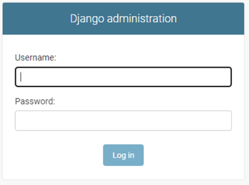
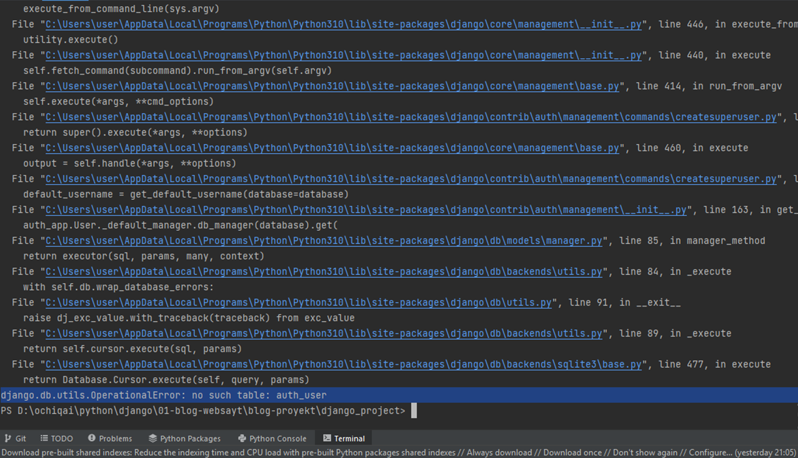
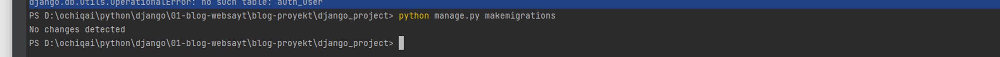
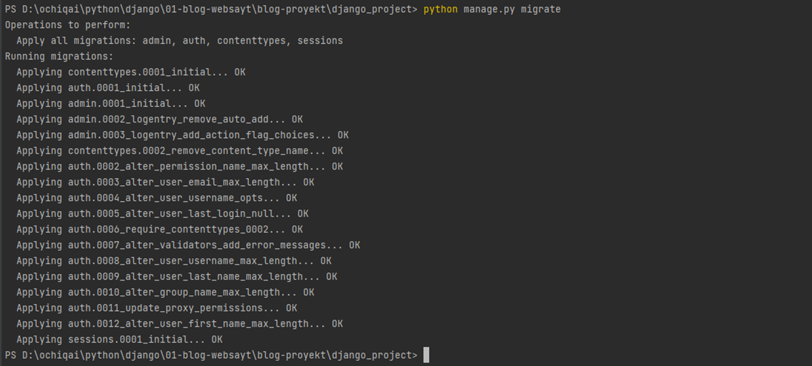
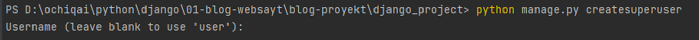
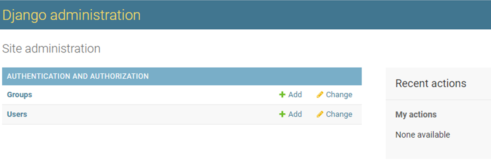
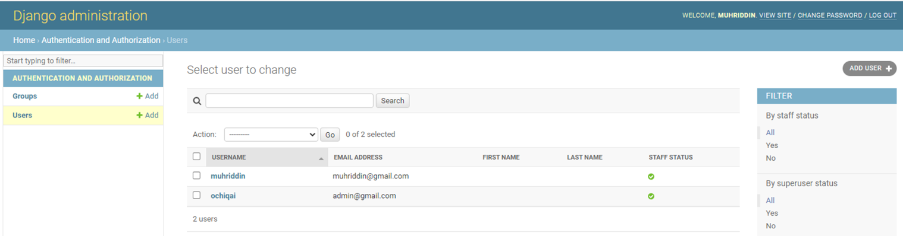
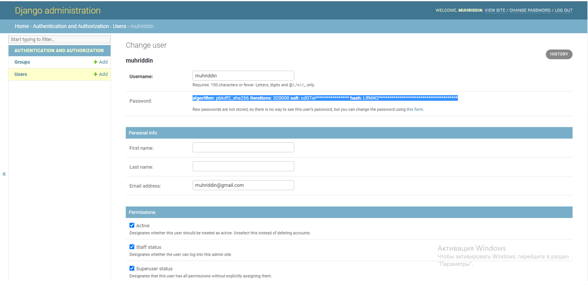
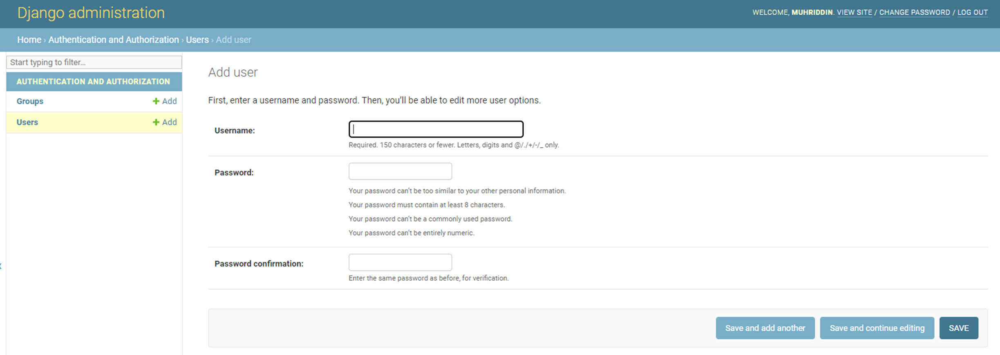
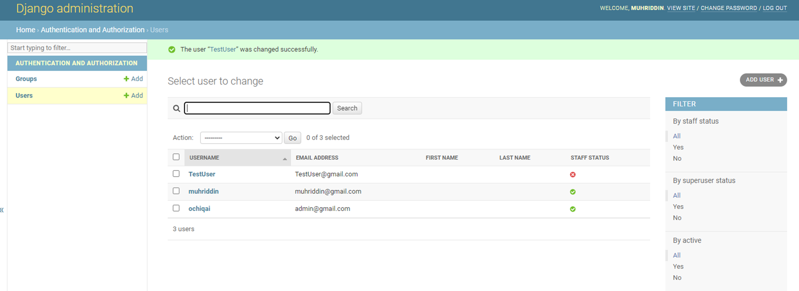

## Admin Sahifasi
- [Admin Sahifasi](#admin-sahifasi)
  * [Admin sahifasi nima?](#admin-sahifasi-nima-)
  * [Admin sahfisiga kirish](#admin-sahfisiga-kirish)
  * [Admin sahifasiga sayohat](#admin-sahifasiga-sayohat)


### Admin sahifasi nima?

Har bir sayt qilinganda murakkablik darajasiga qarab admin sahifasi bo'ladi. Ba'zi saytlarga admin
sahifasi shart bo'lsa, ba'zilariga shart emas. Masalan, saytimiz oddiy bo'lsa, obunachilar bo'lmasa -- shartmas.

Agar saytimiz murakkab yani obunachilar bo'lsa, onlayn maktab yoki magazin va shunga o'xshash bo'lsa admin 
sahifasi kerak bo'ladi. 

Djangoda admin sahifasi tayyor qilingan (minimal darajada). Hozir admin sahifasi bilan tanishamiz va 
u bilan nimalar qilish mumkinligimizni ko'ramiz.

Admin sahifasiga ruhsati bor kishi, sayt ustida mutloq boshqaruvga ega bo'ladi. Masalan, obunachilarni 
o'chirishi mumkin. Ularning yozgan bloklarini ham o'chirishi mumkin. 


### Admin sahfisiga kirish
Admin sahifasiga borish uchun. Web browserga saytimizning manzilini kiritamiz yani bu manzilni `http://127.0.0.1:8000/` 
hamda uning yonidan slash belgi`/` orqali `admin`ni kiritamiz. Shundan so'ng bizning sahifamizda quyidagini ko'ramiz:

<p align="center" width="350">
    
</p>

`Django administration` - bu django adminstratsiyasi deb ataladi. Va ikki joyda ma'lumot kiritib 
`login` orqali sahifaga kirishimiz mumkin. Lekin, bizda oldindan admin bo'lmaganligi uchun biz uni yaratib 
olishimiz kerak. Quyidagi etaplarni bajaramiz:
 * `django_server` serverni o'chiramiz agar ishlayotgan bo'lsa
 * `django_project` papkadan `python manage.py createsuperuser` ni ishlatamiz 
 * `terminal`da quyidagilar paydo bo'ladi

    <p align="center" width="450">
        
    </p>

 * `Terminal`ning so'ngi qismiga e'tibor beradigan bo'lsak, quyidagilar paydo bo'ladi: 
   * `django.db.utils.OperationalError: no such table: auth_user`. Bunda biz ishga tushurmoqchi bo'lgan `superuser` ishlamadi. 
   * Chunki biz `database` yaratmaganmiz yangi super foydalanuvchi (yani adminstrator) ni saqlab qo'yish uchun. 
 * `Database` yaratib olish uchun biz 
   * `python manage.py makemigrations` kiritamiz va quyidagilar paydo bo'ladi:
        <p align="center" width="450">
            
        </p>

   * Keyin `migrations` ishga tushuramiz: `python manage.py migrate`:
        <p align="center" width="450">
            
        </p>
    
 * Shundan so'ng dastlabki qadamga qaytamiz ya'ni: `python manage.py createsuperuser` ni ishlatamiz: 

    <p align="center" width="450">
        
    </p>

   * `Username` so'raladi. Uni yaratib olamiz (misol uchun: ochiqai) 
   * Keyin, `Email address:` so'raladi. Shu yerga pochta manzilni kiritamiz (masalan: admin@gmail.com)
   * Keyin, `password` so'raladi. Parol tanlaymiz va `enter`ni bosamiz 
   * `password again` paydo bo'ladi shunda parolni qaytadan yana kiritamiz -- tasdiqlash uchun 
   * Agar hammasi joyida bo'lsa ushbu yozuv paydo bo'ladi 
     * `Superuser created successfully.`

 * Barcha narsa o'rnatilgandan so'ng `python manage.py server` orqali serverni ishga tushuramiz.
 * Va admin sahifasiga 
    <p align="center" width="350">
        
    </p>
 * Hozir o'zimiz yaratib olgan `username` va `password` larni kiritib login qilamiz:


### Admin sahifasiga sayohat
Login qilgandan keyin quyidagi sahifani ko'ramiz
    <p align="center" width="450">
        
    </p>

Biz `groups` va `users` ko'rib turibmiz, shunda biz `groups`ga kirgan holda guruhlar yaratishimiz mumkin bo'ladi. 
`Users`ga kirish orqali esa foydalanuvchilarni tekshira olamiz.

<p align="center" width="450">
    
</p>

Kiritilgan foydalanuvchining (user) ustiga bosish orqali, u haqida ma'lumot olishimiz mumkin.

<p align="center" width="450">
    
</p>

Biz bu yerda yangi foydalanuvchi (user) qo'shsak bo'ladi. Buning uchun yuqori qismdagi 
`users`ni bosib orqaga qaytamiz va u yerda o'ng tomonda tepadagi `add user` tugmasini bosamiz, 
ushbu oyna paydo bo'ladi: 

<p align="center" width="450">
    
</p>

Bu sahifada biz `username`ga biror bir nom kiritib olamiz (masalan: TestUser). Keyin `password` qismida 
parol kiritamiz va `password confirmation` qismida parolni tasdiqlaymiz. Keyin `save` tugmasi bosamiz.

```
username : TestUser
password : 12345678
password confirmation : 12345678 
```

Yangi foydalanuvchi (user) paydo bo'ladi.

<p align="center" width="450">
    
</p>
