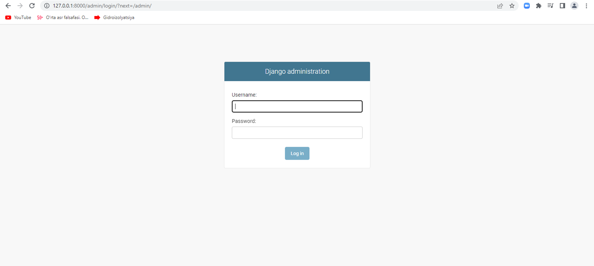
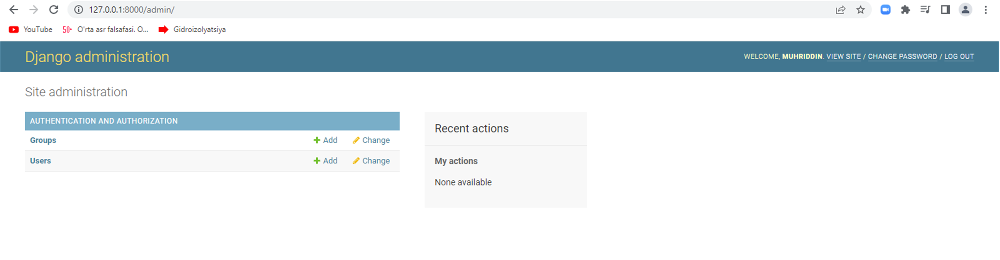
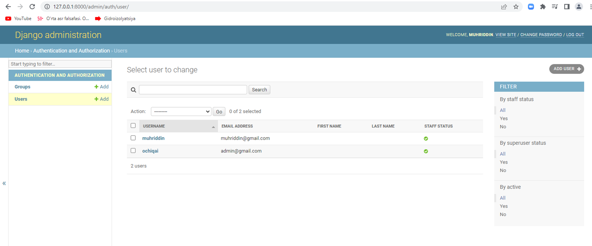

## Django_admin
* 4 - kunda biz web saytlar uchun `admin` yaratishni ko'rib chiqamiz. `admin` bu web saytimizni boshqarish uchun , yangiliklarni kirtib borish, veb sayt foydalanuvchilari (users) boshqarish uchun qo'llaniladi.
* Dastlabki qadamda biz `admin`ni homani web saytimizdan ko'rib olamaiz. web browserga homaki satimizning manzilini kiritamiz yani bu manzilni `http://127.0.0.1:8000/` hamda uning yonidan slash belgi`/` orqalim `admin` kiritamiz. Shundan so'ng bizning sahifamizda shunday ko'rinig paydo bo'ladi.

<p align="center">
    
</p>

* Yuqoridagi `Django administration`ni ko'rib turibsizlar. Unda bizda oldindan admin bo'lmaganligi uchun biz uni yaratib olamiz.

* 1 - qadamda `django_server`ni o'chirib olamiz.`django_project` fayl orqali biz `python manage.py createsuperuser` kiritib olamiz.Bularni kiritganizmda so'ng `terminal`da quyidagilar paydo bo'ladi.

<p align="center">
    
</p>

* `Terminal`ning so'ngi qismiga e'tibor beradigan bo'lsak, quyidagilar paydo bo'ladi `django.db.utils.OperationalError: no such table: auth_user`.Bunda biz ishga tushurmoqchi bo'lgan `superuser` ishlamadi.Chunki biz `database` yaratib olishimiz kerak bo'ladi.
* `Database` yaratib olish uchun biz avvalo `migration` commandasi kirtib olishimiz kerak.Buning yana biz `python manage.py makemigrations` kirtib olamiz va quyidagilar paydo bo'ladi.

<p align="center">
    
</p>

* `No changes detected` yozuvi paydo bo'ldi. Bu bizga hech qanday o'zgarish yoqligi ko'rsatayapti. Agar biz biror model kiritganimizda bu yerda ko'rishimiz mumkin endi.Biz `migrations` ishga tushurishimiz uchun esa, `python manage.py migrate` kiritishimiz kerak bo'ladi va quydagilar paydo bo'ladi.

<p align="center">
    
</p>

* `user table` ishga tushdi. Shundan so'ng dastalki qadamga qaytamiz ya'ni `pyhton manage.py createsuperuser` kiritamiz. Quydagilar paydo bo'ladi. 

<p align="center">
    
</p>

* `Username` paydo bo'ldi va o'zimiz uchun `username` yaratib olamiz(misol uchin: ochiqai).Keyingi qadamda `Email address:` paydo bo'ladi va shu yerga pochta manzilimizni kiritamiz(misol uchun:admin@gmail.com)Keyin qadamda `password` paydo bo'ladi, biz unga parol kirtamiz va `enter`ni bosamiz, `password again` paydo bo'ladi shuda parolimizni qaytadan kiritamiz tasdiqlaymiz. Agar hammasi joyida bo'lsa ushu yozuv paydo bo'ladi `Superuser created successfully.`

* Barcha narsa o'rnatilgandan so'ng `python manage.py server` orqali serverni ishga tushuramiz va quyida joyga o'zimiz yaratib olgan `username` va `password` kiritamiz.Kerakli narsalar kiritilgandan so'ng esa quyidagi oyna paydo bo'ladi.

<p align="center">
    
</p>

* Quyidagi oynada biz `groups` va `users` ko'rib turibmiz, shunda biz `groups` kirgan holda guruhlar yaratishimiz mumkin bo'ladi. `Users`ga kirish orqali foydalanuvchilarni tekshira olamiz.

<p align="center">
    
</p>

* Kiritilgan foydalanuvning(user) ustiga bosish orqali biz u haqida ma'lumotlarni olish imkoniyatimiz bo'ladi.

<p align="center">
    
</p>

* Biz yana bu yerda yana foydalanuvchi(user) qo'shimiz mumkin bo'ladi. Buning uchun yuqori qismdagi `users`bosib orqaga qaytamiz va u yerda o'ng tomonda tepadagi `add user` tugmasini bosamiz, shu oyna paydo bo'ladi. 

<p align="center">
    
</p>

* Bu oynada biz `username`ga biror bir nom kiritib olamiz(Misol uchun: TestUser). Keyin `password` qismida parol kirtamiz va `password confirmation` qismida parolni tasdiqlaymiz. Keyin `save` tugmasi bosamiz.
```
username : TestUser
password : 12345678
password confirmation : 12345678 
```
* Quyidagi paydo bo'ladi. Yangi foydalanuvchi(user) paydo bo'ladi.

<p align="center">
    
</p>
