## Ma'lumotlar bazasi

* Ma'lumotlar bazasini yaratishni ko'rib chiqamiz.
Ma'lumotlar bazasini qisqacha `database` deb foydalanamiz. `database` maqsadi o'zimizning saytimizdagi xabarlarni yaratishga xizmat qiladi. 
Djangoda o'zining ORM (object relational mapper) bo'ladi. Bu narsa `database`ga kirishga va undagi ma'lumotlarni erkin foydalanishga ruhsat beradi.

* Databaza programmlari juda ko'p: Oracle, MySQL, Microsoft SQL Server, PostgreSQL, va SQLite. Biz SQLiteni ko'rib chiqamiz. Sababi, bu keng tarqalgan va allaqachon python bilan birga keladi. 

* Birinchi navbatda django `ORM`dan foydalanamiz, bu narsa bizning databasemiz tuzulishini `class` sifatida ko'rsatadi. Bu `class`lar `model`lar deb nomlanadi.

* Birinchi loyihamizdagi `blog` nomli appimizga borib `models.py` ni ochib olamiz va quyidagi ishni bajaramiz.

```python
from django.db import models
from django.utils import timezone
from django.contrib.auth.models import User


class Xabar(models.Model):
    sarlavha = models.CharField(max_length=100)
    matn = models.TextField()
    sana = models.DateTimeField(default=timezone.now)
    muallif = models.ForeignKey(User, on_delete=models.CASCADE)
```
* Yuqorida Xabar modelini `class` sifatida yaratib oldik va unga sodda ma'lumotlarni kiritib o'tdik.

* Terminalga borib `python manage.py makemigrations` buyrug'ini bajarsak quyidagi paydo bo'ladi.

<p align="center">
    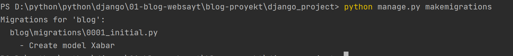
</p>

`blog` nomli appimizizdagi `migrations` papkasiga borsak `0001_initial.py` paydo bo'ladi.

```python
# Generated by Django 3.1.14 on 2022-06-25 08:52

from django.conf import settings
from django.db import migrations, models
import django.db.models.deletion
import django.utils.timezone


class Migration(migrations.Migration):

    initial = True

    dependencies = [
        migrations.swappable_dependency(settings.AUTH_USER_MODEL),
    ]

    operations = [
        migrations.CreateModel(
            name='Xabar',
            fields=[
                ('id', models.AutoField(auto_created=True, primary_key=True, serialize=False, verbose_name='ID')),
                ('sarlavha', models.CharField(max_length=100)),
                ('matn', models.TextField()),
                ('sana', models.DateTimeField(default=django.utils.timezone.now)),
                ('muallif', models.ForeignKey(on_delete=django.db.models.deletion.CASCADE, to=settings.AUTH_USER_MODEL)),
            ],
        ),
    ]
```
* Terminalga borib quyidagi buyruqni bersak `python manage.py sqlmigrate blog 0001` buyrug'ini bajarsak, `sql` holatida ko'rishimiz mumkin.

<p align="center">
    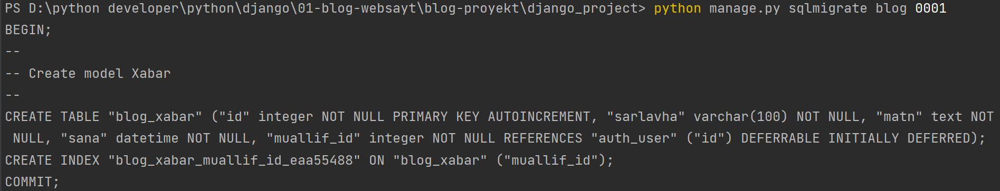
</p>

* Terminalga borib quyidagi buyruqni bajaramiz `python manage.py migrate`.

<p align="center">
    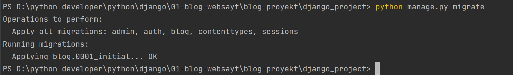
</p>

* Yuqorida `ok` yozuviga ko'zingiz tushadi. Nima uchun `migrations` juda foydali, chunki u bizga malumotlar bazasida o'zgartirishlar kiritishimizga yordam beradi.
Agar bizda `migrations`ni amalga oshirishni imkoni bo'lmasa ma'lumotlar bazasi tuzulmasini yangilash uchun murakkab `SQL` kodini ishga tushurishimiz kerak bo'lar edi. 


* Terminalga `python manage.py shell` buyrug'ini bajaramiz.
Bu bizga `python` kodlarini ishga tushirishimiz mumkin va django obyektlarimiz bilan ham ishlay olamiz.

<p align="center">
    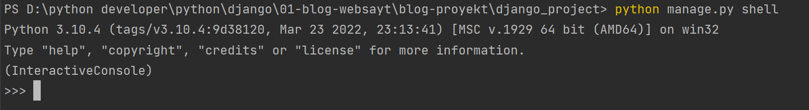
</p>

* Quyidagi ishlarni bajarib ko'ramiz

<p align="center">
    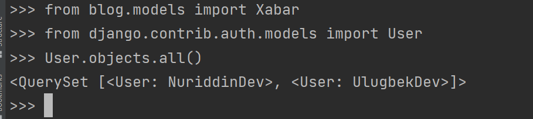
</p>

* O'tkan darsda `admin` qismiga foydalanuvchilarni kiritishni ko'rib chiqqandik. Yuqoridagi kod biz yaratgan foydalanuvchilarni qaytardi.

* Birinchi foydalanuvchini chiqarib ko'ramiz.

<p align="center">
    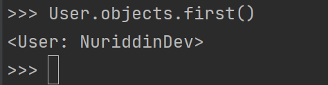
</p>

* Filterlash

<p align="center">
    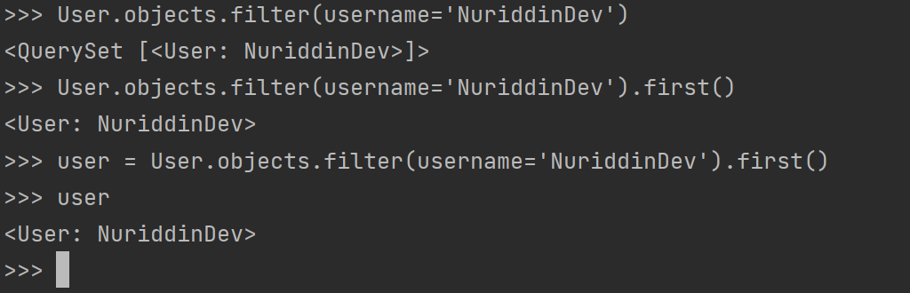
</p>

* Yuqorida filterlash orqali birinchi foydalanuvchini olib uni `user` o'zgaruvchisiga ta'minladik.

* Foydalanuvchi `id` orqali ham chaqirishimiz mumkin. (pk-primarykey)

<p align="center">
    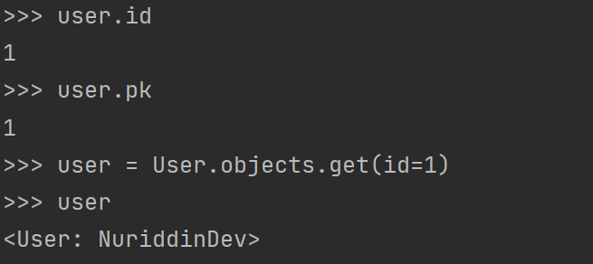
</p>

* `Xabar.objects.all()` buyrug'ini bajarsak, biz bo'sh so'rovlar to'plamiga ega bo'lamiz.

<p align="center">
    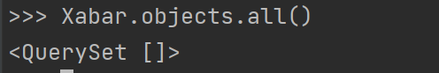
</p>

* Keling `xabar_1`nomli so'rovni hosil qilishni ko'ramiz. Quyidagi ishlarni bajaramiz.

<p align="center">
    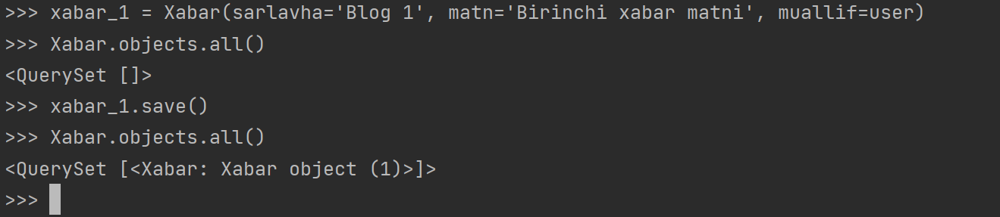
</p>

* Biz `xabar_1` so'rovini yaratib oldik va `Xabar.objects.all()` buyrug'ini bajargandik bizga hech qanday so'rov yo'q deb qaytardi. Biz so'rovni hosil qilganimizdan so'ng uni saqlab qo'yishimiz kerak `xabar_1.save()` ka'bi. 
`xabar_1`ni `save` qilganimizdan so'ng `Xabar.objects.all()` qayta ishlatganimizda u bizga bitta so'rov borligini qaytardi.

`__str__` metodidan foydalanish.

`models.py` ga quyidagi o'zgarishni kiritamiz.

```python
from django.db import models
from django.utils import timezone
from django.contrib.auth.models import User


class Xabar(models.Model):
    sarlavha = models.CharField(max_length=100)
    matn = models.TextField()
    sana = models.DateTimeField(default=timezone.now)
    muallif = models.ForeignKey(User, on_delete=models.CASCADE)

    def __str__(self):
        return self.sarlavha
```

* Ushbu o'zgarishlar kuchga kirishi uchun buyruq satrimizni ochib olib, undan chiqishimiz va uni qayta ochishimiz kerak.
Endi undan chiqamiz (`exit()`)va `Python Shell` buyrugini qayta ishga tushuramiz `python manage.py shell`.

* Quyidagi ishni bajaramiz.

<p align="center">
    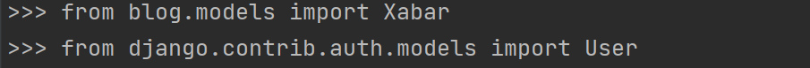
</p>

`Xabar.objects.all()` buyrug'ini yana bajaramiz. 

<p align="center">
    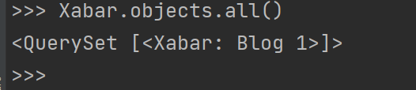
</p>

* Filter yordamida birinchi foydalanuvchini olib yana `user` uzgaruvchiga yuklab olib, ikkinchi xabarni yozib ko'ramiz(`xabar_2`).

```console
>>> user = User.objects.filter(username='NuriddinDev').first()
>>> user
<User: NuriddinDev>
```

<p align="center">
    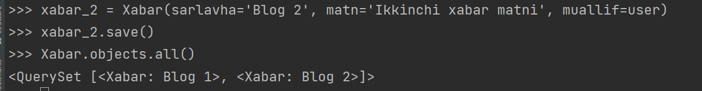
</p>

* Agar biz nirinchi cabarni matnini ko'rmoqchi bo'lsak quyidagicha bajaramiz.

```console
>>> xabar = Xabar.objects.first()
>>> xabar.matn
'Birinchi xabar matni'
```
* Huddi shunday sanasi va muallifini ham ko'rishimiz mumkin.

```console
>>> xabar.sana
datetime.datetime(2022, 6, 25, 11, 5, 50, 199329, tzinfo=<UTC>)
>>> xabar.muallif
<User: NuriddinDev>
```

* Biz foydalanuvchi emailini ham kurishimiz mumkin.

```console
>>> xabar.muallif.email
'nuriddinturobov595@gmail.com'
```
 
* Xabarni quyidagicha olishimiz ham mumkin.
```console
>>> user.xabar_set
<django.db.models.fields.related_descriptors.create_reverse_many_to_one_manager.<locals>.RelatedManager object at 0x00000236D2B1CC40>
>>> user.xabar_set.all()
<QuerySet [<Xabar: Blog 1>, <Xabar: Blog 2>]>
```
* Bu holatda uchinchi xabarni ham yozib ko'rsak bo'ladi.

```console
>>> user.xabar_set.create(sarlavha='Blog 3', matn='Uchinchi xabar matni') 
<Xabar: Blog 3>
```
* Yuqori biz uchinchi xabarni yaratib oldik. Bu holatda biz muallifni berish va uni saqlashimiz shart emas. Bu holatda avtomatik ravishda ma'lumotlar bazasiga saqlaydi.

* Agar biz barcha xabarlarni yana bir bor so'rasak quyidagicha hosil bo'ladi.

```console
>>> Xabar.objects.all()
<QuerySet [<Xabar: Blog 1>, <Xabar: Blog 2>, <Xabar: Blog 3>]>
```

* `exit()` orqali muhitdan chiqamiz.

* Keling endi ushbu xabar ma'lumotlarini saytimizning administrator sahifasida qanday tahrirlashimiz mumkinligini ko'rib chiqamiz.

* `blog` appimiz ichidagi `views.py`ga quyidagicha o'zgartirishlar kiritamiz.

<details>
<summary>views.py</summary>

```python
from django.shortcuts import render
from django.http import HttpResponse
from .models import Xabar <--- bu yer uzgardi

bloglar = [
    {
        'muallif': 'Nuriddin',
        'sarlavha': 'Programma nima?',
        'matn':
            """Programma bu aniq bir muammoni yechish uchun ko'rsatmalar ketma keltligidir. 
                Programmalash esa mana shu ko'rsatmalarni ishlab shiqishdir. Shuning uchun, 
                programmist uchun eng muhim kerak bo'ladigan mahorat bu berilgan muammoni hal qilish ketma-ketligini 
                o'ylab topish. Yechim ko'rsatmalari aniq va to'g'ri bo'lishi shart. Bu mahorat, programma tuzish orqali 
                shakllantiriladi. Qancha ko'p programma tuzsangiz shuncha yaxshi, ko'p o'qish yoki kino ko'rish bilan emas :).
            """,
        'sana': '28 Avgust, 2021'
    },
    {
        'muallif': 'Muhriddin',
        'sarlavha': 'Funksiya haqida',
        'matn':
            """Biz programma ko'rsatmalardan tashkil topishini bildik. Kattaroq programma tuzayotganimizda, ko'rsatmalar 
                ko'payib ketadi. Ularni ixchamlashtirish uchun, soddalashtirish uchun biron nima qilishimiz kerak.
                Tasavvur qiling bir 999 varaqli kitob bor. Uning na mundarijasi, na bobi bor. Na bo'limi, na varaq 
                nomeri bor. Boshidan oxirigacha hammasi tekst. Kitobni o'qiyotgan odam o'qib ketaveradi. Lekin u 
                yerdan qaysi betga kelgani, o'qiyotgan joyi asosan nima uchunligi bilmay o'qib ketaveradi. Bu 
                kitobxonga juda katta qiyinchilik bo'ladi. Mana shu va boshqa muammolarni hal qilish uchun 
                kitoblarda quyidagilar qilingan:
            """,
        'sana': '17 Sentabr 2021'
    }
]


def home(request):
    kontekst = {
        "bloglar": Xabar.objects.all() <--- bu yer uzgardi
    }
    return render(request, "blog/home.html", kontekst)

def about(request):
    return render(request, "blog/about.html", {'title': "ochiqai"})


def ochiqai(request):
    return HttpResponse('<h1>Ochiq AI ga xush kelibsiz! </h1>')
```

</details>

* `python manage.py runserver` orqali serverni ishlatib ko'ramiz.


<p align="center">
    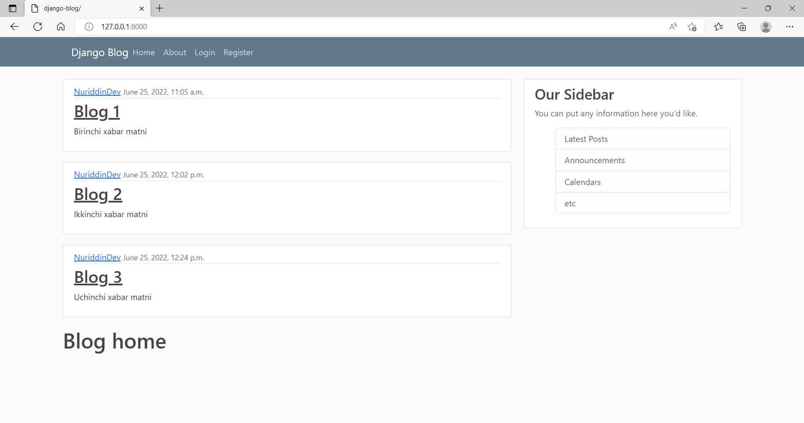
</p>

* Sanasining ko'rinishini uzgartiramiz. `https://docs.djangoproject.com/en/2.1/ref/templates/builtins/#date` 
quyidagi manzil orqali djangoda `date` haqida ma'lumot olishingiz mumkin.

* `templates`dagi `home.html`ga quyidagicha o'zgartirishlar kiritamiz.

```html



    
        <article class="media content-section">
          <div class="media-body">
            <div class="article-metadata">
              <a class="mr-2" href="#">{{ xabar.muallif }}</a>
              <small class="text-muted">{{ xabar.sana|date:"F d, Y" }}</small> <-- bu joyi uzgardi
            </div>
            <h2><a class="article-title" href="#">{{ xabar.sarlavha}}</a></h2>
            <p class="article-content">{{ xabar.matn}}</p>
          </div>
        </article>
    
    <h1>Blog home</h1>

```

* Serverimizni yangilasak, sanasiga e'tibor bersangiz uzgargan.

<p align="center">
    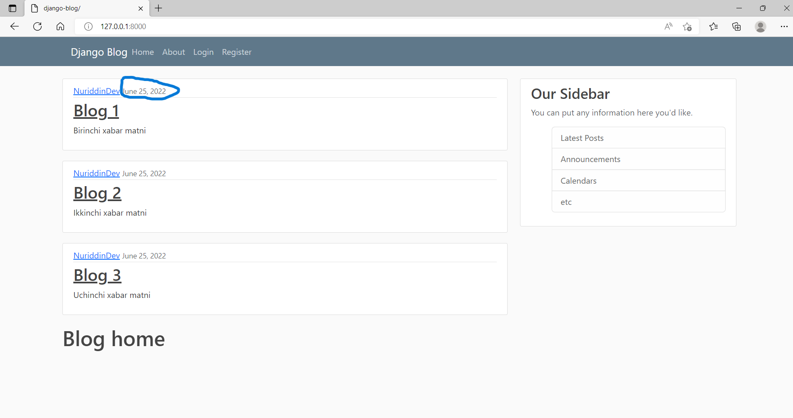
</p>

* Endi `blog` appimizdagi `views.py`ning ba'zi kerakmas qismini o'chirib tashlaymiz.

<details>
<summary>views.py</summary>

```python
from django.shortcuts import render
from django.http import HttpResponse
from .models import Xabar <--- bu yer uzgardi

 

def home(request):
    kontekst = {
        "bloglar": Xabar.objects.all() <--- bu yer uzgardi
    }
    return render(request, "blog/home.html", kontekst)

def about(request):
    return render(request, "blog/about.html", {'title': "ochiqai"})


def ochiqai(request):
    return HttpResponse('<h1>Ochiq AI ga xush kelibsiz! </h1>')
```

</details>

`bloglar` nomli uzimiz yozgan xabarni uchirdik chunki endi biz ma'lumot bazasida hosil qilgan xabarlarimiz mavjud.

* `blog`appimizdagi `admin.py` quyidagi ishni bajaramiz va uni saqlaymiz.

```python
from django.contrib import admin
from .models import Xabar

admin.site.register(Xabar)
```

* Serverni ishlatib admin qismini ochib olsak `http://127.0.0.1:8000/admin`. Biz yozib o'tkan xabarlarni ko'rishingiz mumkin.

<p align="center">
    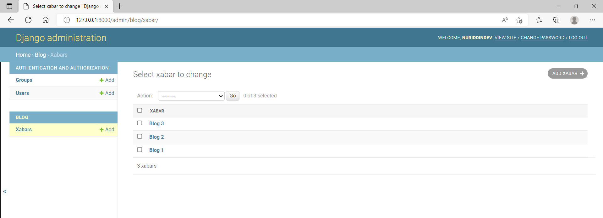
</p>

* Shu yerdan turib ham biz xabarlarga uzgartirishlar kiritsak bo'ladi.

* Masalan `Blog 3` ga kirib uzgartirish kiritib `SAVE` tugmasini bosish orqali qilgan uzgartirishimizni saqlab qo'yamiz.

<p align="center">
    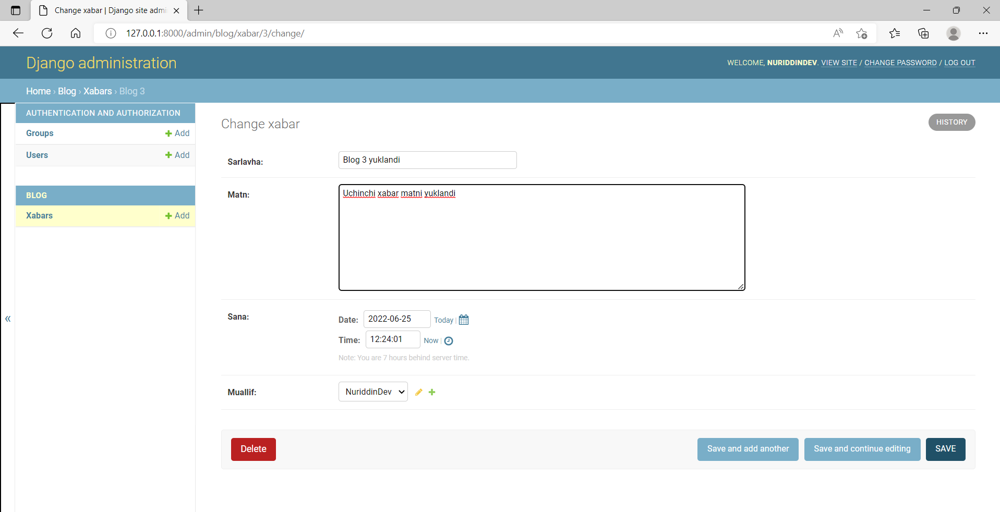
</p>

* Shu joydan `muallif` qismini ham uzgartirib qo'ysak bo'ladi. Masalan `Blog 1` xabarini muallifi `NuridiinDev` ni `UlugbekDev`ga uzgartirish.

<p align="center">
    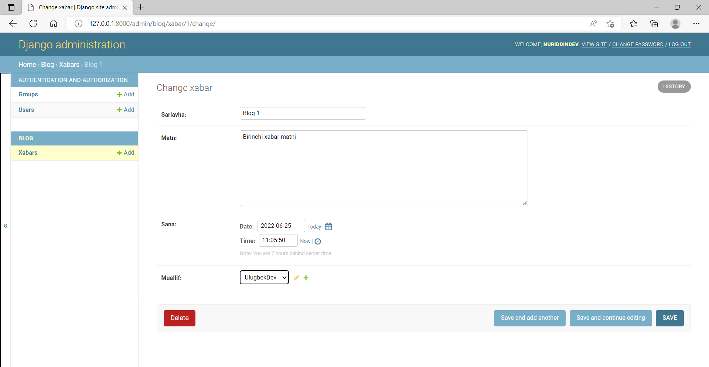
</p>

* O'zgartirib bo'lganimizdan so'ng `SAVE` tugmasini bosib saqlab qo'yamiz.

<p align="center">
    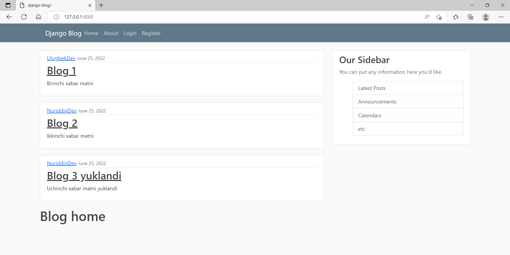
</p>

* Yuqorida xabarlarga o'zgartirishlar kiritganimizni ko'rishingiz mumkin.

