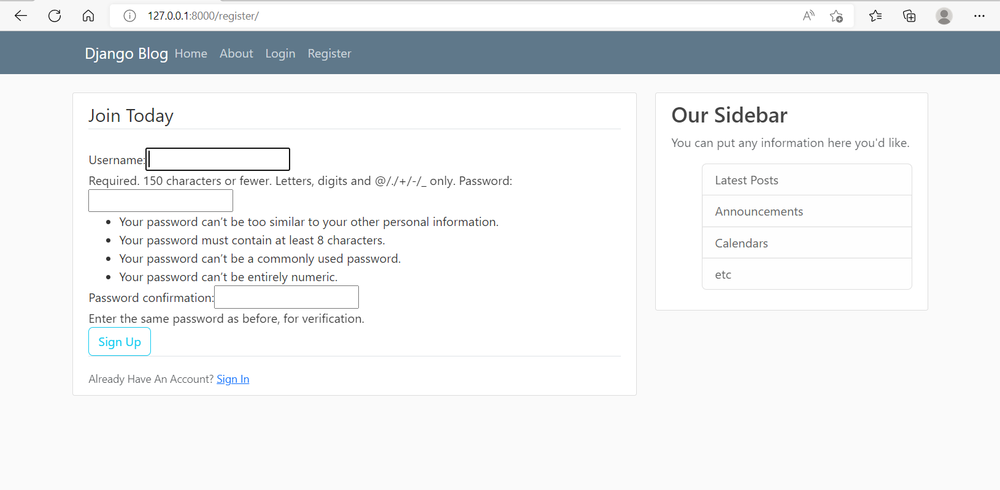
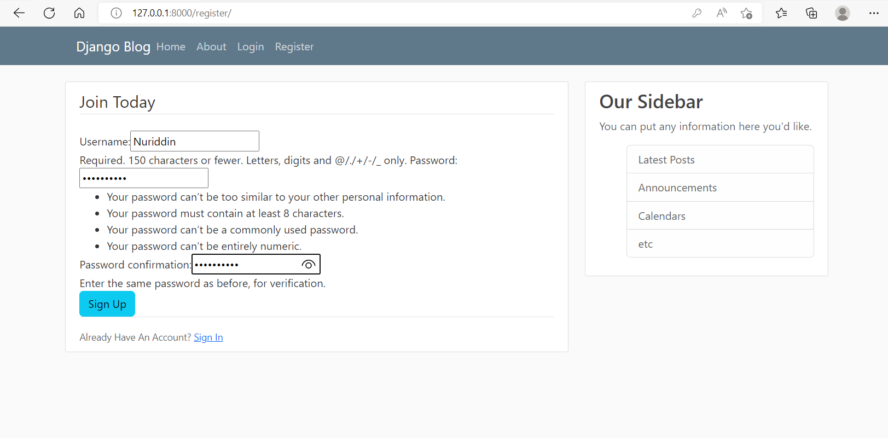
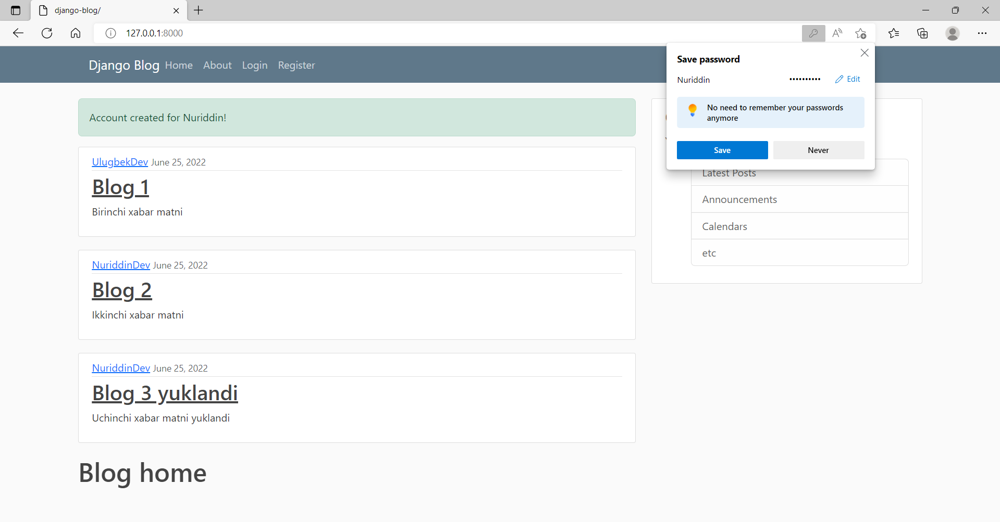
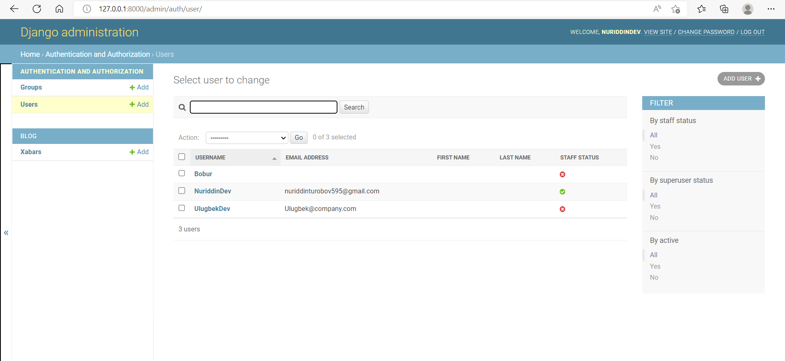
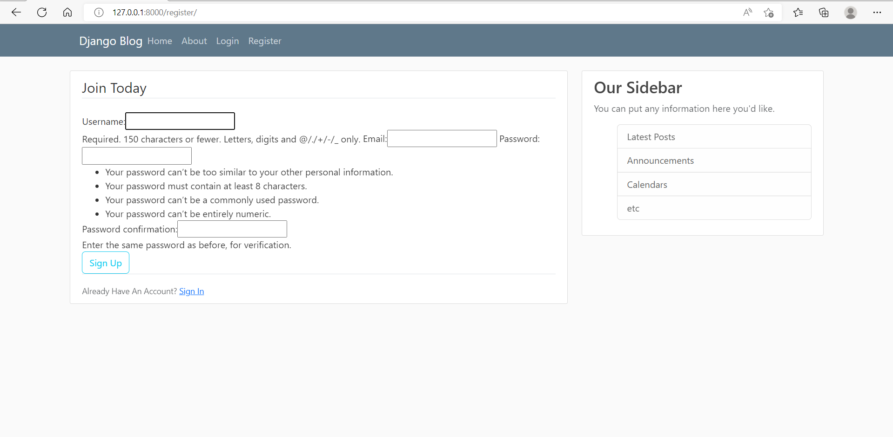
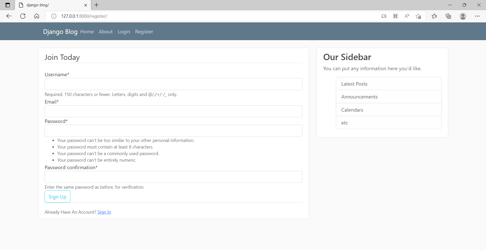

# User Registration (Saytdan ro'yhatdan o'tish)

* [Kirish](#kirish)
* [Email qismini qo'shish](#email-qismini-qo-shish)
* [Bootstrap4 dan foydalanish](#bootstrap4-dan-foydalanish)


## Kirish

Youtube, Twitter va boshqa saytlarda registration (ro'yhatdan o'tish) bo'limiga duch kelganmiz, 
ro'yhatdan o'tish orqali esa saytdan kengroq foydalanish imkonini beradi. 
Misol uchun foydalanuvchi saytda o'z akkountini yaratish orqali, post qoldirish va online biror mahsulot harid qilishga ega bo'ladi.

Registration qismini yaratish uchun birinchi navbatda yangi `app` yaratib olamiz. Ya'ni <br>
`django_project` loyihamiz ichidan `users`nomli yangi app yaratib olamiz.

```console
python manage.py startapp users
```

bunda `users` yangi app nomi.


Yaratgan appimizni `django_project` loyihamizdagi `settings.py` faylining `INSTALLED_APPS` qismiga qo'shib qo'yishimiz kerak:


```python
INSTALLED_APPS = [
    'blog.apps.BlogConfig',
    'users.apps.UsersConfig',
    'django.contrib.admin',
    'django.contrib.auth',
    'django.contrib.contenttypes',
    'django.contrib.sessions',
    'django.contrib.messages',
    'django.contrib.staticfiles',
]
```

`'users.apps.UsersConfig',` qismini kiritib o'tdik.

`users` appimizning `views.py` fayliga borib quyidagi ishlarni bajaramiz.


```python
from django.shortcuts import render
from django.contrib.auth.forms import UserCreationForm


def register(request):
    form = UserCreationForm()
    return render(request, 'users/register.html', {'form': form})
```

Yuqorida djangoda mavjud tayyor formalardan foydalandik va `register` funksiyasida `register.html`faylini manzilini ko'rsatib 
`render` orqali uzatayabmiz. Va endi biz `register.html` yaratib olishimiz kerak.
`users`appimizning ichidan `templates` papkasini yaratib olamiz va uning ichidan `users` papkasini va uning ichidan esa 
`register.html` faylini yaratib olamiz.

```console
django_project      
│   manage.py
└───blog
    │   __init__.py
    │   admin.py
    │   apps.py
    │   models.py
    │   tests.py
    │   views.py
    └───templates
        └───blog
└───users
    │   __init__.py
    │   admin.py
    │   apps.py
    │   models.py
    │   tests.py
    │   views.py
    |   migrations
    └───templates
            └─── users
                  └─── register.html 
```

`register.html`da quyidagi ishlarni bajaramiz.

```html


    <div class="content-section">
        <form method="POST">
            
            <fieldset class="form-group">
                <legend class="border-bottom mb-4">Join Today</legend>
                {{ form }}
            </fieldset>
            <div class="form-group">
                <button class="btn btn-outline-info" type="submit">Sign Up</button>
            </div>
        </form>
        <div class="border-top pt-3">
            <small class="text-muted">
                Already Have An Account? <a class="ml-2" href="#">Sign In</a>
            </small>
        </div>
    </div>

```

`django_project`ning `urls.py` qismiga borib quyidagicha o'zgartirishlar kiritib `register` qismini qo'shib o'tamiz.

```python
from django.contrib import admin
from django.urls import path, include
from users import views as user_views

urlpatterns = [
    path('admin/', admin.site.urls),
    path('register/', user_views.register, name='register'),
    path('', include('blog.urls')),
]
```

Serverni ishlatib `python manage.py runserver` quyidagi manzilni ishlatib ko'ramiz:

 - `http://127.0.0.1:8000/register/`

<p align="center">
    
</p>


Foydalanuchi ro'yhatdan o'tgandan so'ng `Sign Up` tugmasini bosganida foydalanuvchi uchun akkaount yaratilishini ko'rib chiqamiz.
`users` appimizning `views.py` qismiga quyidagicha o'zgartiramiz.

```python
from django.shortcuts import render, redirect
from django.contrib.auth.forms import UserCreationForm
from django.contrib import messages

def register(request):
    if request.method == 'POST':
        form = UserCreationForm(request.POST)
        if form.is_valid():
            username = form.cleaned_data.get('username')
            messages.success(request, f'Account created for {username}!')
            return redirect('blog-home')
    else:
        form = UserCreationForm()
    return render(request, 'users/register.html', {'form': form})
```

`blog`appimizdagi templates qismiga borib `base.html`ning `block content`qismiga borib quyidagicha kod yozamiz.

```html
<div class="col-md-8">
    
      
        <div class="alert alert-{{ message.tags }}">
            {{ message }}
        </div>
      
    
    
</div>
```

Serverni `http://127.0.0.1:8000/register/` qismiga borib `Username` va `Password` qismiga ma'lumotlar kiritamiz.

<p align="center">
    
</p>


`Sign Up` tugmasini bosish orqali quyidagi oynani ko'rishimiz mumkin:

<p align="center">
    
</p>


E'tibor bersangiz `Account created for Nuriddin!` xabari chiqdi. 

`form.save()` qismini `users` appimizning `views.py` fayliga quyidagicha qo'shib qo'ysak, biror yangi foydalanuvchini ro'yhatdan o'tkazib saytimizning admin bo'limining foydalanuvchilar qismida (`Users`) ko'rinish mumkin.

```python
from django.shortcuts import render, redirect
from django.contrib.auth.forms import UserCreationForm
from django.contrib import messages

def register(request):
    if request.method == 'POST':
        form = UserCreationForm(request.POST)
        if form.is_valid():
            form.save() 
            username = form.cleaned_data.get('username')
            messages.success(request, f'Account created for {username}!')
            return redirect('blog-home')
    else:
        form = UserCreationForm()
    return render(request, 'users/register.html', {'form': form})
```

Serverni ishlatib register qismiga borib `http://127.0.0.1:8000/register/` `Username` qismiga `Bobur`ni va parolini kiritib `Sign Up` tugmasini bosib, saytimizning `admin` bo'limiga borib `Users` qismida `Bobur` ismini saqlanganini ko'rishimiz mumkin.

<p align="center">
    
</p>

## Email qismini qo'shish

`Registration`ga `email` qismini qo'shishni ko'ramiz. Foydalanuvchi ro'yhatdan o'tayotganda endi elektron pochtasini ham kiritib o'tishi kerak bo'ladi.

`users` appimizga `forms.py` nomli yangi fayl ochib olamiz.
Va `forms.py`ga quyidagi ishlarni bajaramiz.

```python
from django import forms
from django.contrib.auth.models import User
from django.contrib.auth.forms import UserCreationForm


class UserRegisterForm(UserCreationForm):
    email = forms.EmailField()

    class Meta:
        model = User
        fields = ['username', 'email', 'password1', 'password2']
```

`users` appimizdagi `views.py` faylini quyidagicha o'zgartiramiz.

```python
from django.shortcuts import render, redirect
from django.contrib import messages
from .forms import UserRegisterForm

def register(request):
    if request.method == 'POST':
        form = UserRegisterForm(request.POST)
        if form.is_valid():
            form.save()
            username = form.cleaned_data.get('username')
            messages.success(request, f'Account created for {username}!')
            return redirect('blog-home')
    else:
        form = UserRegisterForm()
    return render(request, 'users/register.html', {'form': form})
```

Serverni ishlatib register qismiga kirsak `http://127.0.0.1:8000/register/` `Email` qismini ham qo'shilganini ko'rishimiz mumkin.

<p align="center">
    
</p>


## Bootstrap4 dan foydalanish

Registration `form` ni chiroyliroq ko'rinishi uchun djangoda mavjud `crispy-forms`dan foydalanamiz.
`django-crispy-forms`ni o'rnatib olamiz `pip install django-crispy-forms`.

```console
Successfully installed django-crispy-forms-1.14.0
WARNING: You are using pip version 22.0.4; however, version 22.1.2 is available.
You should consider upgrading via the 'C:\Users\MSI\AppData\Local\Programs\Python\Python310\python.exe -m pip install --upgrade pip' command.
```

`django_project` loyihamizning `settings.py` faylining `INSTALLED_APPS` qismiga `crispy_forms`ni quyidagicha qo'shib qo'yamiz.

```python
INSTALLED_APPS = [
    'blog.apps.BlogConfig',
    'users.apps.UsersConfig',
    'crispy_forms',
    'django.contrib.admin',
    'django.contrib.auth',
    'django.contrib.contenttypes',
    'django.contrib.sessions',
    'django.contrib.messages',
    'django.contrib.staticfiles',
]
```

Va `settings.py`ning eng ohirgi qatoriga borib `CRISPY_TEMPLATE_PACK = 'bootstrap4'`ni qo'shib qo'yamiz. `register.html`ga quyidagicha o'zgartirish kiritamiz.

```html

 

    <div class="content-section">
        <form method="POST">
            
            <fieldset class="form-group">
                <legend class="border-bottom mb-4">Join Today</legend>
                {{ form|crispy }}
            </fieldset>
            <div class="form-group">
                <button class="btn btn-outline-info" type="submit">Sign Up</button>
            </div>
        </form>
        <div class="border-top pt-3">
            <small class="text-muted">
                Already Have An Account? <a class="ml-2" href="#">Sign In</a>
            </small>
        </div>
    </div>

```

Serverni qayta ishlatib `python manage.py runserver` register qismini ochib olsak `http://127.0.0.1:8000/register/` quyidagicha o'zgarishni ko'rishimiz mumkin.

<p align="center">
    
</p>

