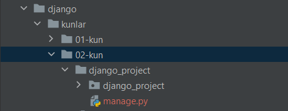

#### Djangoni o'rnatish va ishga tushirish.

1. Terminalga quyidagicha yozish orqali djangoni o'rnatamiz.

    `pip install django`

2. Django versiyasi tekshirish.

    `python -m django --version`

3. Quyidagi buyruq orqali yangi project yaratamiz.

   `django-admin startproject django_project`
   

    

   
 
   E'tibor bersangiz 02-kun faylimiz ichida `django_project` hosil bo'ldi.

4. Djangoni o'rnatib bo'lgach serverda ishlatib ko'ramiz.
   Birinchi `manage.py` fayli joylashgan papkaga `cd papka_nomi` buyrug'i orqali boramiz.  
 

Qora ekranga quyidagicha yozamiz.
`python manage.py runserver`  

   

`http://127.0.0.1:8000/` quyidagi manzilni internetda ishlatib ko'ramiz.

