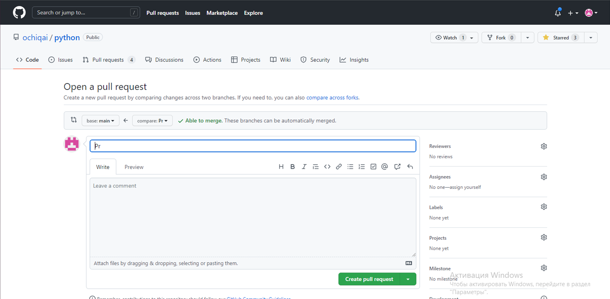
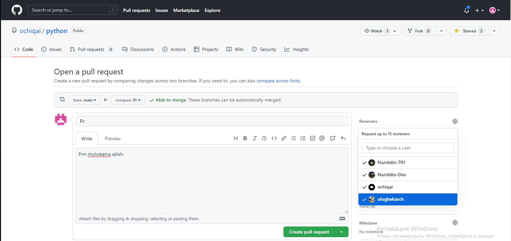
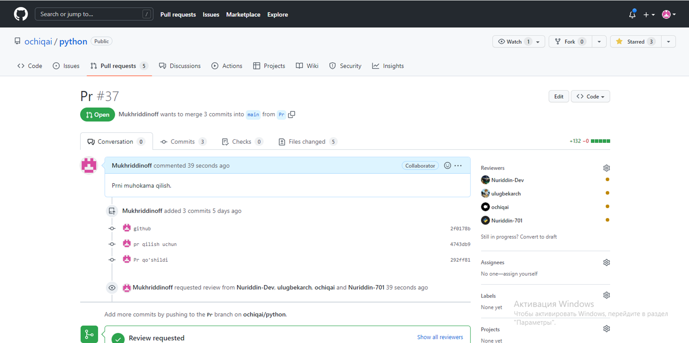
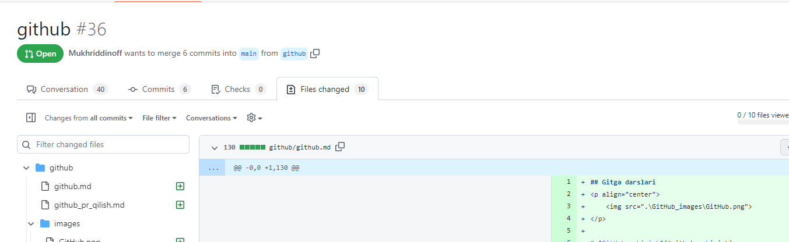

## Githubda PR(pull request) qilish

* [PR (pull request) nima](#pr-pull-request-nima)
* [PR (pull request) qilish](#pr-pull-request-qilish)
* [Tayanch tushunchalar](#tayanch-tushunchalar)


### PR (pull request) nima

* `PR` (pull request) bu - github platformasiga yangi branch orqali qilgan o'zgartirishlaringiz haqida boshqa foydalanuvchilarga xabar berish hisoblanadi. Yangi branchda pr bir marotaba qilinadi va 
userlar unga kommentariya orqali xato - kamchiliklarini va o'z fikrlarini bildirishadi. Biz PR qilingan branchlarni
github platformasidagi `pull requests` dan ko'rishimiz mumkin bo'ladi. 

### PR (pull request) qilish

* Fayllarni githubda PR qilish uchun githubning maxsus kommandalari orqali `git bush` yoki `PyCharm` terminalidan foydalanamiz.
Hop, dastlabki qadamda biz yangi `branch` hosil qilib olishimiz kerak bo'ladi. Buning uchun biz `PyCharm` terminalidan foydalanamiz. 
Terminalda yangi branch hosil qilish uchun `git checkout -b [yaratmoqchi bo'lgan branch nomi]` kiritamiz.
Barcha branchlarni ko'rish uchun esa `git branch` dan foydalanamiz.
```console
PS D:\ochiqai\python\django\01-blog-websayt\blog-proyekt> git checkout -b yangi_branch
Switched to a new branch 'yangi_branch'
```
* Endi o'zgartirishlar qilamiz, masalan fayllar yaratamiz. Va gitga boramizda git add <fayl_nomi> ni bajaramiz. Agar biz `git add .` qiladigan bo'lsak bo'lsak barcha fayllardagi o'zgarishlar yuklanishi mumkin.
```console
PS D:\ochiqai\python\django\01-blog-websayt\blog-proyekt> git add my_work.md
```
Kiritilgan faylimizni tekshirib olishimiz uchun `git status` dan foydalanamiz.
```console
PS D:\ochiqai\python\django\01-blog-websayt\blog-proyekt> git status
On branch yangi_branch
Changes to be committed:
  (use "git restore --staged <file>..." to unstage)
        new file:   my_work.md

Changes not staged for commit:
  (use "git add <file>..." to update what will be committed)
  (use "git restore <file>..." to discard changes in working directory)
        modified:   ../../../github/github_PR_qilish.md
```
Faylimizni saqlab qolish uchun esa, `git commit -m`dan foydalanamiz. 

```console
PS D:\ochiqai\python\django\01-blog-websayt\blog-proyekt> git commit -m"PR qo'shildi"
[PR 292ff81] yangi_branch qo'shildi
 1 file changed, 1 insertion(+)
 create mode 100644 django/01-blog-websayt/blog-proyekt/my_work.md
```
Faylni githubga birlashtirish uchun esa, `git push`ni kiritamiz.

```console
PS D:\ochiqai\python\django\01-blog-websayt\blog-proyekt> git push
fatal: The current branch yangi_branch has no upstream branch.
To push the current branch and set the remote as upstream, use

    git push --set-upstream origin yangi_branch

```

Bu yerda `git push --set-upstream origin yangi_branch` buyrug'i paydo bo'ladi. Buning ma'nosi githubga yangi branch 
kiritayotganimizda github buni hali tanimaydi, uni ta'nitish uchun o'sha buyruqni kiritamiz.

```console
PS D:\ochiqai\python\django\01-blog-websayt\blog-proyekt> git push --set-upstream origin yangi_branch
Enumerating objects: 10, done.
Counting objects: 100% (10/10), done.
Delta compression using up to 4 threads
Compressing objects: 100% (4/4), done.
Writing objects: 100% (6/6), 464 bytes | 12.00 KiB/s, done.
Total 6 (delta 3), reused 0 (delta 0), pack-reused 0
remote: Resolving deltas: 100% (3/3), completed with 3 local objects.
remote:
remote: Create a pull request for 'yangi_branch' on GitHub by visiting:
remote:      https://github.com/ochiqai/python/pull/new/PR
remote:
To https://github.com/ochiqai/python.git
 * [new branch]      PR -> PR
branch 'yangi_branch' set up to track 'origin/yangi_branch'.
```
Bunda bizga yangi branch qo'shilganligi haqida ma'lumot berilmoqda. Keyingi qadamda biz, yuborilgan xabardagi 
birinchi manzilga `remote:      https://github.com/ochiqai/python/pull/new/PR` boramiz.

Borgan manzilimizda bu ko'rinishdagi oyna hosil bo'ladi.

<p>
    
</p>

Yuqorida oynada biz branch bog'lash uchun, komment qoldirishimz va reviewers taggida qaysi userlar bu fayl ko'rish ekanligi belgilaymiz.

<p>
    
</p>

Keyingi qadamda oynadagi  yashil rangdagi `Create pull request` bosamiz.

Keyinchalik biz bu branchni github platformasidagi `pull request`ga borib ko'rishimiz mumkin bo'ladi.

<p>
     
</p>

Shundan so'ng biz, fayl haqida o'z fikrlarimizni qoldirish uchun `Files changed` borib, matn boshidagi `+` bosamiz, va u yerda 
komment qoldirish uchun joy ochiladi.

<p>
    
</p>

Shunda so'ng biz, `Start a review` bosamiz, kommentlarni ko'rish uchun esa ortga qaytamiz. 

<p>
    
</p>

githubdagi o'zgarishlani kompyuterimizga yuklash uchun `git pull`dan foydalanamiz.
```console
PS D:\ochiqai\python\github> git pull
remote: Enumerating objects: 3, done.
remote: Counting objects: 100% (3/3), done.
remote: Total 3 (delta 2), reused 3 (delta 2), pack-reused 0
Unpacking objects: 100% (3/3), 457 bytes | 3.00 KiB/s, done.
From https://github.com/ochiqai/python
   0ed90a1..9ff2438  main       -> origin/main
Already up to date.
```
Bu yerda biz oxirgi o'zgarishlarni yukladik.
>>> Biz tugatdik

### Tayanch tushunchalar

<ul>
<li>git add "fayl nomi" - faylni yuklash uchun ishlatiladi</li>
<li>git status - o'zgarishlarni tekshirish</li>
<li>git checkout -b "yangi branch nomi" - yangi branch hosil qilish uchun</li>
<li>git commit -m - faylni saqlash uchun</li>
<li>git push - githubga joylashtirish uchun</li>
</ul>


