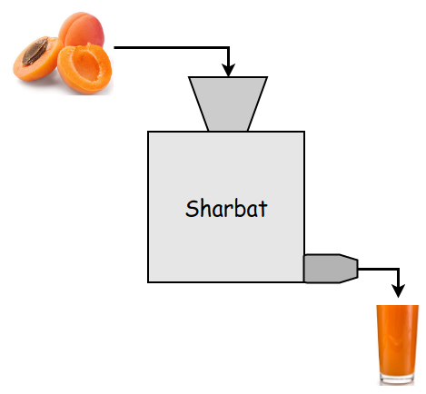

# Funksiyalar

Biz programma _ko'rsatmalardan_ tashkil topishini bildik. Kattaroq programma tuzayotganimizda, 
ko'rsatmalar ko'payib ketadi. Ularni ixchamlashtirish uchun, soddalashtirish uchun biron nima 
qilishimiz kerak. 

Tasavvur qiling bir 999 varaqli kitob bor. Uning na mundarijasi, na bobi bor. Na bo'limi, 
na varaq nomeri bor. Boshidan oxirigacha hammasi tekst. Kitobni o'qiyotgan odam o'qib ketaveradi.
Lekin u yerdan qaysi betga kelgani, o'qiyotgan joyi asosan nima uchunligi bilmay o'qib ketaveradi. 
Bu kitobxonga juda katta qiyinchilik bo'ladi. Mana shu va boshqa muammolarni hal qilish uchun 
kitoblarda quyidagilar qilingan:

 - **Mundarija**: kitob haqida umumiy ma'lumot beradi.
 - **Boblar**: mazkur bobda nima haqida ekanligi haqida malumot beradi.
 - va boshqalar 

Shunga o'xshash maqsadda, programma tushunarli va qulay bo'lishligi 
uchun -- **funksiyadan** foydalanamiz. 


## Funksiya nima?

Dehqonchasiga, funksiya shunday narsaki, u o'ziga biron nima oladida, uning ustida biron narsa bajaradi. 
Va natijani chiqaradi. Masalan o'rik sharbati tayyorlash mashinasi olaylik. Uning vazifasi (funksiyasi)
o'rikni olib sharbat qilib chiqarishdir. Sharbatni ayanan qanday qilish jarayoni bizga hozircha 
muhim emas. Biz o'rikni beramiz, u sharbat **qaytaradi**:



> Bu yerda funksiyasi va vazifasi so'zlarining manosi bir xil.


## Python Funksiyalari 

### `type` funksiyasi
Pythonda juda ko'p funksiyalar mavjud. Masalan, o'tgan kunimizda `type` ko'rsatmasini ko'rdik.
Aslida, bu funksiya. U o'ziga qiymat olib (o'rik emas), qiymatning qaysi turga tegishliligini aniqlab 
bizga qaytaradi (sharbat emas). Masalan, `3` soni oladida, u `<class, int>` ni qaytaradi.


Shuni bildikki, funksiyalar qiymat **qaytaradi**. Biz o'sha qaytarilgan qiymatni olib konsolga 
chiqarishimiz mumkin. 

```python
turi = type(999)
print(turi)
```
ishlatsak 

```commandline
--------------
<class 'int''>
```

### `int` funksiyasi- butunlar sonlar
Bazida stringni butun songa o'tkazishga to'g'ri 
keladi. Masalan, `999` stringni songa o'tkazish uchun quyidagicha `int` funksiyasidan foydalanamiz.

```python 
x = int("999")
```

Xullas, 
- o'zgaruvchi hosil qildik va unga stringga tegishli `"999"` qiymatini yukladik `belgilar = "999"`
- `int` funkiyasi `belgilar` ni olayapti va uni butun songa o'tkazayapti (almashtirayapti).
Nihoyat, natijani `x` o'zgaruvchisiga yuklayapti. 


### `float` funksiyasi- haqiqiy sonlar
Xuddi shunga o'xshash haqiqiy songa o'tkazish uchun ham `float` funksiya mavjud. 

```python
x = float('3.14568568')
```

### `str` funksiyasi

Stringni songa o'tkazadigan funksiya. Bildik. Endi sonni stringga
o'tkazadigan funksiyalar ham bormi? Albatta, u `str`.

```python
x = str(81) # natija x = '81'
```


### `len` funksiyasi
Berilgan stringli o'zgaruvchi yoki qiymatning uzunligini qaytaradi.

```python
a = "salom"
b = len(a)
print(b)
```
```commandline
-
5
```

### `max` funksiyasi

Berilgan bir necha sonlarning kattasini qaytaradi.

```python
kattasi = max(2, 81)
print(kattasi)
```
```commandline
--
81
```

Shunga o'xshash sonlarning kichigini topish uchun esa `min` funskiyasidan foydalanamiz.


## Matematik funksiyalar

Pythonda `module` degan tushuncha mavjud. U bir-biriga bog'liq funksiyalar 
to'plamidir. Matematik funksiyalardan foydalanish uchun biz matematika uchun maxsus
hosil qilingan `module` dan foydalanamiz. Uni ishlashtish uchun **import** qilamiz.
Xo'sh import ni qanday qilamiz? 

```python
import math
```

Bu yerda `math` degani matematika. `math` o'z ichiga juda ko'p matematik funksiyalarni
o'z ichiga oladi. 

> Ularning ishlashi ham yuqorida o'tganimizdek. Funksiya qiymat oladi, va natijani qaytaradi.

Keling, 2 ta funksiyani ko'raylik. 

- `sin(10)` hisoblash:
  ```python
  x = math.sin(10)
  print(x)
  ```

  ```commandline
  -------------------
  -0.5440211108893698
  ```

  Bu yerda kerakli funksiyani ishlatish uchun birinchi `math` keyin nuqta `.` qo'yib 
  kerakli funksiyani foydalanayapmiz. '.' xuddi bizga eshik vazifasini o'tayapti. U orqali funksiyalarni
  tanlaymiz.

- Ildiz chiqarish. `64` dan ildizini topmoqchi bo'lsak `sqrt` funksiyasini chaqiramiz:

  ```python
  x = math.sqrt(99)
  print(x)
  ```
  
  ```commandline
  ---------------
  9.9498743710662
  ```


## Yangi funksiyalar yaratish
Shu paytgacha, tayyor funksiyalarni ko'rib o'tdik. Pythonda biz uchun kerak bo'lgan funksiyalar mavjud 
bo'lmasligi mumkin. Unda, o'zimiz xoxlagan funksiyani yratishimiz mumkin. Qanday?

Keling, shunday funksiya yarataylikki, berilgan 2 sonni bir biridan ayirsin va natijani qaytarsin. 
Funksiya nomini `ayirish` deb ataylik. 2 sonni esa `a` va `b` deb ataylik.

```python
def ayirish(a, b):
  natija = a - b
  
  return natija
```

Bu yerda:

- **`def`**: Kalit so'z bulib, funksiya hosil qilinayotganini anglatadi. Va `def` ishtirok etgan qator 
  boshlang'ich (**header**) deb ataladi. Va bu qator `:` belgisini bilan tugaydi. Qolganlari tanasi 
  (**body**) deb ataladi. 
- `ayirish`: funksiya nomi.
- `a, b`: funksiya parametrlari deb ataladi. Ular har doim `()` qavslar ichiga yoziladi.
- `return`: qaytarish degani. `return natija` natija qaytar.
- E'tibor bering tana (body) qismi `def` tagidan ustma-ust tushmagan. Balki, ozroq bo'sh joy tashlab yozilgan.
  Yozish qoidasi shunaqa. Dehqoncasiga esa, shunday yozilsa tushunarli bo'ladi.

Mana funksiyani hosil qildik. Endi, uni ishlatish uchun, chaqirishimiz kerak. Uni nomi bilan chaqiramiz. 
Va qavs ichiga 2 ta biz xoxlagan sonni kiritamiz: 11 va 6. Bu yerda `11` `a` ga yuklanadi, 
`6` esa `b` ga yuklanadi.

```python
x = ayirish(11, 6)
print(x)
```
```commandline
-
5
```

Boshqa misol, `Salom, Pythonjon` deb chiqaradigan funksiya hosil qilaylik. Funksiya nomi 
`salomlashish` bo'lsin

```python
def salomlashish():
    print("Salom, Pythonjon")
```
E'tibor bering bu funksiya hech qanday parametr olmayapti `()` qavs ichida  hech narsa yo'q.
Hamda funksiyani hech narsa qaytarmayapti `return` yo'q. O'shaning uchun bu funksiyani o'zgaruvchiga 
yuklash shart emas.

```python
salomlashish() 
```

```commandline
----------------
Salom, Pythonjon
```

Bu funsiyani bir necha maratoba chaqirishimiz ham mumkin,

```python
salomlashish()
salomlashish()
salomlashish()
```

```commandline
----------------
Salom, Pythonjon
Salom, Pythonjon
Salom, Pythonjon
```

Keling, bu `salomlashish` funksiyasini ham o'zgaruvchiga yuklab kuraylik. 

```python
x = salomlashish()
print(x)
```

```python
----
None
```

Natija `None` chiqardi. Bu degani **hech narsa** degani dehqonchasiga.


## Programma ishlash oqimi


Programmadagi kodlar balandan pastga qarab ishlaydi (1-qator, 2-qator, ...). Masalan, funksiyadan 
foydalanish uchun uni birinchi hosil qilishimiz kerak. Keyin uni chaqiramiz.

```python
def ayirish(a, b):
  natija = a - b
  
  return natija
    
y = ayirish(11, 6)
```

Quyidagicha ishlamaydi, chunki funksiya hosil qilinmay chaqirilayapti.

```python
y = ayirish(11, 6)

def ayirish(a, b):
  natija = a - b
  
  return natija
```


## Parameterlar va argumentlar
Quyidagi `ayirish` funksiyasini yana olaylik,

```python
def ayirish(a, b):
  natija = a - b
  
  return natija
    
y = ayirish(11, 6)
```

`a va b` lar parameterlar deb ataladi, `10 va 20` esa argumentlar deb ataladi. Programma ishlaganda
`a=11` va `b=6` bo'lib funksiya ishlaydi.

Umuman olganda, funksiya hosil qilinayotganda u o'zgaruvchilardan tashkil topsa, biz ularni parameterlar
deb ataymiz. Funksiyani ishlatayotganimizda o'sha o'zgaruvchilarga qiymat beramiz va qiymatlar 
argumentlar deb ataladi.


## Xo'roz inida qichqiradi 

Biz o'zgaruvchi (variable) ni funksiya ichida yaratsak, u faqat funksiya ichidagina hizmat qiladi.
Masalan, quyida funksiya ichida va tashqarisada bir xil nomli `a` o'zgaruvchisini hosil qilaylik:

```python
def ism():
    a = 'Nuriddin'
    print(a)

a = 'Ulugbek'
ism()
print(a)
```

Bu yerda natija, 

```commandline
--------
Nuriddin
Ulugbek
```

Sababi, `ism` funksiyasidagi `a` o'zgaruvchisi faqat funksiya ichida ishlaydi.


## Mevali/Mevasiz funksiyalar

Mevali funsksiyalar qiymat qaytaradi. Masalan, yuqorida ko'rgan matematik funksiya `sqrt`
qiymat qaytaradi. Yani, `math.sqrt(49)` funksiya argumentiga 49 berilsa `7` qiymatini qaytaradi.
Va uni biron boshqa o'zgaruvchiga yuklab boshqa amallarni bajarsak bo'ladi:

```python
import math

x = math.sqrt(49)
y = x + 3
print(y)
```

Mevasiz funksiyalar hech narsa qaytarmaydi. Bunga misol `print` funksiyasidir. U faqat kiritilgan narsani 
konsolga chiqaradi xolos. Masalan quyidagi programma:

```python
x = 'salom'
print(y)
```
```shell
-----
salom
```

## Nimaga funksiya kerak

Biz yuqorida nimaga funksiya kerakligi haqida ozroq tushuntirishga harakat qildik. Qo'shimcha qilsak,

- Programmani soddalashtirish va oson qilish uchun.
- Bazi amallarni qayta qayta qilishdan qutqaradi.
- Ular keng qo'llaniladi. Bir funksiya yaratasiz, va uni xar xil programma tuzishda foydalanishingiz 
  mumkin. Bu esa bir xil kodni qayta va qayta yozishdan asraydi. Vaqtdan yutiladi.

Keltirilgan sabablar kelgusi kunlarda oydinlashib boraveradi.


## Foydali terminlar

- **funksiya**: Nomga qga ko'rsatmarlar (kommandalar) to'plami. Funksiyalar natija qaytarishligi
  yoki qaytarmasligi ham mumkin. 
- **mevali funksiya**: Agar funsksiya qiymat qaytarsa, mevali funsksiya.
- **mevasiz funksiya**: Agar funsksiya qiymat qaytarmasa, mevasiz funsksiya.
- **qishloqi o'zgaruvchi**: Funksiya ichida elon qilingan o'zgaruvchilar, hamisha funksiya ichida
  yashaydi.
- **parameter**: funksiya elon qilinayotganda, boshlang'ichida, qavs ichida yoziladigan o'zgaruvchilar
- **argument**: Funksiyani ishlatganimizda, funksiya parametrlariga yuklatilgan qiymatlar.
- **return qiymat**: funksiya natijasi. Va u qiymat qaytaradi.
- **.** belgi: Moduldan biron funksiyani chqarish uchun ishlatiladi.
- **programma ishlash oqimi**: Kodlarning birin ketin ishlashi.
- **def**:  kalit so'z. Funksiyani hosil qilish vaqtida ishlatiladi. 'def' define so'zidan olingan
  bo'lib, u hosil qil degan manoni bildiradi bu yerda.
- **:**: Funksiya boshlang'ich qismini uning tanasidan (body) ajratish uchun kerak.
- **()**: Funksiya argumentlari yoki parametrlari, qavslar ichiga olinib yoziladi. 


## Problem solving
1. `+` belgisini chiqaradigan funksiya yozing. Funksiya nomini `add` deb nomlang.
2. `horizontal` nomli funksiya yarating. Va u konsolga quyidagini chiqarsin

    ```commandline
    -------------------------
    ```
   
3. `vertical` nomli funksiya yarating. Va u konsolga quyidagini chiqarsin

    ```commandline
       |
       |
       |
       |
       |
    ```
   
4. `deraza` nomli funksiya yarating. Va u konsolga quyidagini chiqarsin

    ```commandline
      +------+-------+
      |      |       |
      |      |       |
      +------+-------+
      |      |       |
      |      |       |
      +------+-------+
    ```

   
5. `def` kalit so'zi nima uchun ishlatiladi?
6. Quyidagi programma natijasi nima bo'ladi?

    ```python
    def fred():
        print("Zap")
    def jane():
        print("ABC")
    jane()
    fred()
    jane()
    ```

7. `baholar` degan funksiya yarating. Va u uni ishlaganimizda, quyidagilarni chiqarsin.

    ```commandline
    Ism        Baho
    Ulugbek    3
    Nuriddin   5
    ```

8. `chapga` degan funksiya yarating. U `<` ni qaytarsin. Keyin `o'ngga` degan funksiyani yarating, u `>` ni 
   qaytarsin. Shu ikki funksiyadan foydalanib, konsolga quyidagini chiqaring.
   
    ```commandline
    >
    >
    <
    >
    >
    >
    ```
   
9. 1 dan 5 gacha sonlarni qaytaradigan funksiyalar qiling. Masalan: `bir`, `ikki`, ... `besh`.
    Va qyidagini ishlating.
   
   ```python
   kup = bir() + ikki()
   print(kup)
   ```
   
   Amin bo'lingki, konsolga natija 3 chiqsin.
   
   ```commandline
   ----
   3
   ```

  
    

<p align="center">
  
</p>


