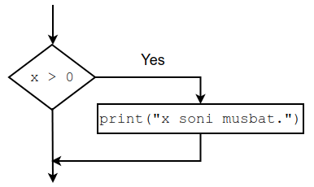
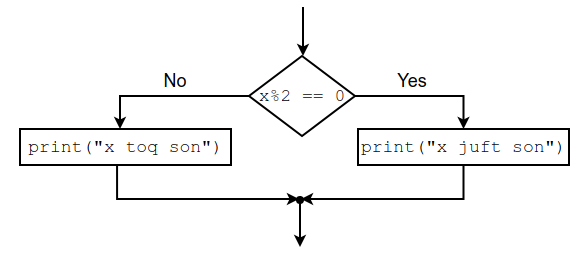

# If

[PDF](https://github.com/ochiqai/python/blob/main/kunlar/04-kun-Agar/04-kun-git.pdf)

## Boolean ifodalari

Boolean ifoda shunday ifodaki, u to'g'ri (true) yoki noto'g'ri (false) bo'ladi. Quyidagi 
ifodada `==` operatori 2 ta qiymatni biri-biriga taqqoslayapti. Agar ular teng 
bo'lsa, u `True` aks holda `False` qaytaradi. 

```python
tengmi = (5 == 5)
print(tengmi)
```
```commandline
----
True
```

```python
tengmi = (5 == 7)
print(tengmi)
```

```commandline
-----
False
```

`True` va `False` -- maxsus qiymatlar bo'lib, u `bool` turiga mavjud. Jumladan,

```python
print(type(True))
```
```commandline
---------------
<class 'bool'>
```

Boshqa taqqoslash operatorlari quyidagilar:

<p align="center">

| Taqqoslash |    Misol   |          Ma'nosi         |
|:----------:|:----------:|:------------------------:|
| `!=`         |   x != y   | x y ga teng emas         |
| `>`          |    x > y   | x y dan katta            |
| `<`          |    x < y   | x y dan kichik           |
| `>=`         |   x >= y   | x y dan katta yoki teng  |
| `<=`         |   x <= y   | x y dan kichik yoki teng |
| `is`         |   x is y   | x y bilan bir xil        |
| `is not`     | x is not y | x y bilan bir xil emas   |

</p>


E'tibor bering `=` belgisi yuklash demakdir, `==` esa tenglik/solishtirish belgisi.


## Mantiqli operatorlar

Mantiqiy operatorlar 3 ta: `and`, `or` va `not`. 

1. `and` (`va` tarjimasi)
  
    ```python
    holat = (x > 0) and (x < 10) 
    ```
    
    Bunda `holat = True` (to'g'ri) qiymatini oladi qachonki **ikkala** holat ham 
    qonoatlantirilsa. Masalan, aytaylik `x = 5`, unda birinchi holat to'g'ri 
  (`5 > 0`). Ikkinchi holat ham to'g'ri (`5 < 10`).
    
    `holat = False` bo'ladi, agar ikkala holat ham noto'g'ri bo'lsa. Yoki, ulardan biri
   noto'g'ri bo'lsa. Masalan `100` olsak. Birinchi shart qanoatlantiradi, 
   ikkinchi shart esa yo'q, yani `100 < 10`. 100 soni 10 sonidan kichik emas.

2. `or` (`yoki` tarjimasi)
    ```python
    holat = (x > 0) or (x < 10) 
    ```
  Bunda `holat=True` bo'lishi uchun holatlardan birigina to'g'ri bo'lsa bo'ldi.
  Masalan, `x = 100` olsak birinchi holat to'g'ri (`True` bo'ladi). Ikkinchi holat 
  ahamiyatga ega emas. Agar, 1-holat `True` bo'lmasa, keyingisi tekshiriladi.
  
- `not` (`teskarisi` tarjimasi)
  Bu operator berilgan `bool` o'zgaruvchisini teskarisiga o'tkazadi. Yani, to'g'ri
  bo'lsa uni noto'g'ri qiladi. Noto'g'ri bo'lsa to'g'ri qiladi; `True` operatorini 
  `False` qiladi, `False` ni `True` qiladi.  Masalan, 

  ```python
    x = 25
    holat = not (x > 10)
    print(holat)
  ```
  ```commandline
  -------
  False
  ```
  
  Bu yerda `25 > 10` to'g'ri --  `25` soni `10` sonidan katta. Lekin oldida `not` 
  bo'lganligi  uchun `True` `False` ga o'zgaradi.
  

## Holatiga qarab ishlatish

Kundalik hayotimizda, ko'pincha turli holatlarga duch kelamiz. Masalan bizda 25000 
so'm bor. Biz kitob olmoqchimiz. Bir necha kitoblarni ko'ramiz va 25000 ga 
solishtiramiz. Agar, kitob narxi 25000 dan yuqori bo'lsa boshqa kitobni ko'ramiz. 
Shunga o'xshash programmalarda ham biron holatni tekshirishga
to'g'ri keladi. Ushbu holatni quyidagicha programmalashimiz mumkin. 

```python
if kitob_narxi < 25000:
    print("Shu kitobni sotib olsam bo'ladi.")
```

E'tibor bering, ona tilimizga tarjima qilsak: agar (`if`)  kitob narxi `25000`dan kichik 
bo'lsa (`kitob_narxi < 25000`), unda `"Shu kitobni sotib olsam bo'ladi."` deb konsolga 
chiqarayapmiz.

Boshqa misol, berilgan sonni musbatligini aniqlash uchun 

```python
if x > 0:
    print("x soni musbat.")
```

E'tibor bering, ona tilimizga tarjima qilsak: agar (`if`) `x` soni `0` dan katta 
bo'lsa (`x > 0`), `"x soni musbat"` deb konsolga chiqaring deyapmiz. Shartdan 
keyin xuddi funksiya kabi ikki nuqta `:` (colon) qo'yamiz. Undan keyin qatordagilar 
esa oldidan bo'shliq qo'yib yoziladi. Grafik ravishda quyidagicha tasvirlashimiz 
mumkin

<p align="center">
    
</p>

Holatdan keyin xuddi funksiya kabi ikki nuqta `:` (colon) qo'yamiz. 
Undan keyin qatordagilar esa oldidan bo'shliq (indendt) qo'yib yoziladi. 


`if` ishtirok etgan qatorni bosh qismi deb, qolganini esa tana qismi deymiz. Tana qismida 
har doim biron nima bo'lishi kerak. Agar siz tanasida hech qanday 
ko'rsatma bermoqchi bo'lmasangiz, `pass` dan foydalansangiz bo'ladi. 
`pass` __hech narsa qilma__ demakdir.

```python
if x > 0:
    pass
```

Unutmangki, agar holat bajarilmasa tana qismi ishlamaydi va keyingi (tana tugagan) qatordan
boshlab programma ishlab ketaveradi.


## Aksincha holat

Holatli ishlatishning ikkinchi formasi **aksincha holat** deb ataladi. Bunda ikki holat
ro'y berishi mumkin

```python
if x % 2 == 0:
    print("x soni juft")
else:
    print("s soni toq")
```

Birinnchi holat `if` bo'lsa, ikkinchi holat `else` bo'ladi. `else` aksincha degani. 

Ishlash rejimi shundayki, agar birinchi holat to'g'ri bo'lsa, birinchi holat tanasigina 
ishlaydi. Qolgani esa tashlab ketiladi. Agar birinchi holat bajarilmasa, birinchi holat 
tanasi tashlab ketiladi, va ikkinchi holat tanasi bajariladi.


<p align="center">
    
</p>

Kitob misoliga qaytsak, agar kitob 25000 so'mdan past bo'lsa olaman, aks holda kitob 
olmayman.


## Zanjirli holatlar

Bazida bizga ikkitadan ko'p holatlarni tekshirishga to'g'ri keladi. O'sha vaqtda bizga 
zanjirli holatlardan foydalanishga to'g'ri keladi.


```python
if x > y:
    print("x soni y sonidan katta")
elif x < y:
    print("x soni y sonidan kichik")
else:
    print("x va y sonlari bir-biriga teng")
```

Bu yerda `elif` `else if` ning qisqartirilgani. Yuqoridagi programmada 3 ta holat 
bo'layapti, lekin programmada faqat ulardan biri to'g'ri bo'ladi va ishlaydi. Holatlar
yana birin ketin yuqoridan pastga qarab solishtirilib boriladi. Va qanoatlantirgan joydagi
tanaga kirib o'sha joy ishlaydi holos, qolganlari ishlamaydi.


## Ichki holatlar 

Shunday holatlar bo'ladiki, biz bir holat ichidan ikkinchi holatni tekshirishga 
to'g'ri keladi. Yuqoridagi programmani quyidagicha yozishimiz ham mumkin edi.

```python
if x == y:
    print("x va y sonlari bir-biriga teng")
else: 
    if x < y:
        print("x soni y sonidan kichik")
    else:
        print("x soni y sonidan katta")
```

Umuman olganda, programma tuzayotganimizda ichki holatlardan kamroq foydalanishga 
harakat qilishimiz kerak. Mantiqiy operatorlar shunday vaqtlarda qo'l keladi. 
Masalan, quyidagi programmani olaylik

- Mantiqiy operatorsiz:

    ```python
    if 0 < x:
        if x < 10:
            print('x soni musbat va bir xonali son.')
    ```

- Mantiqiy operator orqali:

    ```python
    if 0 < x and x < 10:
        print('x soni musbat va bir xonali son.')
    ```

Yana kitob misoliga qaytsak, bazida biz kitob 25000 so'mdan qimmat bo'lmasin **VA** 
juda kerak kitob bo'lsin.


## Odatdan tashqaridagi holatlar

Biz bazida bilamizki, shunday holat bo'ladiki programma ishlamaydi va u xato (error) 
chiqardi. Va programma o'sha yerda to'xtab qoladi. Bunda, xato manosiz yoki tushunarsiz 
bo'lishi mumkin. Shunday holatlarda, bizga **`try/except`** ko'rsatmasi yordamga keladi.

Masalan ikki sonni biri-biriga bo'lish funksiyasini ko'raylik.

```python
def bulish(a, b):
    natija = a / b
    return natija
```

Funksiyani chaqiramiz, va `10/5` bo'lish uchun,

```python
try:
    c = bulish(10, 5)  # 10/5
    print(c)
except:
    print("Nolga bo'lish mumkin emas!")
```

```commandline
-----
2.0
```

Agar `10/0` bo'lsak,

```python
try:
    c = bulish(10, 0)  # 10/5
    print(c)
except:
    print("Nolga bo'lish mumkin emas!")
```

```commandline
-----
Nolga bo'lish mumkin emas!
```

Agar `try/except` ni olib tashlasak, bizga juda qo'rqinchli xato ro'y beradi. Ayniqsa, 
inglizchani bilmaganlar uchun, 

```shell
ZeroDivisionError: division by zero
```


## Mantiqiy amallarda qisqa tutashuv

Aytaylik bizga quyidagi, manqtiqiy ifoda berilgan:

```python
natija = (10 < 5) and (10/0 > 3)
```

Pythonda ifodalar chapdan o'ngga qarab ishlaydi. Yani, birinchi `(10 < 5)` holat 
tekshiriladi, ikkinchi `10/0 > 3` holat tekshiriladi. 
Bu programma ishlaydi chunki birinchi holat `False`, qolgan holatni tekshirishning hojati yuq.
O'shaning uchun, shu yerda programma boshqa holatlarni tekshirishdan to'xtaydi va 
`natija = False` bo'ladi. Mana shu jarayon qisqa tutashuv deb ataladi. Xuddi `0 * 1 = 0` 
bo'ladi.  `0 * 1 * 35 = 0` bo'ladi. `0 * 1 * 35 * 81 = 0` 
bo'ladi. `0` ga har qanday sonni ko'paytirmang baribir nol bo'laveradi. Biron ifodani
olsak va uning birinchi soni `0` bo'lsa, va u bir neche sonlar ga ko'paytirilgan bo'lsa, 
amallarni bajarmasdan turib ko'paytma nolga tengligini aytishimiz mumkin.


Keling holatlar joyini almashtiramiz

```python
natija = (10/0 > 3) and (10 < 5)
```

Bunda programma ishlamaydi, chunki quyidagi xatoni beradi 

```commandline
-----------------------------------
ZeroDivisionError: division by zero
```

Bu xato biz bilgan 'Nolga bo'lish mumkin emas' degan xatodir. Yani, joyini 
almashtirganimizda `(10/0 > 3)` holatini tekshirmagandi. Endi esa tekshirayapti, chunki u 
birinchisi bo'ldi bu yerda. Xullas, chapdan o'ngga qarab ishlashligi esimizdan 
chiqmasligi zarur.


## Interaktiv programma

Programmani qiziqroq va qulaylashtirish uchun, qiymat berish programma 
ishlayotganda so'ralsa yaxshi bo'ladi. Shunda foydalanuvchi xoxlagan qiymatini 
berib tekshirishi mumkin. Shu maqsad uchun pythonda `input` funksiyasi mavjud:

```python
x_string = input("Sonni kiriting: ")
print(x_string)
```

```shell
Sonni kiriting: 1
1
```

E'tibor beringki, foydalanuvchi kiritgan qiymat hamisha string turiga tegishli bo'ladi. 
Son kiritilgan bo'lsa, u ustida arifmetik amallar bajarmoqchi bo'lsangiz, uni songa 
konvert qilishimiz kerak. Biz konvert qiladigan funksiyani ko'rib o'tdik. Eslatma, `int` 
butun sonlar uchun, `float` haqiqiy sonlar uchun.

Keling 2 sonni qo'shish misolini ko'rsak, sonlar foydalanuvchi tomonidan kiritilsin,

```python
birinchi = input("1-sonni kiriting: ")
ikkinchi = input("2-sonni kiriting: ")
natija_string = birinchi + ikkinchi
natija_butun = int(birinchi) + int(ikkinchi)
print('Butun songa konvert qilinMAdi: ', natija_string)
print('Butun songa konvert qilindi:', natija_butun)
```

```commandline
1-sonni kiriting: 5
2-sonni kiriting: 7
Butun songa konvert qilinMAdi:  57
Butun songa konvert qilindi: 12
```


## Foydali terminlar

- **tana (body)**: `if` holatidan keyingi kodlar 
- **boolean ifoda**: `True` (to'g'ri) yoki `False` (noto'g'ri) qiymatga ega bo'ladi.
- **zanjirli holat (chained conditional)**: bir biriga bog'liq turli xil holatlarni 
  tekshiruvi
- **taqqoslash operatori (comparison operator)**: `>, <, ==, >=, <=, !=`
- **holat (condition)**: programma holatga qarab kerakli qatorni ishlatishga ko'rsatma 
  beradi
- **mantiqiy operatorlar (logical operators)**: `and, or, not`
- **qisqa-tutashuv (short-circuit)**: Ifodagi amallarni qisman bajarish. Chunki, 
  python oxirgi 
  natijani oldindan bilgani uchun boshqa amallarga xojat yo'q.


## Problem solving

0. Holat nima uchun kerak?
1. Programma yarating. Agar berilgan son 100 bo'lsa, 90 dan `"90 dan katta"` deb chiqsin, 
   aks holda `90 dan kichik` deb chiqsin.
2. Sonning juft yoki toqligini aniqlang.
3. Programma tuzing. Foydalanuvchi faqat son kiritsin, agar string kiritsa. `Son kiriting, ilitmos`
    deb chiqsin. `try\except` dan foydalaning.

4. Programma tuzing. Agar, foydalanuvchi, 
   - 5 kiritsa `alo`  
   - 4 kiritsa `yaxshi`
   - 3 kiritsa `yomon`
   - 2 kiritsa `qoniqarsiz`
 
   deb chiqarsin 

5. Boolean ifodalar ishlash yo'nalishi qanday? misol keltiring. 
6. Holat bosh qismi nima?
7. Holat tana qismi nima?
8. Zanjirli (chain) holat nima?
9. Ichki (nested) holatlar nima?
10. Interaktive kiritish qanaqa bo'ladi?
11. Mantiqiy amallarda qisqa tutashuv hodisasini tushuntiring?
12. Odatdagidan tashqari holat yani "try/except" ni tushuntiring.
13. Necha xil boolean ifodalar bor?
  
    


