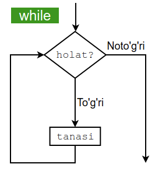

# Yana, yana va yana

## Yangilash

Ifodalarda ko'p uchraydigan narsa, bu o'zgaruvchilarni yangilash. Bunda berilgan o'zgaruvchi o'zining qiymatini
yagisiga o'zgariradi. O'zgaruvchi nomi o'zgarishsiz qoladi.

```python
x = x + 1
```

Dehqonchasiga, "joriy (hozirdagi) o'zgaruvchi qiymatini olgin, unga 1 ni qo'shgin va keyin 'yangi' 
qiymatni yan o'sha o'zgaruvchiga yuklagin."

Albatta, bunda `x` ning eski qiymati bo'lishi zarur, aks holda programma o'ng tarafdan ishlagni uchun
`x` degan o'zgaruvchi yo'q deb xato beradi

```python
x = x + 1
-----------------------------------
NameError: name `x` is not defined
```

Eski qiymatni yangisiga almashtirish uchun, `x` ga biron qiymat yuklab qo'yishimiz kerak. Masalan,

```python
x = 0
x = x + 1
```

O'zgaruvchi eski qiymatini birga oshirib o'zgartirish - **inkrement** (increment). Birga kamaytirish esa
**dekriment** (decrement) deb ataladi.


## while ifodasi

Kompyuterlar takrorlanuvchi topshiriqlarni bajarish uchun foydalaniladi. Bir xil topshiriqni qayta 
qayta xatosiz qilishda kompyuterga ten keladigani yo'q. Odam charchab qolishligi va natijada xato qilishligi mumkin. 
Shuningdek odam sekin qiladi. Mana shu maqsadda Pythonda ham takrorlanuvchi topshiriqlarni bajarish
uchun bir necha qulayliklar qilingan.

Shulardan biri `while` deb ataladi. Quyidagi misolda `1 dan 10 gacha` sonni chiqarish programmasi keltirilgan

```python
x = 1
while x <= 10:
    print(x)
    x = x + 1
```

```commandline   
1
2
3
4
5
6
7
8
9
10
```

Dehqonchasiga: `x` qiymati `10` da kichik bo'lsa uni konsolga chiqargin VA `x` qiymatini birga 
oshirib `x` ning eski qimatini yangilagin. Shu narsani toki `x` qiymatini  `10` dan katta 
bo'lguncha qilgin. Agar, `x` qiymati 10 dan katta bo'lsa programma tugatilsin.

Rasmiyroq qilib tushuntirsak:

- 1-qadam  `while` yonida turuvchi holat (shart) ni `To'g'ri (True) yoki Noto'g'ri (False)` ekanligini 
    hisoblagin.
- 2-qadam Agar holat `_No_to'g'ri` bo'lsa, `while` tanasiga kirmagin, va programmani tana tashqarisadan 
   davom ettrivergin.
- 3-qadam Agar holat `To'g'ri` bo'lsa, `while` tanasiga ifodlarni ham hisoblagin va yan `while` yani 
    1-qadamga borgin.

Mana shu qadamlar 1-qadamdan 3-qadamga bir marotaba borishi **takrorlanish** (iteration) deb ataladi.
Masalan, balanddagi programmada 10 marta takrorlanish bo'ldi deyiladi. Yani, `while` tanisi 10 marta 
ishladi.

`while` tanasidagi `x` o'zgaruvchisi takroriy o'zgaruvchi hisoblanib, `while` tanasi qachon ishlashdan
to'tashlikni hal qiladi. Agar, `while` tanasida takroroiy o'zgaruvchi bo'lmasa, u **to'xtovsiz, cheksiz**
ishlayveradi.

Xullas, `while` quiydagi strukturaga ga

```python
kodlar
while holat:
    kodlar
```

Grafik ko'rinishi




## Cheksiz takrorlanish

Ba'zi hollarda bir ataylab takroriy o'zgaruvchidan foydalanmaymiz. Chunki, biz aniq necha marta takrorlanishini 
bilmaymiz, va foydalanuvchi ixtiyorida bo'ladi.

Quyidagi programma cheksiz ishlaydi:

```python
n = 1
while True:
    print(n)
    n = n + 1
print("Bo'ldi")
```

Bu programma kompyuter energiyasi tugagunicha ishlaydi yoki uni o'zingiz to'xtatmaguningizcha. Chunki
`while` holati har doim `True` (`To'g'ri`).

Bir ko'rinishda bu foydasiz ko'rinishi mumkin lekin, biz foydali qilishimiz ham mumkin. Aytaylik,
programma tuzdingiz va foydalanuvchida qiymat kiritishni so'radingiz toki `tamom` degan 
string yozgunicha:

```python
while True:
    belgi = input('> ')
    if belgi == 'tamom':
        break
    print(belgi)
print("Proramma ishladi")
```

`while` dagi shart har doim `True`, shuning uchun i doimo ishlayveradi toki `break` 
ko'rsatmasiga borgunicha. 

Har safar  `while` ishlaganida, u foydalanuvchida biron string kiritishni kutadi. Agar, foydalanuvchi
`tamom` deb yozsa, programma `break` ifodasiga boradi va takrorlanish to'taydi. Aks holda, programma
foydalanunchidan yana yana va yana so'rayveradi. Masalan quyidagicha bo'lishi mumkin,

```commandline
> a
a
> b
b
> c
c
> salom
salom
> hayr
hayr
> tamom
Proramma ishladi
```


## `Continue` yoxud `davom etaver`

Shunday holatlar bo'ladiki, siz programma ishlayotganida hozirgi tokrorlanishni to'liq to'xtatmay, 
keyingisiga zudlik bilan o'tishingiz kerak bo'ladi. Xo'sh buni qanday qilamiz? `continue` uka bizga 
yordam beradi. 

Tushunarli bo'lishi uchun balandagi programmani quyidagicha o'zgartiraylik.

```python
while True:
    belgi = input('> ')
    if belgi == '#':
        continue
    if belgi == 'tamom':
        break
    print(belgi)
print("Proramma ishladi")
```

Bu yerda, programma yuqoridagidek toki `tamom` yozilgunicha ishlaydi. Agar `#` yozilsa  programma 
`continue` ga boradidabir daniga yana `while True` qatoriga sakraydi. E'tibor bering, 
`continue` dan keyingi qatorlar tashlab ketiladi.

Masalan,

```commandline
> a
a
> b
b
> c
c
> #
> #
> tamom
Proramma ishladi
```

Nima kiritilgan bo'lsa hammasi konsolga chiqayapti. Lekin `#` esa chiqmayapti.


## `for` yoxud aniq miqdorda takrorlanish

Bazi vaqtda biz takrorlanishlar sonini aniq bilamiz. Shunda qarab takrorlanishlar uchun alohida
Pythonda qulaylik bor. Bu esa -- `for`. For quyidagi strukturaga ega:

```python
for i in range(boshlanish, tugash, qadam): # bosh qismi
    # tana qismi
```

Bunda `range` funksiyasi uchta parametr qabul qiladi. Ular `boshlanish`, `tugash`, va `qadam`.
Va `boshlanish` joyidan `qadam` tashlanib `tugash`gacha boriladi. Masalan.

```python
for i in range(1, 11, 1): 
    print(i)
```

Bunda, `1 boshlanishi`, va unga `1 qadam `qo'shayapmiz toki qadam `11` bo'lgunicha, yani `tugash` 
nuqtasi `11` ga yetguncha. Natija,

```commandline
1
2
3
4
5
6
7
8
9
10
```


##  Foydali terminlar


## Problem solving

1. Inkrement nima?
2. Dekriment nima?
3. O'zgaruvchilarni yangilash nima?
4. `while` yordamida 30 dan 0 gacha bo'lgan sonlarni chiqaring, kamayish tartibida.
5. `for` yordamidan 1 dan 15 gacha bo'lgan sonlarni chiqaring.
6. Shunday programma yozingki, u foydalanuvchidan sonlarni qabul qilsin agar son kiritilmay 
   harf kiritilsa, foydalanuvchiga "son kiriting" deb ogohlantirsin va davom etsin. Qachonki 
   foydalanuvchi `tamom` deb yozsa. O'shanda, shu paytgacha bo'lgan sonlarni hammasi qo'shib 
   konsolga chiqarsin.
   ```commandline
   Raqam kiriting: 4 
   Raqam kiriting: 6
   Raqam kiriting: 5
   Raqam kiriting: nuriddin
   son kiriting
   Raqam kiriting: 10
   Raqam kiriting: tamom
   yigindi: 20
   ```

7. Shunday programma yozingki, u foydalanuvchidan sonlarni qabul qilsin agar son kiritilmay 
   harf kiritilsa, foydalanuvchiga "son kiriting" deb ogohlantirsin va davom etsin. Qachonki 
   foydalanuvchi `tamom` deb yozsa. O'shanda, shu paytgacha kirtilgan sonlar umumiysini 
   konsolga chiqarsin.
   
   ```commandline
   Raqam kiriting: 4 
   Raqam kiriting: 6
   Raqam kiriting: 5
   Raqam kiriting: nuriddin
   son kiriting
   Raqam kiriting: 10
   Raqam kiriting: tamom
   soni: 4
   ```

8. Shunday programma yozingki, u foydalanuvchidan sonlarni qabul qilsin agar son kiritilmay 
   harf kiritilsa, foydalanuvchiga "son kiriting" deb ogohlantirsin va davom etsin. Qachonki 
   foydalanuvchi `tamom` deb yozsa. O'shanda, shu paytgacha kirtilgan sonlar o'rtachasini 
   konsolga chiqarsin.
   
   ```commandline
   Raqam kiriting: 4 
   Raqam kiriting: 6
   Raqam kiriting: 5
   Raqam kiriting: nuriddin
   son kiriting
   Raqam kiriting: 10
   Raqam kiriting: tamom
   soni: 5
   ```
   
9. Shunday programma tuzingki konsolga quyiga chiqsin.

```commandline
x    pow(x, 2)  pow(x, 3)   Farqi
-    ---------  ---------   -----
1.0  1.0        1.0         0.0
2.0  4.0        8.0         4.0  
```
