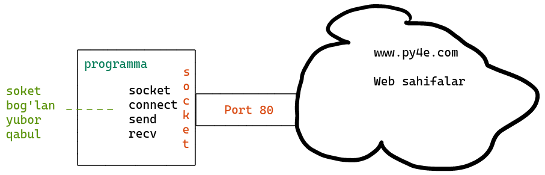

# Networked programs

Shu paytgacha biz programma tuzganimizda. Ular malumotni kompyuter o'zidan o'qidi/oldi. Yoki fayllar bilan 
ishlaganimizda fayllar kompyuterimizda turgan edi. Lekin, internetga esa malumotlar ko'p manba'lardan kelishi 
mumkin. 

Bugin, biz o'zimiz web brovser (google chrome, opera, safari) rolini o'ynaymiz. Va veb sahifalarni HTTP 
(Hypertext Transfer Protocol) orqali olamiz. Keyin ulardan malumotlarni o'qib, ulardan keraklisini ajratib olamiz (parse).


## HTTP Protokol
Veb sahifani ishlatadigan netvork protokoli aslida juda oson. Pythonda `socket` degan biblioteka bor. Bu biblioteka
netvork aloqalarni taminlashni va soketlardan maumotlarni olishni juda osonlashtiradi.

Soket bu xuddi faylga o'xshaydi. Farqli tarafi shundaki, bitta soket ikki programma o'rtasida ikki tomonlama aloqani
taminlaydi. Agar, soketga biron malumot yozilsa, u programmaga yuboriladi. Agar malumotni soketdan o'qisangiz
demak u malumotni boshqa programma yuborganini bildiradi.  Quyidagicha tasvirlash mumkin:

<p align="center">
    
</p>


Aytaylik soketga hech qanday programma malumot yubormagan, unda sizni programmangiz baribir malumot kelishini shunchaki kutadi.
Aytaylik 2 ta programma soketga hech qanday malumot yubormay uzoq vaqt malumot yubormasa, ular bir birini juda uzoq kutib qoladi. 
Shuning uchun internat orqali aloqa qiladigan programmalar uchun protokol joriy qilingan.

Protokol bu aniq qoidalar to'plamiki bunda qaysi programma birinchi malumot yuboradi, nima qiladi,va keyin malumotga
qanaqa javob bo'lish kerak, keyingi malumotni kim yuboradi va hokazo. Shundayki, 2 ta programma bir biri bilan
skoet orqali navbatma va navbat aloqa qilishdir. 

Hozrida juda ko'p protokollar mavjud. Shulardan HTTP quyidagi linkda berilgan 
[HTTP protokol](https://www.w3.org/Protocols/rfc2616/rfc2616.txt)

Bu ko'p varaqli dokument hisoblanadi (176 bet). o'qimochi bo'lganlar o'qishi mumkin. Lekin, hozir 36 betga qarasangiz 
`GET` so'rovini ko'rishingiz mumkin. Veb serverdan dokument so'ramoqchi bo'lsak, biz www.pr4e.org serveri 80 portga
ga bog'lanamiz. Keyin quyidagini yuboramiz

```commandline
GET http://data.pr4e.org/romeo.txt HTTP/1.0
```

Ikkinchi parameterda bu biz so'rayotgan veb sahifa. Va biz bo'sh qator ham yuboramiz. Veb server dokument/fayl haqida
qo'shimcha malumot bilan javob qaytaradi. Va undan keyin asosiy dokument kontenti keladi.


## Oddiy Veb Brovzer

HTTP protokol qanday ishlashini ko'rishimiz uchun oddiy programma tuzamiz. 

 - Programma veb serverga bog'lanadi.  
 - Keyin HTTP qoidalariga muvofiq dokumentni so'raydi.
 - Va serverdan qaytgan narsani ekranga chiqaradi.


```python

import socket

# soket hosil qilish
mysocket = socket.socket(socket.AF_INET, socket.SOCK_STREAM)
# soket orqali serverga bog'lanish
mysocket.connect(('data.pr4e.org', 80))

# adres va uni ikkilikga o'tkazish
cmd = 'GET http://data.pr4e.org/romeo.txt HTTP/1.0\r\n\r\n'.encode()
# so'rovnoma yuborish
mysocket.send(cmd)

while True:
    # malumot olish, 512 ta harfdan iborat
    data = mysocket.recv(512)
    # agar malumot qolmasa loopda chiqish
    if len(data) < 1:
        break
    # malumotni stringga o'tkazish va chiqarish     
    print(data.decode(), end='')

# soketni yopish
mysocket.close()
```
Prgoramma nima qilayapti: birinchi programma 80-port orqali www.py4e.com severiga bog'lanayapti. 
Programma veb brovzer rolini o'ynayotgani uchun, HTTP protokol aytadiki biz GET kommandasi va bush qatorni 
jo'natishimiz shart. `\r\n` qator tugaganligini bildiradi. Demak, `\r\n\r\n` ikki teksni ajratish uchun kerak.

Bo'sh qatorni yuborganimizdan so'z, biz loop orqali malumotni soketdan - 512 ta harfdan iborat qilib birin ketin olaveramiz.
Shu zahoti ularni ham ekranga chiqaramiz toki malumot qolmaganicha. Programma quyidagini chiqaradi:

```commandline
b'GET http://data.pr4e.org/romeo.txt HTTP/1.0\r\n\r\n'
HTTP/1.1 200 OK
Date: Tue, 28 Dec 2021 10:52:58 GMT
Server: Apache/2.4.18 (Ubuntu)
Last-Modified: Sat, 13 May 2017 11:22:22 GMT
ETag: "a7-54f6609245537"
Accept-Ranges: bytes
Content-Length: 167
Cache-Control: max-age=0, no-cache, no-store, must-revalidate
Pragma: no-cache
Expires: Wed, 11 Jan 1984 05:00:00 GMT
Connection: close
Content-Type: text/plain

But soft what light through yonder window breaks
It is the east and Juliet is the sun
Arise fair sun and kill the envious moon
Who is already sick and pale with grief
```

To'liq malumot qo'shimcha malumot bilan boshlanadi. Masalan, `Date: Tue, 28 Dec 2021 10:52:58 GMT` qachon malumot olingani
bildiradi. `Content-Type: text/plain` malumot turini bildiradi, bunda tekst.

Server qo'shimcha malumotni yuborgandan so'ng, u bo'sh qator qo'yadi. Bo'sh qator qo'shimcha malumot 
tugaganligini bildiradi. Keyin `remeo.txt` fayli tekstini yuboradi.

Programmadan, `encode` va `decode` funksiyalarini ko'rishimiz mumkin. HTTP protokol malumotlarni ikkilik (binary) ko'rinishida
yuborishligini taqozo qiladi. `encode` va `decode` funksiyalari o'shalarni taminlaydi. `encode` ikkilikga o'tkazadi. 
Va `decode` asliga qaytaradi -- yani stringga qaytaradi. Programma illustratsiyasi quyidagicha 


<p align="center">
    
</p>

Rasmlarni HTTP orqali olish ham shunda o'xshash bo'ladi.


## `urllib`


Yuqorida biz HTTPdan `socket` bibliotekasi orqali malumotni yuborish va qabul qiloishni ko'rdik. Lekin bunday qilish
keng tarqalganiligi uchun, Pythonda ana shuni ancha osonlashtirilgan. Ya'ni `urrlib` bibliotekasi qilingan.

`urllib`dan foydalanganda, veb sahifani xuddi faylxa o'xshatsak bo'ladi. Oddiygina qilib qaysi veb sahifani
ochmoqchiligingizni aytasiz va `urllib` qolgan hamma HTTP protokol va qo'shimcha malumotlarni amalga ochiradi.

Yuqoridagi `romeo.txt` ni o'qishini quyidagicha yozishimiz mumkin

```python

import urllib.request
fayl = urllib.request.urlopen("http://data.pr4e.org/romeo.txt")
for qator in fayl:
    print(qator.decode().strip())

```

Veb sahifa `urllib.urlopen` orqali ochilganidan so'ng, uni xuddi fayl kabi ishlatamiz va `for loop` 
orqali malumotlarni o'qiymiz. 

Programma ishlaganida, biz faqat tekstni ko'ramiz. Qo'shimcha malumotlar `urllib` orqali olinadi va hal qilinadi.
Foydalanuvchiga ko'rsatilmaydi.

```commandline
But soft what light through yonder window breaks
It is the east and Juliet is the sun
Arise fair sun and kill the envious moon
Who is already sick and pale with grief
```


## HTML Parsing 
Biz internetda ishlaganimizda ko'pincha biron malumotni qidiramiz. Hozir, HTML malumotni regular ifodalar orqali
pars qilishni ko'ramiz. Masalan quyidagi  oddiy veb sahifani olaylik:

```html
<h1>The First Page</h1>
<p>
If you like, you can switch to the
<a href="http://www.dr-chuck.com/page2.htm">
Second Page</a>.
</p>
```

Vazifa shunday bo'lsinki, yuqoridagi sahifadan linklarni olish kerak.

Buning uchun biz regular ifodadan foydalansak bo'ladi. Link `href="http` deb boshlanadi va undan keyin `//` 
belgilari keladi. Shunday qilib, quyidagicha regular ifodani tuzsak bo'ladi,

```commandline
href="http[s]?://.+?"
```

Bu yerda `[s]` degani, `http` yoki `https` bo'lishi mumkinligini bildiradi. Bizni maqsad linklarni olish
bo'lganligi uchun ifodani `()`larga olamiz,

```commandline
href="(http[s]?://.+?)"
```

Umuman programmada qo'llasak,

```python
# Search for link values within URL input
import urllib.request, urllib.parse, urllib.error
import re
import ssl

# Ignore SSL certificate errors
ctx = ssl.create_default_context()
ctx.check_hostname = False
ctx.verify_mode = ssl.CERT_NONE
# ixtiyoriy urlni kiriting
url = input('URL addresni kiriting - ')
html = urllib.request.urlopen(url, context=ctx).read()
links = re.findall(b'href="(http[s]?://.*?)"', html)

for link in links:
    print(link.decode())
```

- `ssl` bibliotekasi `https` bilan ishlash uchun kerak
- `read()` metodi HTML sors kodini bayt (`bytes`) ko'rinishida qaytaradi.
- `findall` regular ifoda metodi berilgan regular ifodaga mos tekstlarni qaytaradi.

Programmani ishlatsak quyidagini olishimiz mumkin,

```commandline
URL addresni kiriting - http://www.kun.uz
b'<!DOCTYPE html>\n<html lang="uz">\n\t<head>\n\t\t<meta http-equiv="Content-Type" content="text/html; charset=utf-8">\n\t\t<meta http-equiv="X-UA-Compatible" content="IE=edge;chrome=1" />\n\t\t<meta name="viewport" content="width=device-width">\n\t\t<meta name="viewport" content="width=device-width, initial-scale=1, minimum-scale=1, maximum-scale=1">\n\t\t<link rel="shortcut icon" href="/favicon.ico?v=1" />\n    \t<link rel="apple-touch-icon" sizes="180x180" href="/apple-touch-icon.png">\n    \t<link rel="icon" type="image/png" sizes="32x32" href="/favicon32x32.png">\n    \t<link rel="icon" type="image/png" sizes="16x16" href="/favicon1616.png">\n    \t<link rel="mask-icon" href="/safari-pinned-tab.svg" color="#5bbad5">\n    \t<link rel="alternate" type="application/rss+xml" title="RSS feed" href="/rss" />\n    \t<meta name="author" content="Kun uz">\n      <meta name="theme-color" content="#000">\n      <meta name="msapplication-navbutton-color" content="#000">\n      <meta name="apple-mobile-web-app-status-bar-style" content="#000">\n      <meta name="google-site-verification" content="XRKGT7ifCTNLGtaaVKVLrQLffNnYmSRe5A6BvwCfTy4" />\n    \t<title>\xd0\x8e\xd0\xb7\xd0\xb1\xd0\xb5\xd0\xba\xd0\xb8\xd1\x81\xd1\x82\xd0\xbe\xd0\xbd \xd0\xb2\xd0\xb0 \xd0\xb6\xd0\xb0\xd2\xb3\xd0\xbe\xd0\xbd \xd1\x8f\xd0\xbd\xd0\xb3\xd0\xb8\xd0\xbb\xd0\xb8\xd0\xba\xd0\xbb\xd0\xb0\xd1\x80\xd0\xb8, \xd1\x8d\xd0\xbd\xd0\xb3 \xd1\x81\xd1\x9e\xd0\xbd\xd0\xb3\xd0\xb3\xd0\xb8 \xd1\x82\xd0\xb5\xd0\xb7\xd0\xba\xd0\xbe\xd1\x80 \xd1\x85\xd0\xb0\xd0\xb1\xd0\xb0\xd1\x80\xd0\xbb\xd0\xb0\xd1\x80, \xd2\x9b\xd0\xb8\xd0\xb7\xd0\xb8\xd2\x9b\xd0\xb0\xd1\x80\xd0\xbb\xd0\xb8 \xd0\xbc\xd0\xb0\xd2\x9b\xd0\xbe\xd0\xbb\xd0\xb0, \xd0\xb8\xd0\xbd\xd1\x82\xd0\xb5\xd1\x80\xd0\xb2\xd1\x8c\xd1\x8e, \xd1\x84\xd0\xbe\xd1\x82\xd0\xbe \xd0\xb2\xd0\xb0 \xd0\xb2\xd0\xb8\xd0\xb4\xd0\xb5\xd0\xbe \xd0\xbc\xd0\xb0\xd1\x82\xd0\xb5\xd1\x80\xd0\xb8\xd0\xb0\xd0\xbb\xd0\xbb\xd0\xb0\xd1\x80 - KUN.UZ</title>\n\t\t\t<style media="screen">\n\t\t\t\t.adv-wrapper img{\n\t\t\t\t\tmax-height: 100% !important;\n\t\t\t\t}\n\t\t\t</style>\n    \t<meta name="description" content="\xd0\x8e\xd0\xb7\xd0\xb1\xd0\xb5\xd0\xba\xd0\xb8\xd1\x81\xd1\x82\xd0\xbe\xd0\xbd\xd0\xb4\xd0\xb0 \xd0\xb2\xd0\xb0 \xd0\xb4\xd1\x83\xd0\xbd\xd1\x91\xd0\xb4\xd0\xb0 \xd1\x80\xd1\x9e\xd0\xb9 \xd0\xb1\xd0\xb5\xd1\x80\xd0\xb0\xd1\x91\xd1\x82\xd0\xb3\xd0\xb0\xd0\xbd \xd1\x8d\xd0\xbd\xd0\xb3 \xd1\x81\xd1\x9e\xd0\xbd\xd0\xb3\xd0\xb3\xd0\xb8 \xd1\x8f\xd0\xbd\xd0\xb3\xd0\xb8\xd0\xbb\xd0\xb8\xd0\xba\xd0\xbb\xd0\xb0\xd1\x80 \xd0\xb2\xd0\xb0 \xd1\x85\xd0\xb0\xd0\xb1\xd0\xb0\xd1\x80\xd0\xbb\xd0\xb0\xd1\x80, \xd0\xb6\xd0\xb0\xd0\xbc\xd0\xb8\xd1\x8f\xd1\x82, \xd0\xb8\xd2\x9b\xd1\x82\xd0\xb8\xd1\x81\xd0\xbe\xd0\xb4\xd0\xb8\xd1\x91\xd1\x82, \xd0\xbc\xd0\xb0\xd0\xb4\xd0\xb0\xd0\xbd\xd0\xb8\xd1\x8f\xd1\x82, \xd1\x81\xd0\xbe\xd0\xbf\xd1\x80\xd1\x82, \xd1\x82\xd0\xb5\xd0\xbd\xd0\xbe\xd0\xbb\xd0\xbe\xd0\xb3\xd0\xb8\xd1\x8f\xd0\xbb\xd0\xb0\xd1\x80\xd0\xb3\xd0\xb0 \xd0\xbe\xd0\xb8\xd0\xb4 \xd2\x9b\xd0\xb8\xd0\xb7\xd0\xb8\xd2\x9b\xd0\xb0\xd1\x80\xd0\xbb\xd0\xb8 \xd0\xbc\xd0\xb0\xd2\x9b\xd0\xbe\xd0\xbb\xd0\xb0\xd0\xbb\xd0\xb0\xd1\x80. \xd0\x9c\xd0\xb0\xd1\x88\xd2\xb3\xd1\x83\xd1\x80\xd0\xbb\xd0\xb0\xd1\x80 \xd0\xb1\xd0\xb8\xd0\xbb\xd0\xb0\xd0\xbd \xd0\xb8\xd0\xbd\xd1\x82\xd0\xb5\xd1\x80\xd1\x8c\xd0\xb2\xd1\x8e\xd0\xbb\xd0\xb0\xd1\x80, \xd0\xb1\xd0\xb0\xd1\x80\xd1\x87\xd0\xb0 KUN.UZ \xd1\x81\xd0\xb0\xd0\xb9\xd1\x82\xd0\xb8\xd0\xb4\xd0\xb0.">\n<meta name="keywords" content="Yangiliklar,\xd1\x85\xd0\xb0\xd0\xb1\xd0\xb0\xd1\x80\xd0\xbb\xd0\xb0\xd1\x80,\xd0\xb8\xd0\xbd\xd1\x82\xd0\xb5\xd1\x80\xd0\xb2\xd1\x8c\xd1\x8e, Dunyo Sport, \xd1\x84\xd0\xbe\xd1\x82\xd0\xbe \xd0\xb2\xd0\xb0 \xd0\xb2\xd0\xb8\xd0\xb4\xd0\xb5\xd0\xbe \xd0\xbc\xd0\xb0\xd1\x82\xd0\xb5\xd1\x80\xd0\xb8\xd0\xb0\xd0\xbb\xd0\xbb\xd0\xb0\xd1\x80">\n<meta property="og:title" content="Kun.uz.Eng qiziqarli yangiliklar">\n<meta property="og:description" content="Eng qiziqarli yangiliklar \xe2\x80\x94 bizda! Dunyo, mahalliy, gadjetlar, sport, avtomobillar olami yangiliklaridan xabardor bo\xe2\x80\x98ling.">\n<meta property="og:type" content="website">\n<meta property="og:url" content="https://kun.uz/">\n<meta property="og:site_name" content="Kun.uz">\n<link href="/assets/4da8d774/styles/vendor.css?v=1615819572" rel="stylesheet">\n<link href="/assets/4da8d774/styles/style.css?v=1636518273" rel="stylesheet">\n<link href="/assets/4da8d774/styles/fonts.css?v=1609415512" rel="stylesheet">    \t<meta name="csrf-param" content="_csrf">\n    <meta name="csrf-token" content="7ezPEJ0hse4cDPs45O3sImwVRRyK8PZHZZ77dSeqg6e636wmyxLfjFNhikmjq6pFI1IIVtyCxSwM3I0FY_zQ8Q==">\n\t\t\t<script src="https://yastatic.net/pcode/adfox/loader.js" crossorigin="anonymous"></script>\n\t</head>\n\t<body>\n      <script>\n      (function(i,s,o,g,r,a,m){i[\'GoogleAnalyticsObject\']=r;i[r]=i[r]||function(){\n              (i[r].q=i[r].q||[]).push(arguments)},i[r].l=1*new Date();a=s.createElement(o),\n          m=s.getElementsByTagName(o)[0];a.async=1;a.src=g;m.parentNode.insertBefore(a,m)\n      })(window,document,\'script\',\'https://www.google-analytics.com/analytics.js\',\'ga\');\n\n      ga(\'create\', \'UA-28543543-1\', \'auto\');\n      ga(\'send\', \'pageview\');\n\n  </script>\n\n  <!-- Yandex.Metrika counter -->\n  <script type="text/javascript">\n      (function (d, w, c) {\n          (w[c] = w[c] || []).push(function() {\n              try {\n                  w.yaCounter22022599 = new Ya.Metrika({\n                      id:22022599,\n                      clickmap:true,\n                      trackLinks:true,\n                      accurateTrackBounce:true,\n                      webvisor:true\n                  });\n              } catch(e) { }\n          });\n\n          var n = d.getElementsByTagName("script")[0],\n              s = d.createElement("script"),\n              f = function () { n.parentNode.insertBefore(s, n); };\n          s.type = "text/javascript";\n          s.async = true;\n          s.src = "https://mc.yandex.ru/metrika/watch.js";\n\n          if (w.opera == "[object Opera]") {\n              d.addEventListener("DOMContentLoaded", f, false);\n          } else { f(); }\n      })(document, window, "yandex_metrika_callbacks");\n\n\n  </script>\n  <noscript><div></div></noscript>\n  <!-- /Yandex.Metrika counter -->\n\t\t      <div class="page-preloader">\n        <div class="inner-loader"></div>\n      </div>\n\t\t\t<div class="outer-wrapper">\n        \t\t<header class="page-header">\n\t\t<div class="container">\n\t\t\t <div id=\'adfox_163358652822099952\'></div>\n      <script>\n          window.yaContextCb.push(()=>{\n              Ya.adfoxCode.create({\n                  ownerId: 367651,\n                  containerId: \'adfox_163358652822099952\',\n                  params: {\n                      pp: \'g\',\n                      ps: \'eudb\',\n                      p2: \'hhiz\'\n                  }\n              })\n          })\n      </script>\t\t\t<div class="page-header__wrapper"><a href="/" class="page-header__logo"></a><ul class="page-header__menu reset-list"><li class="page-header__menu-item"><a href="/news/category/uzbekiston" class="menu-link">\xd0\x8e\xd0\xb7\xd0\xb1\xd0\xb5\xd0\xba\xd0\xb8\xd1\x81\xd1\x82\xd0\xbe\xd0\xbd</a></li><li class="page-header__menu-item"><a href="/news/category/jahon" class="menu-link">\xd0\x96\xd0\xb0\xd2\xb3\xd0\xbe\xd0\xbd</a></li><li class="page-header__menu-item"><a href="/news/category/iktisodiet" class="menu-link">\xd0\x98\xd2\x9b\xd1\x82\xd0\xb8\xd1\x81\xd0\xbe\xd0\xb4\xd0\xb8\xd1\x91\xd1\x82</a></li><li class="page-header__menu-item"><a href="/news/category/jamiyat" class="menu-link">\xd0\x96\xd0\xb0\xd0\xbc\xd0\xb8\xd1\x8f\xd1\x82</a></li><li class="page-header__menu-item"><a href="/news/category/tehnologia" class="menu-link">\xd0\xa4\xd0\xb0\xd0\xbd-\xd1\x82\xd0\xb5\xd1\x85\xd0\xbd\xd0\xb8\xd0\xba\xd0\xb0</a></li><li class="page-header__menu-item"><a href="/news/category/sport" class="menu-link">\xd0\xa1\xd0\xbf\xd0\xbe\xd1\x80\xd1\x82</a></li><li class="page-header__menu-item"><a href="/news/category/businessclass" class="menu-link">Business class</a></li><li class="page-header__menu-item"><a href="/news/audio/list" class="menu-link">\xd0\x90\xd1\x83\xd0\xb4\xd0\xb8\xd0\xbe</a></li></ul><div class="page-header__search-block"><form action="/news/news/search" method="get"><div class="form-group"><button class="search-button"></button><input type="text" id="search-input" name="q" value="" placeholder="\xd2\x9a\xd0\xb8\xd0\xb4\xd0\xb8\xd1\x80\xd1\x83\xd0\xb2" required="true"></div></form></div><div class="page-header__options"><div class="menu-btn"></div><div class="lang-wrapper"><div class="lang-block"> <div class="lang-toggle"><div class="lang-current">\xd0\x8e\xd0\xb7\xd0\xb1\xd0\xb5\xd0\xba\xd1\x87\xd0\xb0</div></div><div class="lang-list"><div class="lang-block"><a class="lang-link" href="/changelang/uz?c=%2Fuz%2F">O\'zbekcha</a></div><div class="lang-block"><a class="lang-link" href="/changelang/ru?c=%2Fru%2F">\xd0\xa0\xd1\x83\xd1\x81\xd1\x81\xd0\xba\xd0\xb8\xd0\xb9</a></div><div class="lang-block"><a class="lang-link" href="/changelang/en?c=%2Fen%2F">English</a></div></div></div></div><div class="toggle-search"></div><div class="profile"></div></div></div>\t\t</div>\n\t</header>\n\t<div class="wrapper">\n\t\t<main>\n\t\t<div class="container mb-50">\n\t<div class="countries"><div class="countries-list"> <div class="regions">\xd2\xb2\xd1\x83\xd0\xb4\xd1\x83\xd0\xb4\xd0\xbb\xd0\xb0\xd1\x80</div><ul class="list"><li ><a href="/region/toshkent">\xd0\xa2\xd0\xbe\xd1\x88\xd0\xba\xd0\xb5\xd0\xbd\xd1\x82 \xd1\x88.</a></li><li ><a href="/region/qoraqalpogiston">\xd2\x9a\xd0\xbe\xd1\x80\xd0\xb0\xd2\x9b\xd0\xb0\xd0\xbb\xd0\xbf\xd0\xbe\xd2\x93\xd0\xb8\xd1\x81\xd1\x82\xd0\xbe\xd0\xbd</a></li><li ><a href="/region/andijon">\xd0\x90\xd0\xbd\xd0\xb4\xd0\xb8\xd0\xb6\xd0\xbe\xd0\xbd</a></li><li ><a href="/region/fargona">\xd0\xa4\xd0\xb0\xd1\x80\xd2\x93\xd0\xbe\xd0\xbd\xd0\xb0</a></li><li ><a href="/region/namangan">\xd0\x9d\xd0\xb0\xd0\xbc\xd0\xb0\xd0\xbd\xd0\xb3\xd0\xb0\xd0\xbd</a></li><li ><a href="/region/samarqand">\xd0\xa1\xd0\xb0\xd0\xbc\xd0\xb0\xd1\x80\xd2\x9b\xd0\xb0\xd0\xbd\xd0\xb4</a></li><li ><a href="/region/buxoro">\xd0\x91\xd1\x83\xd1\x85\xd0\xbe\xd1\x80\xd0\xbe</a></li><li ><a href="/region/xorazm">\xd0\xa5\xd0\xbe\xd1\x80\xd0\xb0\xd0\xb7\xd0\xbc</a></li><li ><a href="/region/surxondaryo">\xd0\xa1\xd1\x83\xd1\x80\xd1\x85\xd0\xbe\xd0\xbd\xd0\xb4\xd0\xb0\xd1\x80\xd1\x91</a></li><li ><a href="/region/qashqadaryo">\xd2\x9a\xd0\xb0\xd1\x88\xd2\x9b\xd0\xb0\xd0\xb4\xd0\xb0\xd1\x80\xd1\x91</a></li><li ><a href="/region/jizzax">\xd0\x96\xd0\xb8\xd0\xb7\xd0\xb7\xd0\xb0\xd1\x85</a></li><li ><a href="/region/sirdaryo">\xd0\xa1\xd0\xb8\xd1\x80\xd0\xb4\xd0\xb0\xd1\x80\xd1\x91</a></li><li ><a href="/region/toshkent-viloyati">\xd0\xa2\xd0\xbe\xd1\x88\xd0\xba\xd0\xb5\xd0\xbd\xd1\x82 \xd0\xb2\xd0\xb8\xd0\xbb.</a></li><li ><a href="/region/navoiy">\xd0\x9d\xd0\xb0\xd0\xb2\xd0\xbe\xd0\xb8\xd0\xb9</a></li></ul></div></div>\t<div class="row">\n\t\t<div class="col-md-9">\n\t\t\t<div class="top-news">\n\t\t\t\t\t\t\t\t\t\t\t\t\t\t\t\t\t\t\t\t\t\t<div class="top-news__big">\n\t\t\t\t\t\t\t\t<a class="big-news" href="/news/2021/12/27/katta-imtiyozlar-yerosti-boyliklarini-ozlashtirishdan-kimlar-manfaat-koradi">\n                      \t\t\t\t<span class="big-news__img"></span>\n                      \t\t\t\t<span class="big-news__content">\n                        \t\t\t\t<div class="news-meta"><span>13:01 / 27.12.2021</span></div><span class="big-news__title">\xd0\x9a\xd0\xb0\xd1\x82\xd1\x82\xd0\xb0 \xd0\xb8\xd0\xbc\xd1\x82\xd0\xb8\xd1\x91\xd0\xb7\xd0\xbb\xd0\xb0\xd1\x80: \xd0\x95\xd1\x80\xd0\xbe\xd1\x81\xd1\x82\xd0\xb8 \xd0\xb1\xd0\xbe\xd0\xb9\xd0\xbb\xd0\xb8\xd0\xba\xd0\xbb\xd0\xb0\xd1\x80\xd0\xb8\xd0\xbd\xd0\xb8 \xd1\x9e\xd0\xb7\xd0\xbb\xd0\xb0\xd1\x88\xd1\x82\xd0\xb8\xd1\x80\xd0\xb8\xd1\x88\xd0\xb4\xd0\xb0\xd0\xbd \xd0\xba\xd0\xb8\xd0\xbc\xd0\xbb\xd0\xb0\xd1\x80 \xd0\xbc\xd0\xb0\xd0\xbd\xd1\x84\xd0\xb0\xd0\xb0\xd1\x82 \xd0\xba\xd1\x9e\xd1\x80\xd0\xb0\xd0\xb4\xd0\xb8?</span>\n                        \t\t\t\t<span class="big-news__description">\xd0\x8e\xd0\xb7\xd0\xb1\xd0\xb5\xd0\xba\xd0\xb8\xd1\x81\xd1\x82\xd0\xbe\xd0\xbd\xd0\xb4\xd0\xb0 2022 \xd0\xb9\xd0\xb8\xd0\xbb\xd0\xb4\xd0\xb0\xd0\xbd \xd0\x95\xd1\x80 \xd2\x9b\xd0\xb0\xd1\x8a\xd1\x80\xd0\xb8\xd0\xb4\xd0\xb0\xd0\xbd \xd1\x84\xd0\xbe\xd0\xb9\xd0\xb4\xd0\xb0\xd0\xbb\xd0\xb0\xd0\xbd\xd0\xb3\xd0\xb0\xd0\xbd\xd0\xbb\xd0\xb8\xd0\xba \xd1\x83\xd1\x87\xd1\x83\xd0\xbd (\xd0\xbe\xd0\xbb\xd1\x82\xd0\xb8\xd0\xbd\xd0\xb4\xd0\xb0\xd0\xbd \xd1\x82\xd0\xbe\xd1\x80\xd1\x82\xd0\xb8\xd0\xb1 \xd0\xb3\xd0\xb0\xd0\xb7\xd0\xb3\xd0\xb0\xd1\x87\xd0\xb0) \xd1\x81\xd0\xbe\xd0\xbb\xd0\xb8\xd2\x9b \xd1\x81\xd1\x82\xd0\xb0\xd0\xb2\xd0\xba\xd0\xb0\xd0\xbb\xd0\xb0\xd1\x80\xd0\xb8 \xd0\xbf\xd0\xb0\xd1\x81\xd0\xb0\xd0\xb9\xd0\xbc\xd0\xbe\xd2\x9b\xd0\xb4\xd0\xb0. \xd0\x9b\xd0\xb5\xd0\xba\xd0\xb8\xd0\xbd \xd1\x81\xd1\x82\xd0\xb0\xd0\xb2\xd0\xba\xd0\xb0\xd0\xbb\xd0\xb0\xd1\x80 \xd0\x9d\xd0\x9a\xd0\x9c\xd0\x9a, \xd0\x9e\xd0\x9a\xd0\x9c\xd0\x9a \xd0\xb2\xd0\xb0 \xe2\x80\x9c\xd0\x8e\xd0\xb7\xd0\xb1\xd0\xb5\xd0\xba\xd0\xbd\xd0\xb5\xd1\x84\xd1\x82\xd0\xb3\xd0\xb0\xd0\xb7\xe2\x80\x9d \xd1\x83\xd1\x87\xd1\x83\xd0\xbd \xd1\x9e\xd0\xb7\xd0\xb3\xd0\xb0\xd1\x80\xd0\xbc\xd0\xb0\xd1\x81\xd0\xb4\xd0\xb0\xd0\xbd \xd2\x9b\xd0\xbe\xd0\xbb\xd0\xb0\xd0\xb4\xd0\xb8.</span>\n                      \t\t\t\t</span>\n                      \t\t\t</a>\n\t\t\t                </div><div class="top-news__small-items"> <div class="row">\n\t\t\t                                \t\t\t\t\t\t                \t<div class="col-md-6">\n                        <div class="small-news"><a class="small-news__img" href="/news/2021/12/26/kitoblar-qayerda-ozmuda-yoqolgani-aytilayotgan-qadimiy-qolyozmalar-bilan-bogliq-vaziyat-chigallashmoqda"></a>\n                          <div class="small-news__content">\n                            <div class="news-meta"><span>19:00 / 26.12.2021</span></div><a class="small-news__title" href="/news/2021/12/26/kitoblar-qayerda-ozmuda-yoqolgani-aytilayotgan-qadimiy-qolyozmalar-bilan-bogliq-vaziyat-chigallashmoqda">\xd0\x9a\xd0\xb8\xd1\x82\xd0\xbe\xd0\xb1\xd0\xbb\xd0\xb0\xd1\x80 \xd2\x9b\xd0\xb0\xd0\xb5\xd1\x80\xd0\xb4\xd0\xb0? \xd0\x8e\xd0\xb7\xd0\x9c\xd0\xa3\xd0\xb4\xd0\xb0 \xd0\xb9\xd1\x9e\xd2\x9b\xd0\xbe\xd0\xbb\xd0\xb3\xd0\xb0\xd0\xbd\xd0\xb8 \xd0\xb0\xd0\xb9\xd1\x82\xd0\xb8\xd0\xbb\xd0\xb0\xd1\x91\xd1\x82\xd0\xb3\xd0\xb0\xd0\xbd \xd2\x9b\xd0\xb0\xd0\xb4\xd0\xb8\xd0\xbc\xd0\xb8\xd0\xb9 \xd2\x9b\xd1\x9e\xd0\xbb\xd1\x91\xd0\xb7\xd0\xbc\xd0\xb0\xd0\xbb\xd0\xb0\xd1\x80 \xd0\xb1\xd0\xb8\xd0\xbb\xd0\xb0\xd0\xbd \xd0\xb1\xd0\xbe\xd2\x93\xd0\xbb\xd0\xb8\xd2\x9b \xd0\xb2\xd0\xb0\xd0\xb7\xd0\xb8\xd1\x8f\xd1\x82 \xd1\x87\xd0\xb8\xd0\xb3\xd0\xb0\xd0\xbb\xd0\xbb\xd0\xb0\xd1\x88\xd0\xbc\xd0\xbe\xd2\x9b\xd0\xb4\xd0\xb0</a>\n                          </div>\n                        </div>\n                    </div>\n                                        \t\t\t\t\t\t                \t<div class="col-md-6">\n                        <div class="small-news"><a class="small-news__img" href="/news/2021/12/26/papayya-zaytun-kivi-va-banan-pishdi-buloqboshilik-shifokorning-ajabtovur-bogi"></a>\n                          <div class="small-news__content">\n                            <div class="news-meta"><span>15:22 / 26.12.2021</span></div><a class="small-news__title" href="/news/2021/12/26/papayya-zaytun-kivi-va-banan-pishdi-buloqboshilik-shifokorning-ajabtovur-bogi">\xe2\x80\x9c\xd0\x9f\xd0\xb0\xd0\xbf\xd0\xb0\xd0\xb9\xd1\x8f, \xd0\xb7\xd0\xb0\xd0\xb9\xd1\x82\xd1\x83\xd0\xbd, \xd0\xba\xd0\xb8\xd0\xb2\xd0\xb8 \xd0\xb2\xd0\xb0 \xd0\xb1\xd0\xb0\xd0\xbd\xd0\xb0\xd0\xbd \xd0\xbf\xd0\xb8\xd1\x88\xd0\xb4\xd0\xb8\xe2\x80\x9d \xe2\x80\x94 \xd0\xb1\xd1\x83\xd0\xbb\xd0\xbe\xd2\x9b\xd0\xb1\xd0\xbe\xd1\x88\xd0\xb8\xd0\xbb\xd0\xb8\xd0\xba \xd1\x88\xd0\xb8\xd1\x84\xd0\xbe\xd0\xba\xd0\xbe\xd1\x80\xd0\xbd\xd0\xb8\xd0\xbd\xd0\xb3 \xd0\xb0\xd0\xb6\xd0\xb0\xd0\xb1\xd1\x82\xd0\xbe\xd0\xb2\xd1\x83\xd1\x80 \xd0\xb1\xd0\xbe\xd2\x93\xd0\xb8</a>\n                          </div>\n                        </div>\n                    </div>\n                                        \t\t\t\t\t\t                \t<div class="col-md-6">\n                        <div class="small-news"><a class="small-news__img" href="/news/2021/12/26/prezident-aytgan-soliq-yiguvchilar-kimlar-edi-masullar-izoh-berishdi"></a>\n                          <div class="small-news__content">\n                            <div class="news-meta"><span>11:40 / 26.12.2021</span></div><a class="small-news__title" href="/news/2021/12/26/prezident-aytgan-soliq-yiguvchilar-kimlar-edi-masullar-izoh-berishdi">\xd0\x9f\xd1\x80\xd0\xb5\xd0\xb7\xd0\xb8\xd0\xb4\xd0\xb5\xd0\xbd\xd1\x82 \xd0\xb0\xd0\xb9\xd1\x82\xd0\xb3\xd0\xb0\xd0\xbd \xc2\xab\xd1\x81\xd0\xbe\xd0\xbb\xd0\xb8\xd2\x9b \xd0\xb9\xd0\xb8\xd2\x93\xd1\x83\xd0\xb2\xd1\x87\xd0\xb8\xd0\xbb\xd0\xb0\xd1\x80\xc2\xbb \xd0\xba\xd0\xb8\xd0\xbc\xd0\xbb\xd0\xb0\xd1\x80 \xd1\x8d\xd0\xb4\xd0\xb8? \xd0\x9c\xd0\xb0\xd1\x81\xd1\x8a\xd1\x83\xd0\xbb\xd0\xbb\xd0\xb0\xd1\x80 \xd0\xb8\xd0\xb7\xd0\xbe\xd2\xb3 \xd0\xb1\xd0\xb5\xd1\x80\xd0\xb8\xd1\x88\xd0\xb4\xd0\xb8</a>\n                          </div>\n                        </div>\n                    </div>\n                                        \t\t\t\t\t\t                \t<div class="col-md-6">\n                        <div class="small-news"><a class="small-news__img" href="/news/2021/12/25/komil-allamjonov-mast-holda-avtomobil-boshqarganlik-uchun-15-sutka-qamoq-jazosi-belgilashni-taklif-qildi"></a>\n                          <div class="small-news__content">\n                            <div class="news-meta"><span>22:42 / 25.12.2021</span></div><a class="small-news__title" href="/news/2021/12/25/komil-allamjonov-mast-holda-avtomobil-boshqarganlik-uchun-15-sutka-qamoq-jazosi-belgilashni-taklif-qildi">\xd0\x9a\xd0\xbe\xd0\xbc\xd0\xb8\xd0\xbb \xd0\x90\xd0\xbb\xd0\xbb\xd0\xb0\xd0\xbc\xd0\xb6\xd0\xbe\xd0\xbd\xd0\xbe\xd0\xb2 \xd0\xbc\xd0\xb0\xd1\x81\xd1\x82 \xd2\xb3\xd0\xbe\xd0\xbb\xd0\xb4\xd0\xb0 \xd0\xb0\xd0\xb2\xd1\x82\xd0\xbe\xd0\xbc\xd0\xbe\xd0\xb1\xd0\xb8\xd0\xbb \xd0\xb1\xd0\xbe\xd1\x88\xd2\x9b\xd0\xb0\xd1\x80\xd0\xb3\xd0\xb0\xd0\xbd\xd0\xbb\xd0\xb8\xd0\xba \xd1\x83\xd1\x87\xd1\x83\xd0\xbd 15 \xd1\x81\xd1\x83\xd1\x82\xd0\xba\xd0\xb0 \xd2\x9b\xd0\xb0\xd0\xbc\xd0\xbe\xd2\x9b \xd0\xb6\xd0\xb0\xd0\xb7\xd0\xbe\xd1\x81\xd0\xb8 \xd0\xb1\xd0\xb5\xd0\xbb\xd0\xb3\xd0\xb8\xd0\xbb\xd0\xb0\xd1\x88\xd0\xbd\xd0\xb8 \xd1\x82\xd0\xb0\xd0\xba\xd0\xbb\xd0\xb8\xd1\x84 \xd2\x9b\xd0\xb8\xd0\xbb\xd0\xb4\xd0\xb8</a>\n                          </div>\n                        </div>\n                    </div>\n                                                           </div>\n               </div>\n           \t\t\t</div>\n\t\t\t<div class="editor-choice">\n\t\t\t\t\t\t\t\t<div class="block-title"><a href="/news/list?f=selected"><span>\xd0\x9c\xd1\x83\xd2\xb3\xd0\xb0\xd1\x80\xd1\x80\xd0\xb8\xd1\x80 \xd1\x82\xd0\xb0\xd0\xbd\xd0\xbb\xd0\xbe\xd0\xb2\xd0\xb8</span></a><a class="link" href="/news/list?f=selected">\xd0\x91\xd0\xb0\xd1\x80\xd1\x87\xd0\xb0\xd1\x81\xd0\xb8</a></div>\n\t\t\t\t<div class="row">\n\t\t\t\t\t\n\t\t\t\t\t\t<div class="col-md-4">\n\t                      <div class="news">\n\t                        <div class="news__img p-relative"><a href="/news/2021/12/24/yoqolib-borayotgan-qish-qor-nega-yogmayapti"></a>\n\t                        </div>\n\t                        <div class="news-meta"><span>11:50 / 24.12.2021</span></div><a class="news__title" href="/news/2021/12/24/yoqolib-borayotgan-qish-qor-nega-yogmayapti">\xd0\x99\xd1\x9e\xd2\x9b\xd0\xbe\xd0\xbb\xd0\xb8\xd0\xb1 \xd0\xb1\xd0\xbe\xd1\x80\xd0\xb0\xd1\x91\xd1\x82\xd0\xb3\xd0\xb0\xd0\xbd \xd2\x9b\xd0\xb8\xd1\x88. \xd2\x9a\xd0\xbe\xd1\x80 \xd0\xbd\xd0\xb5\xd0\xb3\xd0\xb0 \xd1\x91\xd2\x93\xd0\xbc\xd0\xb0\xd1\x8f\xd0\xbf\xd1\x82\xd0\xb8?</a>\n\t                      </div>\n                    \t</div>\n\n\n\t\t\t\t\t\n                    \n\t\t\t\t\t\t<div class="col-md-4">\n\t                      <div class="news">\n\t                        <div class="news__img p-relative"><a href="/news/2021/12/23/ekologik-inqiroz-ozbekistonning-suv-muammosiga-yechim-bormi-vazir-bilan-suhbat"></a>\n\t                        </div>\n\t                        <div class="news-meta"><span>17:20 / 23.12.2021</span></div><a class="news__title" href="/news/2021/12/23/ekologik-inqiroz-ozbekistonning-suv-muammosiga-yechim-bormi-vazir-bilan-suhbat">\xd0\xad\xd0\xba\xd0\xbe\xd0\xbb\xd0\xbe\xd0\xb3\xd0\xb8\xd0\xba \xd0\xb8\xd0\xbd\xd2\x9b\xd0\xb8\xd1\x80\xd0\xbe\xd0\xb7: \xd0\x8e\xd0\xb7\xd0\xb1\xd0\xb5\xd0\xba\xd0\xb8\xd1\x81\xd1\x82\xd0\xbe\xd0\xbd\xd0\xbd\xd0\xb8\xd0\xbd\xd0\xb3 \xd1\x81\xd1\x83\xd0\xb2 \xd0\xbc\xd1\x83\xd0\xb0\xd0\xbc\xd0\xbc\xd0\xbe\xd1\x81\xd0\xb8\xd0\xb3\xd0\xb0 \xd0\xb5\xd1\x87\xd0\xb8\xd0\xbc \xd0\xb1\xd0\xbe\xd1\x80\xd0\xbc\xd0\xb8? | \xd0\x92\xd0\xb0\xd0\xb7\xd0\xb8\xd1\x80 \xd0\xb1\xd0\xb8\xd0\xbb\xd0\xb0\xd0\xbd \xd1\x81\xd1\x83\xd2\xb3\xd0\xb1\xd0\xb0\xd1\x82</a>\n\t                      </div>\n                    \t</div>\n\n\n\t\t\t\t\t\n                    \n\t\t\t\t\t\t<div class="col-md-4">\n\t                      <div class="news">\n\t                        <div class="news__img p-relative"><a href="/news/2021/12/23/garoyib-tez-yordam-osma-koprik-qishga-gamlangan-suv-manzil-oqdahana"></a>\n\t                        </div>\n\t                        <div class="news-meta"><span>16:01 / 23.12.2021</span></div><a class="news__title" href="/news/2021/12/23/garoyib-tez-yordam-osma-koprik-qishga-gamlangan-suv-manzil-oqdahana">\xd2\x92\xd0\xb0\xd1\x80\xd0\xbe\xd0\xb9\xd0\xb8\xd0\xb1 \xd1\x82\xd0\xb5\xd0\xb7 \xd1\x91\xd1\x80\xd0\xb4\xd0\xb0\xd0\xbc, \xd0\xbe\xd1\x81\xd0\xbc\xd0\xb0 \xd0\xba\xd1\x9e\xd0\xbf\xd1\x80\xd0\xb8\xd0\xba, \xd2\x9b\xd0\xb8\xd1\x88\xd0\xb3\xd0\xb0 \xd2\x93\xd0\xb0\xd0\xbc\xd0\xbb\xd0\xb0\xd0\xbd\xd0\xb3\xd0\xb0\xd0\xbd \xd1\x81\xd1\x83\xd0\xb2. \xe2\x80\x9c\xd0\x9c\xd0\xb0\xd0\xbd\xd0\xb7\xd0\xb8\xd0\xbb\xe2\x80\x9d \xe2\x80\x93 \xd0\x9e\xd2\x9b\xd0\xb4\xd0\xb0\xd2\xb3\xd0\xb0\xd0\xbd\xd0\xb0</a>\n\t                      </div>\n                    \t</div>\n\n\n\t\t\t\t\t\n                    \t\t\t\t</div>\n\t\t\t\t\t\t\t</div>\n\t\t</div>\n\t\t<div class="col-md-3">\n\t\t\t<a href="/news/list" class="block-title"><span>\xd0\xa1\xd1\x9e\xd0\xbd\xd0\xb3\xd0\xb3\xd0\xb8  \xd1\x8f\xd0\xbd\xd0\xb3\xd0\xb8\xd0\xbb\xd0\xb8\xd0\xba\xd0\xbb\xd0\xb0\xd1\x80</span></a>\n\t\t\t<div class="mb-25">\n\t\t\t\t\t\t\t\t\t<a class="news-lenta" href="/news/2021/12/26/prezident-aytgan-soliq-yiguvchilar-kimlar-edi-masullar-izoh-berishdi">\n                    \t                    \t<span class="news-lenta__title"> \xd0\x9f\xd1\x80\xd0\xb5\xd0\xb7\xd0\xb8\xd0\xb4\xd0\xb5\xd0\xbd\xd1\x82 \xd0\xb0\xd0\xb9\xd1\x82\xd0\xb3\xd0\xb0\xd0\xbd \xc2\xab\xd1\x81\xd0\xbe\xd0\xbb\xd0\xb8\xd2\x9b \xd0\xb9\xd0\xb8\xd2\x93\xd1\x83\xd0\xb2\xd1\x87\xd0\xb8\xd0\xbb\xd0\xb0\xd1\x80\xc2\xbb \xd0\xba\xd0\xb8\xd0\xbc\xd0\xbb\xd0\xb0\xd1\x80 \xd1\x8d\xd0\xb4\xd0\xb8? \xd0\x9c\xd0\xb0\xd1\x81\xd1\x8a\xd1\x83\xd0\xbb\xd0\xbb\xd0\xb0\xd1\x80 \xd0\xb8\xd0\xb7\xd0\xbe\xd2\xb3 \xd0\xb1\xd0\xb5\xd1\x80\xd0\xb8\xd1\x88\xd0\xb4\xd0\xb8</span>\n                    \t                  \t</a>\n\t\t\t\t\t\t\t\t\t<a class="news-lenta" href="/news/2021/12/17/media-kompaniyasi-reklama-sotishda-tajribasi-bor-ish-izlovchilarni-ishga-taklif-etadi">\n                    \t                    \t<span class="news-lenta__title"> \xd0\x9c\xd0\xb5\xd0\xb4\xd0\xb8\xd0\xb0\xd0\xba\xd0\xbe\xd0\xbc\xd0\xbf\xd0\xb0\xd0\xbd\xd0\xb8\xd1\x8f \xd1\x80\xd0\xb5\xd0\xba\xd0\xbb\xd0\xb0\xd0\xbc\xd0\xb0 \xd1\x81\xd0\xbe\xd1\x82\xd0\xb8\xd1\x88\xd0\xb4\xd0\xb0 \xd1\x82\xd0\xb0\xd0\xb6\xd1\x80\xd0\xb8\xd0\xb1\xd0\xb0\xd1\x81\xd0\xb8 \xd0\xb1\xd0\xbe\xd1\x80 \xd0\xb8\xd1\x88 \xd0\xb8\xd0\xb7\xd0\xbb\xd0\xbe\xd0\xb2\xd1\x87\xd0\xb8\xd0\xbb\xd0\xb0\xd1\x80\xd0\xbd\xd0\xb8 \xd0\xb8\xd1\x88\xd0\xb3\xd0\xb0 \xd1\x82\xd0\xb0\xd0\xba\xd0\xbb\xd0\xb8\xd1\x84 \xd1\x8d\xd1\x82\xd0\xb0\xd0\xb4\xd0\xb8!</span>\n                    \t                  \t</a>\n\t\t\t\t\t\t\t\t\t<a class="news-lenta" href="/news/2021/12/28/polsha-yevroittifoq-belgilagan-jarimani-tolashdan-bosh-tortdi">\n                    \t                    \t<div class="news-meta"><span>21:23</span></div>\n                    \t                    \t<span class="news-lenta__title"> \xd0\x9f\xd0\xbe\xd0\xbb\xd1\x8c\xd1\x88\xd0\xb0 \xd0\x95\xd0\xb2\xd1\x80\xd0\xbe\xd0\xb8\xd1\x82\xd1\x82\xd0\xb8\xd1\x84\xd0\xbe\xd2\x9b \xd0\xb1\xd0\xb5\xd0\xbb\xd0\xb3\xd0\xb8\xd0\xbb\xd0\xb0\xd0\xb3\xd0\xb0\xd0\xbd \xd0\xb6\xd0\xb0\xd1\x80\xd0\xb8\xd0\xbc\xd0\xb0\xd0\xbd\xd0\xb8 \xd1\x82\xd1\x9e\xd0\xbb\xd0\xb0\xd1\x88\xd0\xb4\xd0\xb0\xd0\xbd \xd0\xb1\xd0\xbe\xd1\x88 \xd1\x82\xd0\xbe\xd1\x80\xd1\x82\xd0\xb4\xd0\xb8</span>\n                    \t                  \t</a>\n\t\t\t\t\t\t\t\t\t<a class="news-lenta" href="/news/2021/12/28/aqshda-armiya-generalini-xitoyga-ogohlantiruvchi-qongiroq-uchun-qatl-etishga-chaqiriq-yangradi">\n                    \t                    \t<div class="news-meta"><span>21:21</span></div>\n                    \t                    \t<span class="news-lenta__title"> \xd0\x90\xd2\x9a\xd0\xa8\xd0\xb4\xd0\xb0 \xd0\xb0\xd1\x80\xd0\xbc\xd0\xb8\xd1\x8f \xd0\xb3\xd0\xb5\xd0\xbd\xd0\xb5\xd1\x80\xd0\xb0\xd0\xbb\xd0\xb8\xd0\xbd\xd0\xb8 \xd0\xa5\xd0\xb8\xd1\x82\xd0\xbe\xd0\xb9\xd0\xb3\xd0\xb0 \xd0\xbe\xd0\xb3\xd0\xbe\xd2\xb3\xd0\xbb\xd0\xb0\xd0\xbd\xd1\x82\xd0\xb8\xd1\x80\xd1\x83\xd0\xb2\xd1\x87\xd0\xb8 \xd2\x9b\xd1\x9e\xd0\xbd\xd2\x93\xd0\xb8\xd1\x80\xd0\xbe\xd2\x9b \xd1\x83\xd1\x87\xd1\x83\xd0\xbd \xd2\x9b\xd0\xb0\xd1\x82\xd0\xbb \xd1\x8d\xd1\x82\xd0\xb8\xd1\x88\xd0\xb3\xd0\xb0 \xd1\x87\xd0\xb0\xd2\x9b\xd0\xb8\xd1\x80\xd0\xb8\xd2\x9b \xd1\x8f\xd0\xbd\xd0\xb3\xd1\x80\xd0\xb0\xd0\xb4\xd0\xb8</span>\n                    \t                  \t</a>\n\t\t\t\t\t\t\t\t\t<a class="news-lenta" href="/news/2021/12/28/unday-xodimlardan-qutulgan-afzal-giyosov-yangiyolda-uchastkavoylardan-plan-talab-qilinayotgani-haqida">\n                    \t                    \t<div class="news-meta"><span>21:00</span></div>\n                    \t                    \t<span class="news-lenta__title"> \xc2\xab\xd0\xa3\xd0\xbd\xd0\xb4\xd0\xb0\xd0\xb9 \xd1\x85\xd0\xbe\xd0\xb4\xd0\xb8\xd0\xbc\xd0\xbb\xd0\xb0\xd1\x80\xd0\xb4\xd0\xb0\xd0\xbd \xd2\x9b\xd1\x83\xd1\x82\xd1\x83\xd0\xbb\xd0\xb3\xd0\xb0\xd0\xbd \xd0\xb0\xd1\x84\xd0\xb7\xd0\xb0\xd0\xbb\xc2\xbb \xe2\x80\x93 \xd2\x92\xd0\xb8\xd1\x91\xd1\x81\xd0\xbe\xd0\xb2 \xd0\xaf\xd0\xbd\xd0\xb3\xd0\xb8\xd0\xb9\xd1\x9e\xd0\xbb\xd0\xb4\xd0\xb0 \xc2\xab\xd1\x83\xd1\x87\xd0\xb0\xd1\x81\xd1\x82\xd0\xba\xd0\xb0\xd0\xb2\xd0\xbe\xd0\xb9\xc2\xbb\xd0\xbb\xd0\xb0\xd1\x80\xd0\xb4\xd0\xb0\xd0\xbd \xd0\xbf\xd0\xbb\xd0\xb0\xd0\xbd \xd1\x82\xd0\xb0\xd0\xbb\xd0\xb0\xd0\xb1 \xd2\x9b\xd0\xb8\xd0\xbb\xd0\xb8\xd0\xbd\xd0\xb0\xd1\x91\xd1\x82\xd0\xb3\xd0\xb0\xd0\xbd\xd0\xb8 \xd2\xb3\xd0\xb0\xd2\x9b\xd0\xb8\xd0\xb4\xd0\xb0</span>\n                    \t                  \t</a>\n\t\t\t\t\t\t\t\t\t<a class="news-lenta" href="/news/2021/12/28/17-yoshli-nodirbek-abdusattorov-amaldagi-jahon-chempioni-magnus-karlsenni-maglub-etdi">\n                    \t                    \t<div class="news-meta"><span>20:39</span></div>\n                    \t                    \t<span class="news-lenta__title"> 17 \xd1\x91\xd1\x88\xd0\xbb\xd0\xb8 \xd0\x9d\xd0\xbe\xd0\xb4\xd0\xb8\xd1\x80\xd0\xb1\xd0\xb5\xd0\xba \xd0\x90\xd0\xb1\xd0\xb4\xd1\x83\xd1\x81\xd0\xb0\xd1\x82\xd1\x82\xd0\xbe\xd1\x80\xd0\xbe\xd0\xb2 \xd0\xb0\xd0\xbc\xd0\xb0\xd0\xbb\xd0\xb4\xd0\xb0\xd0\xb3\xd0\xb8 \xd0\xb6\xd0\xb0\xd2\xb3\xd0\xbe\xd0\xbd \xd1\x87\xd0\xb5\xd0\xbc\xd0\xbf\xd0\xb8\xd0\xbe\xd0\xbd\xd0\xb8 \xd0\x9c\xd0\xb0\xd0\xb3\xd0\xbd\xd1\x83\xd1\x81 \xd0\x9a\xd0\xb0\xd1\x80\xd0\xbb\xd1\x81\xd0\xb5\xd0\xbd\xd0\xbd\xd0\xb8 \xd0\xbc\xd0\xb0\xd2\x93\xd0\xbb\xd1\x83\xd0\xb1 \xd1\x8d\xd1\x82\xd0\xb4\xd0\xb8</span>\n                    \t                  \t</a>\n\t\t\t\t\t\t\t\t\t<a class="news-lenta" href="/news/2021/12/28/turistlar-uchun-eng-ommabop-shaharlar-reytingi-elon-qilindi">\n                    \t                    \t<div class="news-meta"><span>20:26</span></div>\n                    \t                    \t<span class="news-lenta__title"> \xd0\xa2\xd1\x83\xd1\x80\xd0\xb8\xd1\x81\xd1\x82\xd0\xbb\xd0\xb0\xd1\x80 \xd1\x83\xd1\x87\xd1\x83\xd0\xbd \xd1\x8d\xd0\xbd\xd0\xb3 \xd0\xbe\xd0\xbc\xd0\xbc\xd0\xb0\xd0\xb1\xd0\xbe\xd0\xbf \xd1\x88\xd0\xb0\xd2\xb3\xd0\xb0\xd1\x80\xd0\xbb\xd0\xb0\xd1\x80 \xd1\x80\xd0\xb5\xd0\xb9\xd1\x82\xd0\xb8\xd0\xbd\xd0\xb3\xd0\xb8 \xd1\x8d\xd1\x8a\xd0\xbb\xd0\xbe\xd0\xbd \xd2\x9b\xd0\xb8\xd0\xbb\xd0\xb8\xd0\xbd\xd0\xb4\xd0\xb8</span>\n                    \t                  \t</a>\n\t\t\t\t\t\t\t\t\t<a class="news-lenta" href="/news/2021/12/28/dunyodagi-eng-yosh-respublika-navbatdan-tashqari-saylovlar-elon-qildi">\n                    \t                    \t<div class="news-meta"><span>20:25</span></div>\n                    \t                    \t<span class="news-lenta__title"> \xd0\x94\xd1\x83\xd0\xbd\xd1\x91\xd0\xb4\xd0\xb0\xd0\xb3\xd0\xb8 \xd1\x8d\xd0\xbd\xd0\xb3 \xd1\x91\xd1\x88 \xd1\x80\xd0\xb5\xd1\x81\xd0\xbf\xd1\x83\xd0\xb1\xd0\xbb\xd0\xb8\xd0\xba\xd0\xb0 \xd0\xbd\xd0\xb0\xd0\xb2\xd0\xb1\xd0\xb0\xd1\x82\xd0\xb4\xd0\xb0\xd0\xbd \xd1\x82\xd0\xb0\xd1\x88\xd2\x9b\xd0\xb0\xd1\x80\xd0\xb8 \xd1\x81\xd0\xb0\xd0\xb9\xd0\xbb\xd0\xbe\xd0\xb2\xd0\xbb\xd0\xb0\xd1\x80 \xd1\x8d\xd1\x8a\xd0\xbb\xd0\xbe\xd0\xbd \xd2\x9b\xd0\xb8\xd0\xbb\xd0\xb4\xd0\xb8\xc2\xa0</span>\n                    \t                  \t</a>\n\t\t\t\t\t\t\t</div>\n\t\t\t<a href="/news/list" class="main-btn-v2 w-100">\xd0\x9a\xd1\x9e\xd0\xbf\xd1\x80\xd0\xbe\xd2\x9b \xd1\x8f\xd0\xbd\xd0\xb3\xd0\xb8\xd0\xbb\xd0\xb8\xd0\xba</a>\n\t\t</div>\n\t</div>\n</div>\n<div class=\'adv-wrapper\'> <div class=\'container\'><div id=\'adfox_162618030148559683\'></div>\n<script>\n    window.Ya.adfoxCode.create({\n        ownerId: 367651,\n        containerId: \'adfox_162618030148559683\',\n        params: {\n            pp: \'g\',\n            ps: \'eudb\',\n            p2: \'hhcg\'\n        }\n    });\n</script></div></div><div class="container" id="actual-news-content" data=\'{"url":"\\/news\\/list?f=actual","title":"\\u0414\\u043e\\u043b\\u0437\\u0430\\u0440\\u0431 \\u0445\\u0430\\u0431\\u0430\\u0440\\u043b\\u0430\\u0440"}\'></div>\n\t<div class="interview">\n\t\t<div class="container" id="interview-news-content" data=\'{"url":"\\/news\\/list?f=interview","title":"\\u0418\\u043d\\u0442\\u0435\\u0440\\u0432\\u044c\\u044e","btn_title":"\\u0411\\u0430\\u0440\\u0447\\u0430\\u0441\\u0438","img":"\\/assets\\/4da8d774\\/img\\/blue-right-arrow.svg","link":"\\/interviews"}\'></div>\n\t</div>\n\n<div class="container" id="day-theme-content-c" data=\'{"url":"\\/time\\/news\\/main","btn_title":"\\u0411\\u0430\\u0440\\u0447\\u0430 \\u043c\\u0430\\u049b\\u043e\\u043b\\u0430\\u043b\\u0430\\u0440"}\'></div>\n\t<div class="container" id="authored-news" data=\'{"title_all":"\\u0411\\u0430\\u0440\\u0447\\u0430\\u0441\\u0438","url":"\\/news\\/list?f=authored","img":"\\/assets\\/4da8d774\\/img\\/blue-right-arrow.svg"}\'></div>\n\n<div class="business-block" id="business-news" data=\'{"url":"\\/news\\/list?f=business","title":"\\u0411\\u0438\\u0437\\u043d\\u0435\\u0441","link_title":"\\u04b2\\u0430\\u043c\\u043a\\u043e\\u0440\\u043b\\u0438\\u043a \\u049b\\u0438\\u043b\\u0438\\u0448","link":"\\/page\\/reklama","img":"\\/assets\\/4da8d774\\/img\\/blue-right-arrow.svg","logo":"\\/assets\\/4da8d774\\/img\\/kun-uz-logo.svg","max_card":7}\'></div>\n\n<div class="container">\n\t<div class="row">\n\t\t<div class="col-md-6" id="video-news-content" data=\'{"title":"\\u0412\\u0438\\u0434\\u0435\\u043e\\u044f\\u043d\\u0433\\u0438\\u043b\\u0438\\u043a\\u043b\\u0430\\u0440","url":"\\/news\\/list?f=video&t=1","link":"\\/news\\/list?f=video","img":"\\/assets\\/4da8d774\\/img\\/blue-right-arrow.svg","btn_title":"\\u0411\\u0430\\u0440\\u0447\\u0430 \\u043c\\u0430\\u049b\\u043e\\u043b\\u0430\\u043b\\u0430\\u0440"}\'></div>\n\t\t<div class="col-md-6" id="photo-news-content" data=\'{"url":"\\/news\\/list?f=photo&t=1","link":"\\/news\\/list?f=photo","title":"\\u0424\\u043e\\u0442\\u043e\\u044f\\u043d\\u0433\\u0438\\u043b\\u0438\\u043a\\u043b\\u0430\\u0440","img":"\\/assets\\/4da8d774\\/img\\/blue-right-arrow.svg","btn_title":"\\u0411\\u0430\\u0440\\u0447\\u0430 \\u043c\\u0430\\u049b\\u043e\\u043b\\u0430\\u043b\\u0430\\u0440"}\'></div>\n\t</div>\n</div>\t\t</main>\n\t</div>\n\t<footer class="page-footer">\n\t\t<div class="container">\n          <div class="app-banner" style="background: url(\'/assets/4da8d774/img/app-banner.png\') no-repeat center center;background-size: cover;">\n            <div class="app-banner-content">\n              <div class="b-logo"><a href="/"></a></div>\n              <div class="b-text">\n                <div class="title">\xd2\xb2\xd0\xb0\xd1\x80 \xd0\xb4\xd0\xbe\xd0\xb8\xd0\xbc \xd1\x85\xd0\xb0\xd0\xb1\xd0\xb0\xd1\x80\xd0\xb4\xd0\xbe\xd1\x80 \xd0\xb1\xd1\x9e\xd0\xbb\xd0\xb8\xd0\xbd\xd0\xb3!</div>\n                <div class="desc">kun.uz \xd0\xbc\xd0\xbe\xd0\xb1\xd0\xb8\xd0\xbb \xd0\xb8\xd0\xbb\xd0\xbe\xd0\xb2\xd0\xb0\xd0\xbb\xd0\xb0\xd1\x80\xd0\xb8\xd0\xbd\xd0\xb8 \xd0\xba\xd1\x9e\xd1\x87\xd0\xb8\xd1\x80\xd0\xb8\xd0\xb1 \xd0\xbe\xd0\xbb\xd0\xb8\xd0\xbd\xd0\xb3 \xd0\xb2\xd0\xb0 \xd0\xb1\xd0\xb0\xd1\x80\xd1\x87\xd0\xb0 \xd1\x8f\xd0\xbd\xd0\xb3\xd0\xb8\xd0\xbb\xd0\xb8\xd0\xba\xd0\xbb\xd0\xb0\xd1\x80 \xd1\x81\xd0\xb8\xd0\xb7 \xd0\xb1\xd0\xb8\xd0\xbb\xd0\xb0\xd0\xbd</div>\n              </div>\n              <div class="store-btns"><a href="https://itunes.apple.com/us/app/kun.uz/id1042740093?mt=8" target="_blank"></a><a href="https://play.google.com/store/apps/details?id=uz.kun.app" target="_blank"></a></div>\n            </div>\n            <div class="app-banner__ads"><a href="https://appgallery.huawei.com/#/app/C102062477" target="__BLANK"></a></div>\n          </div>\n        </div><div class="page-footer__bottom"><div class="footer-menu-list">\n            <div class="container space-between">\n              <ul class="footer-menu reset-list">\n                <li class="footer-menu__item"><a href="/page/about">\xd0\xa1\xd0\xb0\xd0\xb9\xd1\x82 \xd2\xb3\xd0\xb0\xd2\x9b\xd0\xb8\xd0\xb4\xd0\xb0</a>\n                </li>\n                <li class="footer-menu__item"><a href="/news/rss">RSS</a>\n                </li>\n                <li class="footer-menu__item"><a href="/contact">\xd0\x90\xd0\xbb\xd0\xbe\xd2\x9b\xd0\xb0</a>\n                </li>\n                <li class="footer-menu__item"><a href="/page/reklama">\xd0\xa0\xd0\xb5\xd0\xba\xd0\xbb\xd0\xb0\xd0\xbc\xd0\xb0</a>\n                </li><li class="footer-menu__item"><a href="/time/news">\xd0\x9a\xd1\x83\xd0\xbd \xd0\xbc\xd0\xb0\xd0\xb2\xd0\xb7\xd1\x83\xd0\xbb\xd0\xb0\xd1\x80\xd0\xb8</a></li><li class="footer-menu__item"><a href="/our-team">Kun.uz \xd0\xb6\xd0\xb0\xd0\xbc\xd0\xbe\xd0\xb0\xd1\x81\xd0\xb8</a>\n              </li></ul><a class="d-flex" href="/page/privacy-18"></a>\n            </div>\n          </div><div class="footer-bottom">\n            <div class="container space-between">\n              <div class="footer-text"> \xc2\xabKUN.UZ\xc2\xbb \xd1\x81\xd0\xb0\xd0\xb9\xd1\x82\xd0\xb8\xd0\xb4\xd0\xb0 \xd1\x8d\xd1\x8a\xd0\xbb\xd0\xbe\xd0\xbd \xd2\x9b\xd0\xb8\xd0\xbb\xd0\xb8\xd0\xbd\xd0\xb3\xd0\xb0\xd0\xbd \xd0\xbc\xd0\xb0\xd1\x82\xd0\xb5\xd1\x80\xd0\xb8\xd0\xb0\xd0\xbb\xd0\xbb\xd0\xb0\xd1\x80\xd0\xb4\xd0\xb0\xd0\xbd \xd0\xbd\xd1\x83\xd1\x81\xd1\x85\xd0\xb0 \xd0\xba\xd1\x9e\xd1\x87\xd0\xb8\xd1\x80\xd0\xb8\xd1\x88, \xd1\x82\xd0\xb0\xd1\x80\xd2\x9b\xd0\xb0\xd1\x82\xd0\xb8\xd1\x88 \xd0\xb2\xd0\xb0 \xd0\xb1\xd0\xbe\xd1\x88\xd2\x9b\xd0\xb0 \xd1\x88\xd0\xb0\xd0\xba\xd0\xbb\xd0\xbb\xd0\xb0\xd1\x80\xd0\xb4\xd0\xb0 \xd1\x84\xd0\xbe\xd0\xb9\xd0\xb4\xd0\xb0\xd0\xbb\xd0\xb0\xd0\xbd\xd0\xb8\xd1\x88 \xd1\x84\xd0\xb0\xd2\x9b\xd0\xb0\xd1\x82 \xd1\x82\xd0\xb0\xd2\xb3\xd1\x80\xd0\xb8\xd1\x80\xd0\xb8\xd1\x8f\xd1\x82 \xd1\x91\xd0\xb7\xd0\xbc\xd0\xb0 \xd1\x80\xd0\xbe\xd0\xb7\xd0\xb8\xd0\xbb\xd0\xb8\xd0\xb3\xd0\xb8 \xd0\xb1\xd0\xb8\xd0\xbb\xd0\xb0\xd0\xbd \xd0\xb0\xd0\xbc\xd0\xb0\xd0\xbb\xd0\xb3\xd0\xb0 \xd0\xbe\xd1\x88\xd0\xb8\xd1\x80\xd0\xb8\xd0\xbb\xd0\xb8\xd1\x88\xd0\xb8 \xd0\xbc\xd1\x83\xd0\xbc\xd0\xba\xd0\xb8\xd0\xbd.<br />\xd0\x93\xd1\x83\xd0\xb2\xd0\xbe\xd2\xb3\xd0\xbd\xd0\xbe\xd0\xbc\xd0\xb0: \xe2\x84\x960987. \xd0\x91\xd0\xb5\xd1\x80\xd0\xb8\xd0\xbb\xd0\xb3\xd0\xb0\xd0\xbd \xd1\x81\xd0\xb0\xd0\xbd\xd0\xb0\xd1\x81\xd0\xb8: 22.06.2015 \xd0\xb9\xd0\xb8\xd0\xbb. \xd0\x9c\xd1\x83\xd0\xb0\xd1\x81\xd1\x81\xd0\xb8\xd1\x81: \xc2\xabWEB EXPERT\xc2\xbb \xd0\x9c\xd0\xa7\xd0\x96. \xd0\xa2\xd0\xb0\xd2\xb3\xd1\x80\xd0\xb8\xd1\x80\xd0\xb8\xd1\x8f\xd1\x82 \xd0\xbc\xd0\xb0\xd0\xbd\xd0\xb7\xd0\xb8\xd0\xbb\xd0\xb8: 100043, \xd0\xa2\xd0\xbe\xd1\x88\xd0\xba\xd0\xb5\xd0\xbd\xd1\x82 \xd1\x88\xd0\xb0\xd2\xb3\xd1\x80\xd0\xb8, \xd0\x9a. \xd0\x81\xd1\x80\xd0\xbc\xd0\xb0\xd1\x82\xd0\xbe\xd0\xb2 \xd0\xba\xd1\x9e\xd1\x87\xd0\xb0\xd1\x81\xd0\xb8, 12-\xd1\x83\xd0\xb9. \xd0\xad\xd0\xbb\xd0\xb5\xd0\xba\xd1\x82\xd1\x80\xd0\xbe\xd0\xbd \xd0\xbc\xd0\xb0\xd0\xbd\xd0\xb7\xd0\xb8\xd0\xbb: info@kun.uz.<br/>\xd0\xa1\xd0\xb0\xd0\xb9\xd1\x82\xd0\xb4\xd0\xb0 \xd1\x8d\xd1\x8a\xd0\xbb\xd0\xbe\xd0\xbd \xd2\x9b\xd0\xb8\xd0\xbb\xd0\xb8\xd0\xbd\xd0\xb0\xd1\x91\xd1\x82\xd0\xb3\xd0\xb0\xd0\xbd \xd0\xbc\xd1\x83\xd0\xb0\xd0\xbb\xd0\xbb\xd0\xb8\xd1\x84\xd0\xbb\xd0\xb8\xd0\xba \xd0\xbc\xd0\xb0\xd2\x9b\xd0\xbe\xd0\xbb\xd0\xb0\xd0\xbb\xd0\xb0\xd1\x80\xd0\xb8\xd0\xb4\xd0\xb0 \xd0\xba\xd0\xb5\xd0\xbb\xd1\x82\xd0\xb8\xd1\x80\xd0\xb8\xd0\xbb\xd0\xb3\xd0\xb0\xd0\xbd \xd1\x84\xd0\xb8\xd0\xba\xd1\x80\xd0\xbb\xd0\xb0\xd1\x80 \xd0\xbc\xd1\x83\xd0\xb0\xd0\xbb\xd0\xbb\xd0\xb8\xd1\x84\xd0\xb3\xd0\xb0 \xd1\x82\xd0\xb5\xd0\xb3\xd0\xb8\xd1\x88\xd0\xbb\xd0\xb8 \xd0\xb2\xd0\xb0 \xd1\x83\xd0\xbb\xd0\xb0\xd1\x80 Kun.uz \xd1\x82\xd0\xb0\xd2\xb3\xd1\x80\xd0\xb8\xd1\x80\xd0\xb8\xd1\x8f\xd1\x82\xd0\xb8 \xd0\xbd\xd1\x83\xd2\x9b\xd1\x82\xd0\xb0\xd0\xb8 \xd0\xbd\xd0\xb0\xd0\xb7\xd0\xb0\xd1\x80\xd0\xb8\xd0\xbd\xd0\xb8 \xd0\xb8\xd1\x84\xd0\xbe\xd0\xb4\xd0\xb0 \xd1\x8d\xd1\x82\xd0\xbc\xd0\xb0\xd1\x81\xd0\xbb\xd0\xb8\xd0\xb3\xd0\xb8 \xd0\xbc\xd1\x83\xd0\xbc\xd0\xba\xd0\xb8\xd0\xbd.<br/>\xe2\x93\x89 - \xd0\xbc\xd0\xb0\xd2\x9b\xd0\xbe\xd0\xbb\xd0\xb0 \xd0\xb2\xd0\xb0 \xd0\xbc\xd0\xb0\xd1\x82\xd0\xb5\xd1\x80\xd0\xb8\xd0\xb0\xd0\xbb\xd0\xbb\xd0\xb0\xd1\x80\xd0\xb4\xd0\xb0 \xd2\x9b\xd1\x9e\xd0\xb9\xd0\xb8\xd0\xbb\xd0\xb3\xd0\xb0\xd0\xbd \xd0\xbc\xd0\xb0\xd0\xb7\xd0\xba\xd1\x83\xd1\x80 \xd0\xb1\xd0\xb5\xd0\xbb\xd0\xb3\xd0\xb8 \xd1\x83\xd0\xbb\xd0\xb0\xd1\x80\xd0\xbd\xd0\xb8\xd0\xbd\xd0\xb3 \xd1\x82\xd0\xb8\xd0\xb6\xd0\xbe\xd1\x80\xd0\xb0\xd1\x82 \xd0\xb2\xd0\xb0 \xd1\x80\xd0\xb5\xd0\xba\xd0\xbb\xd0\xb0\xd0\xbc\xd0\xb0 \xd2\xb3\xd1\x83\xd2\x9b\xd1\x83\xd2\x9b\xd0\xbb\xd0\xb0\xd1\x80\xd0\xb8 \xd0\xb0\xd1\x81\xd0\xbe\xd1\x81\xd0\xb8\xd0\xb4\xd0\xb0 \xd1\x8d\xd1\x8a\xd0\xbb\xd0\xbe\xd0\xbd \xd2\x9b\xd0\xb8\xd0\xbb\xd0\xb8\xd0\xbd\xd0\xb3\xd0\xb0\xd0\xbd\xd0\xbb\xd0\xb8\xd0\xb3\xd0\xb8\xd0\xbd\xd0\xb8 \xd0\xb1\xd0\xb8\xd0\xbb\xd0\xb4\xd0\xb8\xd1\x80\xd0\xb0\xd0\xb4\xd0\xb8. </div>\n              <ul class="social-items reset-list">\n                <div class="social-item"><a href="https://www.youtube.com/channel/UCVPst_iSyaVYpuOP4ogRhlw" target="_blank"></a></div>\n                <div class="social-item"><a href="https://telegram.me/kunuzofficial" target="_blank"></a></div>\n                <div class="social-item"><a href="https://www.facebook.com/kunuznews/" target="_blank"></a></div>\n                <div class="social-item"><a href="https://twitter.com/KunUzNews" target="_blank"></a></div>\n                <div class="social-item"><a href="https://www.instagram.com/kun.uz" target="_blank"></a></div>\n                <div class="social-item"><a href="/news/rss" target="_blank"></a></div>\n              </ul>\n            </div>\n          </div></div>\t</footer><a class="cd-top js-cd-top cd-top--fade-out" href="#0">Top</a>\n      </div>\n      <script src="/assets/851381c4/jquery.min.js?v=1609415512"></script>\n<script src="/assets/4da8d774/js/app.js?v=1618660128" version="1.1"></script>\t\t\t<div id="adfox_162530529356214817"></div>\n<script>\n\t\twindow.Ya.adfoxCode.create({\n\t\t\t\townerId: 367651,\n\t\t\t\tcontainerId: \'adfox_162530529356214817\',\n\t\t\t\tparams: {\n\t\t\t\t\t\tpp: \'h\',\n\t\t\t\t\t\tps: \'eudb\',\n\t\t\t\t\t\tp2: \'hgqe\'\n\t\t\t\t}\n});\n</script>\n\t</body>\n</html>\n'
https://itunes.apple.com/us/app/kun.uz/id1042740093?mt=8
https://play.google.com/store/apps/details?id=uz.kun.app
https://appgallery.huawei.com/#/app/C102062477
https://www.youtube.com/channel/UCVPst_iSyaVYpuOP4ogRhlw
https://telegram.me/kunuzofficial
https://www.facebook.com/kunuznews/
https://twitter.com/KunUzNews
https://www.instagram.com/kun.uz
```

Regular ifodalar HTML uchun faqat HTML juda yaxshi trukturaga ega bo'lsa yaxshi ishlaydi. Lekin
aslida ko'p HTML sahifalar noodatiy narsalarga ega bo'ladi. O'shaning uchun boshqa bibliotekalar ham mavjud. 
Masalan, BeatifulSoup. Hozir bu haqida to'xtalmaymiz.

Eslatma:

- **socket** bir biriga malumot yuboradigan va qabul qiladigan ikkita programmaning tarmoqda bog'lanishi.
- **port** bu shunday nomerki, sket orqali serverga bog'lanayotganda qaysi programmaga bog'lanishlikni 
bildiradi. Veb traffik uchun 80. Elektron pochtalar uchun esa 25.


