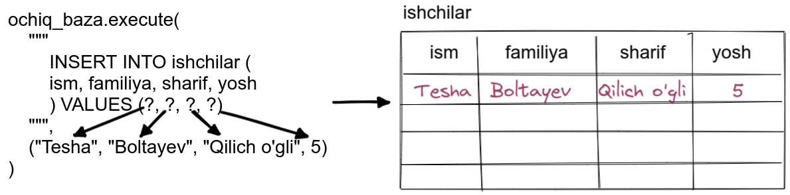

# SQL 

_Databaza_ bu malumotlarni saqlash uchun mo'ljallanga fayl. Databazalar kompyuter doimiy xotirasida saqlanadi, 
o'shaning uchun programma ishlashdan to'xtasa ham baza saqlanib turaveradi.

Databza programmalari shunday tuziladiki, ularga malumot kiritish va olish juda tez bajariladi, 
xattoki juda katta fayllar uchun ham. Bunday tezlikka databaza programmlari _indekslash_ orqali erishadi.

Databaza programmlari juda ko'p: Oracle, MySQL, Microsoft SQL Server, PostgreSQL, va SQLite. Biz
SQLiteni ko'rib chiqamiz. Sababi, bu keng tarqalgan va allaqachon python bilan birga keladi. SQLite shunday 
qilinganki - u berilgan programmaning ajralmas bo'lagi hisoblanadi. 


## Databaza tushunchalari

Databazaga qaraganimizda, u xuddi jadvalga o'xshaydi. Databaza jadvallar (table), qatorlar (row) va 
ustunlardan  (column) tashkil topadi. 


<p align="center">
    
</p>


## Databaza yaratish

SQLiteda databaza yaratish uchun, pythonda `sqlite3` bibliotekasi mavjud. Va uni quyidagicha chaqiramiz.

```python
import sqlite3
```

Keyin, aniq nom bilan databaza yaratish uchun quyidagicha qilamiz,

```python
baza = sqlite3.connect("ishchilar_baza")
```

Bu yerda `sqlite3` ga tegishli `connect` metodi chaqirilib,  u `ishchilar_baza` deb nomlangan baza 
yaratadi va unga bog'lanadi. Shu bilan biz shunday obyekt yaratdikki - u `ishlar_baza` deb nomlangan
bazaga bog'langan.


## Databazani ochish

Endi bu bazani quyidagicha ochamiz

```python
ochiq_baza = baza.cursor()
```

`cursor` metodi xuddi fayllarni ochgan kabi ishlaydi (fayllarni ochish uchun `open` funksiyasidan foydalangandik).
`cursor` metodi obyek qaytaradi va uni `ochiq_baza` o'zgaruvchisiga yuklaymiz.


## Databazadan jadval yaratish

Ochilgan databazaga endi yangi jadval yaratishimiz mumkin. Keling `ishchilar` deb nomlangan jadvalni yaratamiz, 

```python
ochiq_baza.execute("""CREATE TABLE ishchilar (
            ism TEXT,
            familiya TEXT,
            sharif TEXT,
            yosh INTEGER
            )""")
baza.commit()
```
Bu yerda `execute` metodi, argument string qabul qilayapti. Bu yerda string bu maxsus yozuv bo'lib
databaza bilan ishlash uchun yaratilgan. Bu SQL (Structured Query Language) tili deb ataladi. SQL baza bilan ishlash 
uchun yaratilghan til.  

- `CREATE TABLE` kommandasi jadval yaratish uchun foydalaniladi.
- `ishchilar` jadval nomi.
- `()` jadval ustun nomlari uchun ishlatiladi.
- `ism TEXT`, TEXT turiga tegishli ism nomli ustun (ustun nomi va undan keyin uni turi belgilanadi).  
`TEXT` turi `string` turi bilan bir xil.
- `ism`ga o'xshash, `familiya` va `sharif` ham ustun nomlari sifatida berilgan.
- `yosh` bu yerda butun son sifatida olinga o'shaning uchun `INTEGER` qilingan.
- Esdan chiqarmasligimiz kerakki yaratilgan jadvalni, bazaga saqlashlikni. Saqlash uchun `baza.commit()` 
foydalanamiz.

Umuman olganda balanddagi kommanda ishlaganida quyidagi ro'y berayapti 
<p align="center">
    
</p>


### Jadvalga malumot qo'shish
Hozirgacha databaza yaratdik va uning ichida `ishchilar` deb nomlangan jadval ham yaratdik.
Endi unga malumot kiritishni ko'ramiz. Malumot kiritish uchun SQLda `INSERT INTO` kommandasini qo'llaymiz.
Masalan quyidagi malumotni kiritamiz, 


```python
ochiq_baza.execute(
    """
        INSERT INTO ishchilar (
        ism, familiya, sharif, yosh
        ) VALUES (?, ?, ?, ?)
    """,
    ("Tesha", "Boltayev", "Qilich o'gli", 5)
)
baza.commit()
```

Izoh

 - INSERT INTO ishchilar - ishchilar jadvaliga molumot qo'sh
 - ism, familiya, sharif, yosh - qaysi ustunlarga malumot qo'shayotganligimizni aytayapmiz
 - VALUES (?, ?, ?, ?) - qanaqa qiymatlarni qo'yayotganimizni ko'rsatish uchun joy ajratayapmiz. `?` bu yerda
shunchaki joy olib turibdi, aslida hech qanday malumot qo'shmaydi
 - ("Tesha", "Boltayev", "Qilich o'gli", 5) - bu tupledagi malumotlar, yuqoridagi so'roqlarga mos ravishda 
qo'yiladi VALUES (?, ?, ?, ?)
 - jadvalga ham qoi'shganda ham - baza.commit() - metodini chaqirishimiz kerak.

Grafik jihatdan quyidagi holat bo'layapti

<p align="center">
    
</p>

### Jadvaldan malumot o'qish
Shu paytgacha databaza yaratdik, unda jadval yaratdik, va malumot qo'shdik. Endi malumot olishni ko'ramiz.
Malumot olish uchun SQLda `SELECT * FROM jadval_nomi` kommandasidan foydalanamiz. Yuqoridagi `ishchilar` 
jadvalidan malumot olmoqchi bo'lsak quyidagicha qilamiz,

```python
ochiq_baza.execute("SELECT * FROM ishchilar")
for qator in ochiq_baza:
    print(qator)
```

Izoh:

- `execute` metodi orqali `"SELECT * FROM ishchilar"` kommandasini ishlatayapmiz. 
Bunda jadvalning hamma qatorlari o'qilib listda qaytariladi
- Va list bo'lgani uchun `for loop` orqali bemalol chiqarsak bo'ladi.
- E'tibor beringki bu yerda `baza.commit()` dan foydalanmayapmiz chunki malumot o'qilayapti.


### Jadvaldan ma'lumot o'chirish
Shu paytgacha databaza yaratdik, unda jadval yaratdik, malumot qo'shdik va bazadan malumotlarni o'qib chiqardik.
Endi malumotlarni o'chirishchi ko'ramiz. SQLda malumotlarni o'chirish uchun `DELETE FROM jadval nomi WHERE shart` 
dan foydaliniladi. Masalan, quyida `ishchilar` jadvalidan yoshi 5 ga teng bo'lgan malumotlarni o'chirish 
tashlash kodi berilgan,

```python
ochiq_baza.execute("DELETE FROM ishchilar WHERE yosh=?", (5,))
baza.commit()
```

Izoh:

- `?` belgisi shunchaki joy ushlab turibdi. U yerga 5 soni qo'yiladi.
- jadvaldan malumotdan haqiqatda o'chirish uchun `baza.commit()` metodini chaqirishimiz shart.


### Jadvaldagi malumotni yangilash 
Shu paytgacha databaza yaratdik, unda jadval yaratdik, malumot qo'shdik, malumotlarni o'qidik, va o'chirdik.
Shunday vaziyatlar keladiki, bazida malumotlarni xato kirgizamiz o'shani to'g'irlashga to'g'ri keladi.
Shunga o'xshash vaqtlarda SQLda `UPDATE jadval SET o'zgartirish WHERE shart`dan foydalanamiz. Masalan quyidagi 
kodda, 5 yoshini 47 yoshga qanday o'zgartirishimiz mumkinligi ko'rsatilgan,

```python
ochiq_baza.execute("UPDATE ishchilar SET yosh=? WHERE yosh=?", (47, 5))
baza.commit()
```

Izoh:

- `?` so'roqlar o'rniga `(47, 5)` mos ravishda qo'yiladi.
- qilgan amalimiz bazada saqlanishi uchun `baza.commit()` qilishimiz shart.

## Databazani yopish
Albatta databaza bilan ishlab bo'lganimizdan so'ng, uni yopishimiz kerak.

```python
baza.close()
```