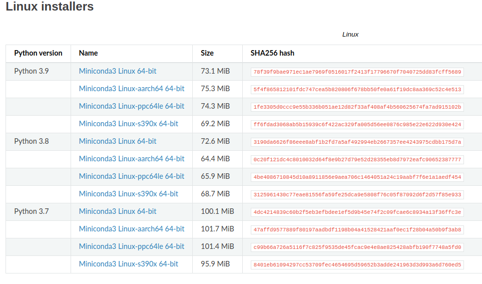

## Conda o'rnatish
1. `https://docs.conda.io/projects/conda/en/latest/user-guide/install/linux.html` linkdan foydalanib yukalb olamiz
 -  

2. `bash Miniconda3-latest-Linux-x86_64.sh` terminalda kiritamiz
3. `conda` deb tekshirib koramiz