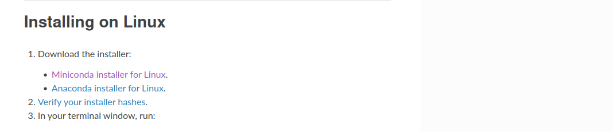
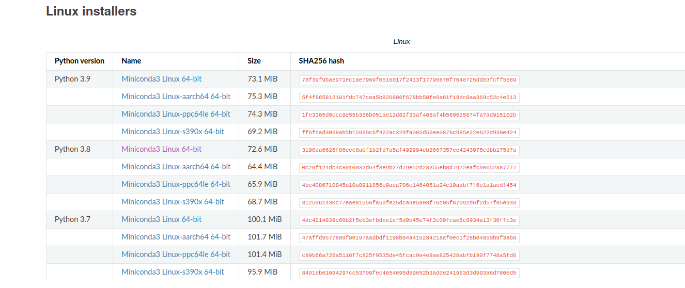

## Condani o'rnatish

 1. Condani yuklab olish

     `https://docs.conda.io/projects/conda/en/latest/user-guide/install/linux.html` linkdan foydalanib yukalb olamiz.

    * Quyidagi qismiga kiramiz.

     
  
    * Kerakli python versiyasi tanlab yuklab olamiz.

    


2. Terminalga kiramiz va condani yuklab olgan qismiga boramiz(papkasi). <br>
   * Masalan quyidagicha :

   ```shell
   ochiqai:~$ ls
   Desktop    ENGLISH     ochiqai   PycharmProjects  Templates
   Documents  miniconda3  Pictures  PythonProjects   Videos
   Downloads  Music       Public    snap
   ochiqai:~$ cd Downloads/
   ochiqai:~/Downloads$ ls
   Miniconda3-py38_4.12.0-Linux-x86_64.sh  'Telegram Desktop'
   ```
   
   * `Miniconda3-py38_4.12.0-Linux-x86_64.sh` qismini terminalda bajarib, condani o'rnatib olamiz. So'ralgan qismiga `y` komandasini kiritamiz.

   ```shell
   ochiqai:~/Downloads$ bash Miniconda3-py38_4.12.0-Linux-x86_64.sh
   ```

3. `conda` deb tekshirib koramiz.

    `conda: command not found`deb qaytarsa, quyidagi komandani bajaramiz.

    ```shell
    ochiqai:~$ source $HOME/miniconda3/bin/activate
    ```

   * Oldida `(base)` komandasi paydo bo'ladi. Condani qayta ishlatib ko'ramiz.

   ```shell
   optional arguments:
   -h, --help     Show this help message and exit.
   -V, --version  Show the conda version number and exit.
   ```
     * Agar biz terminaldan chiqib ketib qayta kirsak har doim ham ishlamasligi mumkin. Shuning uchun quyidagi jarayonlarni bajarib o'tamiz.
     * `ls $HOME/.bashrc` komandani terminalda bajarib `.bashrc` borligini tekshirib olamiz.(Eslatma: nuqtali fayllar odatda ko'rinmaydi. Ko'rishimiz uchun `Ctrl+h`ni bosamiz)

     * `.bashrc` fayliga kiramiz, `export PATH="$HOME/miniconda3/bin:$PATH"` komandasini eng tagiga qo'shib qo'yamiz (saqlab chiqib ketamiz).

     * Terminalni qaytadan ishlatib `conda` komandasi ishlatsak avvalgidek ishlayveradi.

4. `conda -V` orqali conda versiyasini aniqlanadi.

    ```shell
    ochiqai:~$ conda -V
    conda 4.12.0
    ```
   
