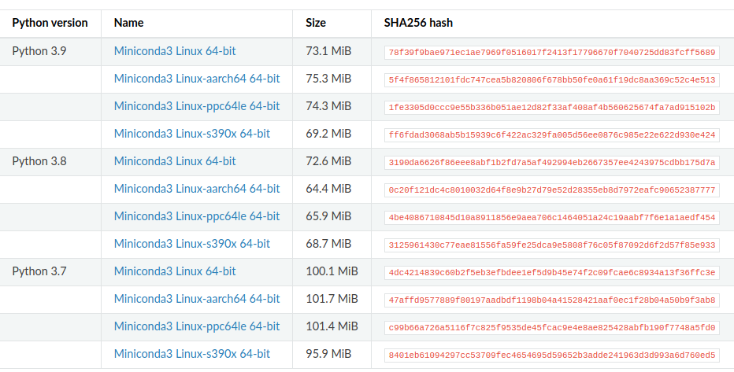

## Condani o'rnatish

#### Condani yuklab olish

1. `https://docs.conda.io/projects/conda/en/latest/user-guide/install/linux.html` linkdan foydalanib yukalb olamiz.

* Quyidagi kismiga kiramiz. (Linux uchun)

   -   
  
* Kerakli python versiyasi tanlab yuklab olamiz.

   -  

2. Terminalga kiramiz va condani yuklab olgan qismiga boramiz(papkasi). <br>
Masalan quyidagicha :

```shell
nuriddin@nuriddin-GF63-Thin-10SC:~$ ls
Desktop    ENGLISH     ochiqai   PycharmProjects  Templates
Documents  miniconda3  Pictures  PythonProjects   Videos
Downloads  Music       Public    snap
nuriddin@nuriddin-GF63-Thin-10SC:~$ cd Downloads/
nuriddin@nuriddin-GF63-Thin-10SC:~/Downloads$ ls
 Miniconda3-py38_4.12.0-Linux-x86_64.sh  'Telegram Desktop'
```
* Quyidagi buyruqni bajaramiz, so'ralgan joyida `y` tugmasi kiritilib o'rnatiladi.
```shell
nuriddin@nuriddin-GF63-Thin-10SC:~/Downloads$ bash Miniconda3-py38_4.12.0-Linux-x86_64.sh
```
 

3. `conda` deb tekshirib koramiz.

`conda: command not found` deb chiqsa, condani ishlatish uchun quyidagi ketma-ketliklarni bajarib o'tamiz.

```shell
nuriddin@nuriddin-GF63-Thin-10SC:~$ source $HOME/miniconda3/bin/activate
```
* Oldida `(base)` komandasi paydo bo'ladi. Condani qayta ishlatib ko'ramiz.

   

* `ls $HOME/.bashrc` komandani terminalda bajarib `.bashrc` borligini tekshirib olamiz.(Eslatma: nuqtali fayllar odatda ko'rinmaydi. Ko'rishimiz uchun `Ctrl+h`ni bosamiz)

* `.bashrc` fayliga kiramiz, `export PATH="$HOME/miniconda3/bin:$PATH"` komandasini eng tagiga qo'shib qo'yamiz.(saqlab chiqib ketamiz)

* Terminalni qaytadan ishlatib `conda` komandasi ishlatsak avvalgidek ishlayveradi.
4. `conda -V` orqali conda versiyasini aniqlanadi.

```shell
(base) nuriddin@nuriddin-GF63-Thin-10SC:~$ conda -V
conda 4.12.0
```
   