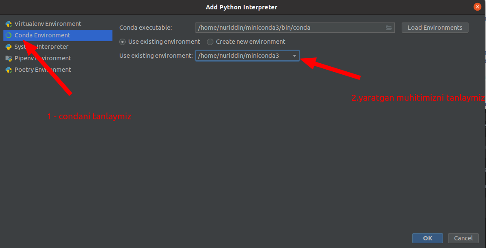

## Conda environment (muhit) yaratish

1. `environment.yml` nomli fayl yaratamiz
2. `https://github.com/ochiqai/python/blob/projects/environment.yml` `environment` ichida `nomi` va kerakli 
kutubxonalar yoziladi
   - 
3. Birinchi terminalda `environment.yml` fayli joylashgan joyga borib olamiz. Va terminalga quyidagi komandani bajaramiz

   ```shell
   conda env create -f environment.yml
   ```

* `conda env list` orqali yaratilgan muhitlarni ko'ramiz.

4. Aktivatsiya qilamiz (Yaratgan muhitimizga kiradi)

```shell
conda activate ochiqai2
```

`ochiqai2` muhit nomi.

5. Muhitni `Pycharm`ga qo'shish.

 - 

 - 