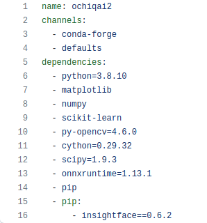

## Conda environment (muhit) yaratish

1. `environment.yml` nomli fayl yaratamiz
2. `https://github.com/ochiqai/python/blob/projects/environment.yml` `environment` ichida `nomi` va kerakli 
kutubxonalar yoziladi
   - 
3. `conda create -f environment.yml` kommandasini terminalga kiritamiz
4. Aktivatsiya qilamiz
   - `conda activate nomi`