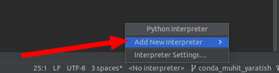
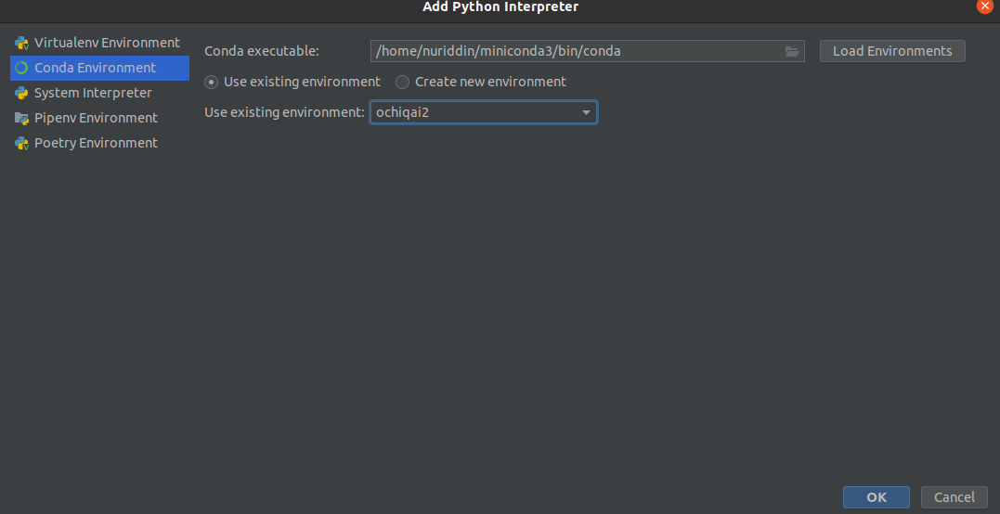

## Conda environment (muhit) yaratish

1. `environment.yml` nomli fayl yaratamiz.

2. `https://github.com/ochiqai/python/blob/projects/environment.yml` `environment` ichida `nomi` va kerakli 
kutubxonalar yoziladi.
   ```yml
   name: ochiqai2  <--- muhit nomi beriladi
   channels:  <--- condani ishlatish uchun.
   - conda-forge
   - defaults
   dependencies:  <--- kerakli kutibxonalarni o'rnatish uchun
   - python=3.8.10
   - matplotlib
   - numpy
   - scikit-learn
   - py-opencv=4.6.0
   - cython=0.29.32
   - scipy=1.9.3
   - onnxruntime=1.13.1
   - pip
   - pip:  <--- pip orqali o'rnatiladigan qismi 
    - insightface==0.6.2
   ```

3. Birinchi terminalda `environment.yml` fayli joylashgan joyga borib olamiz. Terminalga quyidagi komandani bajaramiz

   ```shell
   conda env create -f environment.yml
   ```
   
   * `conda env list` orqali yaratilgan muhitlarni ko'ramiz.

4. Aktivatsiya qilamiz (Yaratgan muhitimizga kiradi)

   ```shell
   conda activate ochiqai2
   ```

   * Yuqorida `ochiqai2` nomli muhitimizga kirib oldik.

5. Muhitni `Pycharm`ga qo'shish.

   

   

   * Yuqorida `Conda Environment` qismiga borib, va `ochiqai2` muhitimizni tanlab olib `ok` tugmasini bosamiz.


6. Conda muhitini o'chirish.

   ```shell
   conda env remove -n MUHIT_NOMI
   ```

   * Masalan:

   ```shell
   conda env remove -n ochiqai
   ```
  
  `ochiqai` - muhit nomi
