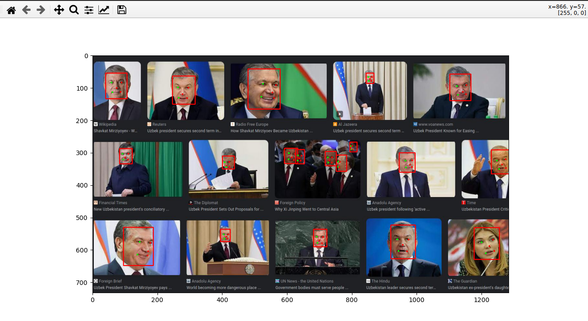

## Yuzlarni rasmdan aniqlash


### Foydalanadigan kutibxonalar

* Kerakli kutibxonalarni `import` qilib olamiz.

    ```python
    import cv2
    import insightface
    from insightface.app.common import Face
    from insightface.app import FaceAnalysis
    import matplotlib.pyplot as plt
    ```

### Model joyini aniqlash

* Biz foydalanadigan modul yuz qismini aniqlab beradigan funksiya kabi tushunsak bo'ladi.

* Rasmdan yuzni aniqlab olish uchun kerak bo'ladigan model joyini aniqlaymiz.

  ```python
  import cv2
  import insightface
  from insightface.app.common import Face
  from insightface.app import FaceAnalysis
  import matplotlib.pyplot as plt
  
  
  app = FaceAnalysis()
  ```
  * `app = FaceAnalysis()` yozib olib dasturimizni ishlatib, model joyini aniqlab olamiz. 

  ```shell
  find model: /home/nuriddin/.insightface/models/buffalo_l/2d106det.onnx landmark_2d_106 ['None', 3, 192, 192] 0.0 1.0
  Applied providers: ['CPUExecutionProvider'], with options: {'CPUExecutionProvider': {}}
  find model: /home/nuriddin/.insightface/models/buffalo_l/det_10g.onnx detection [1, 3, '?', '?'] 127.5 128.0
  Applied providers: ['CPUExecutionProvider'], with options: {'CPUExecutionProvider': {}}
  find model: /home/nuriddin/.insightface/models/buffalo_l/genderage.onnx genderage ['None', 3, 96, 96] 0.0 1.0
  ``` 
  * Yuqorida `detection` qismida `model joyi` berilgan. Va uni `model_joyi` o'zgaruvchisiga ta'minlab olamiz.

```python
import cv2
import insightface
from insightface.app.common import Face
from insightface.app import FaceAnalysis
import matplotlib.pyplot as plt

# app = FaceAnalysis()

model_joyi = "/home/nuriddin/.insightface/models/buffalo_l/det_10g.onnx"
```

* Model joyini aniqlab oldi, endi uni `insightface` orqali chaqirib olamiz va modelimizni `yuz aniqlagich` o'zgaruvchiisiga ta'minlab olamiz.

  ```python
  yuz_aniqlagich = insightface.model_zoo.get_model(model_joyi)
  ```
* Rasmni `640 vs 640` o'lchamga keltirib olamiz.

  ```python
  yuz_aniqlagich = insightface.model_zoo.get_model(model_joyi)
  # (640, 640) ixtiyoriy kiritilgan rasmni ushbu o'lchamga o'tkazadi.
  yuz_aniqlagich.prepare(ctx_id=0, input_size=(640, 640))
  ```
  
### Rasmni o'qib olish

* Foydalanadigan rasmning joyini aniqlab olamiz, `cv2` kutubxonasining `imread` komandasi orqali o'qib olamiz.

  ```python
  rasm_joyi = "rasmlar/uz_prez.jpg"
  rasm = cv2.imread(rasm_joyi)
  ```
  * Rasmni `print` orqali chiqarib ko'rsak, uni [0, 255] oraliqdagi sonlardan tashkil topganini ko'rishimiz mumkin.

### Yuz qismlari va koordinatalarini aniqlash

* `yuz_aniqlagich` modelining `detect` komandasi orqali yuz qismlari, koordinatalarini aniqlab olamiz.

  ```python
  yuz_koordinatalari, yuz_qismlari = yuz_aniqlagich.detect(rasm)
  ```
  
* Endi biz yuz koordinatalarini o'zgartirib olishimiz kerak. Buning uchun yangi o'zgaruvchi yaratib olamiz.

  ```python
  yuz_koordinatalari_uzgartirilgan = []
  ```

*  Yuz koordinatalari o'rganish

    ```python
    >>> yuz_koordinatalari.shape
    (19, 5)
    ```
      * `shape` komandasi orqali nimalar mavjudligini bilib oldik. `19` rasmlar sonini anglatadi, `5` esa nimani anglatishini tushunib olishimiz uchun, birinchi rasmni o'zini chiqarib ko'raylik.

  ```shell
  >>> yuz_koordinatalari[0,:]
  array([479.86224  ,  41.49642  , 578.2567   , 165.86041  ,   0.9085071],
        dtype=float32)
  ```

* Yuqorida dastlabki 4 ta son birinchi rasmimizning koordinatalarini anglatadi. `0.9085071` bu sonni esa koordinatalarning ishonchlilik darajasi deb qarasak bo'ladi. 

* Quyidagi jarayonni bajarib o'tamiz.

    ```python
    for i in range(yuz_koordinatalari.shape[0]):
        koordinata = yuz_koordinatalari[i, 0:4]
        ishonch = yuz_koordinatalari[i, 4]
        yuz_qism = yuz_qismlari[i]
  
        yuz = Face(bbox=koordinata, kps=yuz_qism, det_score=ishonch)
        yuz_koordinatalari_uzgartirilgan.append(yuz)
    ```
    
    * `yuz_koordinatalari.shape[0]` - bu yuzlar soni qarab son qaytaradi(4 ta yuzni aniqlasa `4` qaytaradi va h.k).
    * `koordinata = yuz_koordinatalari[i, 0:4]` - rasm koordinatalar qismi.
    * `ishonch = yuz_koordinatalari[i, 4]` - ishonchlilik qismi. (0.9085071)
    * `koordinata`, `ishonch` va `yuz_qismlari` ni aniqlab olib `Face` kutibxonasiga yuqoridagidek yozib olib, uni `yuz` o'zgaruvchisiga ta'minlab oldik.
    * `yuz_koordinatalari_uzgartirilgan` listiga `append` orqali har bir `yuz`ni qo'shib boramiz.

### Aniqlangan yuzlarni chizib olish

* Rasmdan yuzlarni aniqlagach uni alohida chizib olamiz. 

  ```python
  app = FaceAnalysis()
  chizilgan_rasm = app.draw_on(rasm, yuz_koordinatalari_uzgartirilgan)
  ```
  * `app.draw_on` bizga aniqlangan yuzlarni chizib, rasm ko'rinishida qaytaradi.

  * Rasmni `rgb`ga o'tkazib olib, `matplotlib` yordamida `chizilgan_rasm`ni ko'rishimiz mumikin.

  ```python
  chizilgan_rasm = cv2.cvtColor(chizilgan_rasm, cv2.COLOR_BGR2RGB)
  plt.imshow(chizilgan_rasm)
  plt.show()
  ```
  
* Dasturning umumiy ko'rinishi:

  ```python
  import cv2
  import insightface
  from insightface.app.common import Face
  from insightface.app import FaceAnalysis
  import matplotlib.pyplot as plt
  
  
  # app = FaceAnalysis()
  # /home/ochiqai/.insightface/models/buffalo_l/det_10g.onnx
  
  model_joyi = "/home/ochiqai/.insightface/models/buffalo_l/det_10g.onnx"
  yuz_aniqlagich = insightface.model_zoo.get_model(model_joyi)
  # (640, 640) ixtiyoriy kiritilgan rasmni ushbu o'lchamga o'tkazadi.
  yuz_aniqlagich.prepare(ctx_id=0, input_size=(640, 640))
  
  rasm_joyi = "rasmlar/uz_prez.jpg"
  rasm = cv2.imread(rasm_joyi) # [0, 255]
  
  yuz_koordinatalari, yuz_qismlari = yuz_aniqlagich.detect(rasm)
  
  yuz_koordinatalari_uzgartirilgan = []
  for i in range(yuz_koordinatalari.shape[0]):
      koordinata = yuz_koordinatalari[i, 0:4]
      ishonch = yuz_koordinatalari[i, 4]
      yuz_qism = yuz_qismlari[i]
  
      yuz = Face(bbox=koordinata, kps=yuz_qism, det_score=ishonch)
      yuz_koordinatalari_uzgartirilgan.append(yuz)
  
  
  app = FaceAnalysis()
  chizilgan_rasm = app.draw_on(rasm, yuz_koordinatalari_uzgartirilgan)
  
  chizilgan_rasm = cv2.cvtColor(chizilgan_rasm, cv2.COLOR_BGR2RGB)
  plt.imshow(chizilgan_rasm)
  plt.show()
  ```
  
* Dasturni ishlatamiz, va natijani ko'rishimiz mumkin.

<p align="center">
    
</p>

