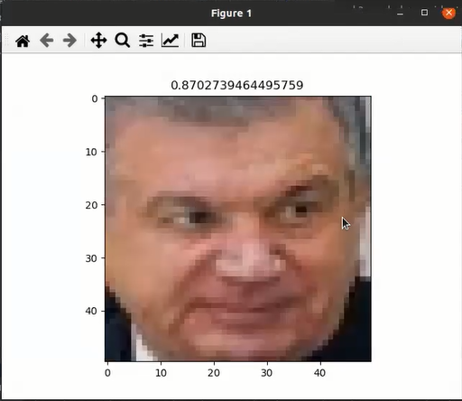

# Yuzalarni AI orqali solishtirish


* [Rasmda piksellarni aniqlash](#rasmda-piksellarni-aniqlash)
* [Rasmlarni solishtirish](#rasmlarni-solishtirish)

## Rasmda piksellarni aniqlash

```shell
rasm = cv2.cvtColor(rasm, cv2.COLOR_BGR2RGB)
yuz_koordinatalari_piksellar = []
for y in yuz_koordinatalari_uzgartirilgan:
    x1 = int(y["bbox"][0])
    y1 = int(y["bbox"][1])
    x2 = int(y["bbox"][2])
    y2 = int(y["bbox"][3])
    rasm_y = rasm[y1:y2, x1:x2]
    rasm_y = cv2.resize(rasm_y, (50, 50))
    piksellar = rasm_y.reshape((1, 7500)) # matrixdan vectorga o'tdik
    yuz_koordinatalari_piksellar.append([piksellar, rasm_y])
```


* y['bbox'] - 'bbox' - bu koordinatlar olish uchun foydalaniladi.
  bu yerda y ni koordinatasi yani bbox 
`array([479.86224,  41.49642, 578.2567 , 165.86041], dtype=float32)`
* ularni tomonlarni aniqlash uchun esa:

  ```shell
  x1 = int(y["bbox"][0])
  y1 = int(y["bbox"][1])
  x2 = int(y["bbox"][2])
  y2 = int(y["bbox"][3])
  ```

shunday ko'rinishga keltirib olamiz. Bular butun songa `int` orqali o'tkazilgan, chunki
jarayon davomida indekslardan foydalanamiz va ular butun sonda bo'lishi kerak.

* Koordinatalarini olish uchun esa:
`rasm_y = rasm[y1:y2, x1:x2]` kiritib olamiz, bu yerda x1, x2, y1, y2 tomonlarni ko'rsatadi.
`rasm = cv2.cvtColor(rasm, cv2.COLOR_BGR2RGB)` buni ham qo'shamiz, bu rasmlarni tiniqroq chiqishiga imkon yaratadi.

  ```shell
  rasm = cv2.cvtColor(rasm, cv2.COLOR_BGR2RGB)
  for y in yuz_koordinatalari_uzgartirilgan:
      x1 = int(y["bbox"][0])
      y1 = int(y["bbox"][1])
      x2 = int(y["bbox"][2])
      y2 = int(y["bbox"][3])
      rasm_y = rasm[y1:y2, x1:x2] 
  
  # natijasi korish uchun 
  #   plt.imshow(rasm_y)
  #   plt.show()
  # kiritib olamiz
  ```

* Natija:

  <p align="center">
      
  </p>

* Keyingi qadamda biz rasmlarni vektorlarga o'tkazib olamiz, undan oldin esa rasmlarni bir xil razmerga 
o'tkazib olamiz. Buning uchun `resize`dan foydalanamiz

  ```shell
  for y in yuz_koordinatalari_uzgartirilgan:
      x1 = int(y["bbox"][0])
      y1 = int(y["bbox"][1])
      x2 = int(y["bbox"][2])
      y2 = int(y["bbox"][3])
      rasm_y = rasm[y1:y2, x1:x2]
      # Bunda biz rasmni ikkala tomoni ham 50 x 50 qilib olib keldik.
      rasm_y = cv2.resize(rasm_y, (50, 50))
  ```

* Natijasi :

  <p align="center">
      
  </p>

* Yani bunda rasm shakli 50x50 shaklga keldi.

* Endigi navbatda biz rasmimizni matritsadan vektorga o'tgazib olamiz. Buning uchun `reshape`dan 
foydalanamiz. Kodimizga `rasm_y.reshape(1, 7500)` kiritib olamiz. `7500` qayerdam keldi ?
Bu rasmnimizni shakli yani `rasm_y.shape()` natijasi : `[50, 50, 3]` bu ichidagilar ko'paytirib 7500 hosil qilinadi.
`pikselar = rasm_y.reshape(1, 7500)` bu vektorga o'tkazadi. `yuz_koordinatalari_piksellar = []` list yaratib olamiz.
`    yuz_koordinatalari_piksellar.append([piksellar, rasm_y])` bu esa vektorlarni to'plash uchun hizmat qiladi va `rasm_y` ham kiritilgan
yani piksellarga mos ravishda rasmlarni ko'rish uchun.

  ```shell
  rasm = cv2.cvtColor(rasm, cv2.COLOR_BGR2RGB)
  yuz_koordinatalari_piksellar = []
  for y in yuz_koordinatalari_uzgartirilgan:
      x1 = int(y["bbox"][0])
      y1 = int(y["bbox"][1])
      x2 = int(y["bbox"][2])
      y2 = int(y["bbox"][3])
      rasm_y = rasm[y1:y2, x1:x2]
      rasm_y = cv2.resize(rasm_y, (50, 50))
      piksellar = rasm_y.reshape((1, 7500)) # matrixdan vectorga o'tdik
      yuz_koordinatalari_piksellar.append([piksellar, rasm_y])
  ```

* Natijani esa:

  ```shell
  for yuz in yuz_koordinatalari_piksellar:
       piksel, rasm = yuz[0], yuz[1]
  #     yuz[0] bu piksellar,  yuz[1] bu rasm hisoblanadi
       plt.imshow(rasm)
       plt.show()
  ```

## Rasmlarni solishtirish

* Bunda biz chetdan biror bir rasm olish orqali yuqoridagi aniqlangan rasm piksellari bilan solishtirib chiqamiz.
* Yuklab olingan rasmni ham yuqoridagi ko'rinishga keltiramiz.
  ```shell
  rasm_joyi = "rasmlar/test_prez.jpg" - bu rasmini joyi
  test_rasm = cv2.imread(rasm_joyi) # [0, 255] - bu rasmni o'qib olish uchun
  test_rasm = cv2.resize(test_rasm, (50, 50))- bu rasmni bir xil shaklga keltirish uchun
  test_piksellar = test_rasm.reshape((1, 7500))- bu matritsadan vektorga utkazish uchun 
  ```
  <p align="center">
      
  </p>

* Biz bu rasmlarni o'zaro solishtirish uchun `taqqoslaydigan funksiyamizni` chqarib olamiz. 
U bizda oldindan mavjud, bu `vektorlarni taqqoslash` deb ataladi, agar siz bu haqida to'liqroq ma'lumot olmoqchi 
bo'lsangiz [vektorlarni taqqoslash](#./projects/yuzlarni-taqqoslash/kod/project-1/vector_taq_01.py) md shaklini o'qishingiz mumkin.

* Funksiyamizni olib kelamiz :

  ```shell
  def ildiz(x):
      return math.sqrt(x)
  
  
  def vector_taq(a, b):
      # kosinus o'xshashlik https://en.wikipedia.org/wiki/Cosine_similarity
      # 1*1 + 2*2 + 2*2 + 1*2 + 1*1 + 1*1
  
      if len(a) == len(b):
          i = 0
          v = 0
          while i < len(a):
              v += (a[i] * b[i])
              i += 1
  
          # modul
          i = 0
          modul_a = 0
          modul_b = 0
          while i < len(a):
              modul_a += (a[i] * a[i])
              modul_b += (b[i] * b[i])
              i += 1
  
          modul_a = ildiz(modul_a)
          modul_b = ildiz(modul_b)
          maxraj = modul_a * modul_b
          yaqinlik = v / maxraj
  
          return yaqinlik
      else:
          print("Elementlar soni teng bo'lish kerak!")
  ```

* Bularni endi `test_prez.jng` bilan solishtirib ko'ramiz.
## Tanib olish moduli
Biz `recognition` moduli orqali aniqlab olamiz 
  ```shell
  joy = "/home/ochiqai/.insightface/models/buffalo_l/w600k_r50.onnx"
  yuz_ai = insightface.model_zoo.get_model(joy)
  yuz_ai.prepare(ctx_id=0)
  ```
## Yuzlarni AI orqali solishtirish
Biz yuzni `for idx, (yuz, yuz_koord) in enumerate(zip(yuz_koordinatalari_piksellar, yuz_koordinatalari_uzgartirilgan)):` 
orqali `indexini va yuz qismlarini kordinatalarini` aniqlab olamiz .`get`metodi orqali asosiy birinchi rasm va uning kordinatalarini
`test_embedding` ga yuklab olamiz qolgan rasmlarni `else yordamida ` `baza_embeddinga ` yuklab olib solishtiramiz  

  ```shell
  for idx, (yuz, yuz_koord) in enumerate(zip(yuz_koordinatalari_piksellar, yuz_koordinatalari_uzgartirilgan)):
    if idx == 0:
        test_embedding = yuz_ai.get(rasm, yuz_koord)
        continue
    else:
        baza_embedding = yuz_ai.get(rasm, yuz_koord)
        yaqinlik = vector_taq(test_embedding.tolist(), baza_embedding.tolist())
        print(yaqinlik)
  ```

<p align="center">
    
</p>


* keyin qo'shimcha tarzda 

  ```shell
  if yaqinlik > 0.1: - bunda namunalarni 0.1 va undan yuqorisini yaqinlikka ancha yaqin deb olsak bo'ladi.'
          plt.title("Bu Shavkat Mirziyoyev")
      else:
          plt.title("Bu boshqa odam")
  ```

ham kiritishimiz mumkin, bu yaqinlikni yaxshiroq qilib chiqarishga imkon yaratadi.

  ```shell
for idx, (yuz, yuz_koord) in enumerate(zip(yuz_koordinatalari_piksellar, yuz_koordinatalari_uzgartirilgan)):
    if idx == 0:
        test_embedding = yuz_ai.get(rasm, yuz_koord)
        continue
    else:
        baza_embedding = yuz_ai.get(rasm, yuz_koord)
        yaqinlik = vector_taq(test_embedding.tolist(), baza_embedding.tolist())
        print(yaqinlik)

    plt.imshow(yuz[1])
    if yaqinlik > 0.1:
        plt.title("Bu Shavkat Mirziyoyev")
    else:
        plt.title("Bu boshqa odam")
    plt.show()
  ```

* Namunalar quydagicha ko'rinish oladi:
1. To'g'ri rasm

  <p align="center">
      
  </p>

2. To'g'ri rasm

  <p align="center">
      
  </p>
 AI da 100% lik natijaga erishdik